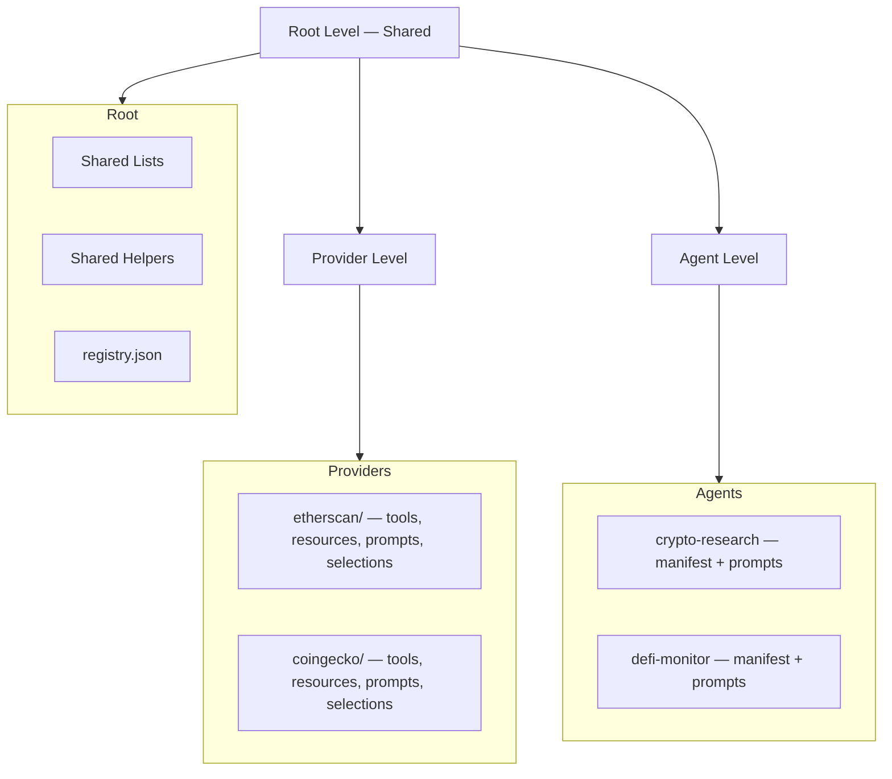

# FlowMCP Specification

 

FlowMCP is a **Tool Catalog with pre-built API templates** and a **Knowledge Base for API workflows**. It unifies access to APIs through two equal channels: **CLI** (direct access) and **MCP/A2A Server** (for agents and MCP clients). This repository contains the specification documents and reference examples — no executable code.

## Architecture

FlowMCP organizes its catalog in three levels:



**Root** holds shared lists, helpers, and the catalog manifest. **Providers** wrap APIs with deterministic tools, resources, prompts, and selections. **Agents** compose tools from multiple providers for specific tasks.

## What's New in v4.0.0

| Feature | Description |
|---------|-------------|
| **Five Primitives** | `tools`, `resources`, `prompts`, `skills`, `selections` — first-class entities at provider level |
| **Selections** | Cross-provider tool/resource compositions with prefill and parameter binding |
| **Prefill** | Schema-side parameter pre-population for downstream tool/resource calls |
| **Optional `meta` Block** | Per-schema metadata: `docs`, `termsOfService`, `dataLicense` — runtime-injected, not persisted in schema |
| **Scoring Protocol v1** | Two-dimension grade (`whenToUse` + `parameters`), 1.0–5.0 scale, Production gate at >= 3.5 |
| **Schema Lifecycle** | Defined stages: Research → Creation → API-Test → Validation → Grade → Production |
| **runSql / describeTables** | First-class resource patterns for SQLite-backed resources |
| **MCP Integration** | Formal MCP server bindings and primitive mapping |

## Quickstart

```bash
git clone https://github.com/FlowMCP/flowmcp-spec.git
cd flowmcp-spec
```

A minimal v4.0.0 schema:

```javascript
export const schema = {
    main: {
        namespace: 'coingecko',
        name: 'Ping',
        description: 'Check CoinGecko API server status',
        version: '4.0.0',
        root: 'https://api.coingecko.com/api/v3',
        requiredServerParams: [],
        requiredLibraries: []
    },
    tools: {
        ping: {
            method: 'GET',
            path: '/ping',
            description: 'Check if CoinGecko API is online',
            parameters: [],
            tests: [
                { _description: 'Basic health check' },
                { _description: 'Verify response format' },
                { _description: 'Confirm uptime' }
            ],
            output: {
                mimeType: 'application/json',
                schema: {
                    type: 'object',
                    properties: {
                        gecko_says: { type: 'string' }
                    }
                }
            }
        }
    }
}
```

## Specification Documents

| # | Document | Description |
|---|----------|-------------|
| 00 | [Overview](spec/v4.3.0/00-overview.md) | Vision, three-level architecture, LLM-First philosophy, terminology |
| 01 | [Schema Format](spec/v4.3.0/01-schema-format.md) | `main` + five primitives, optional `meta` block, naming conventions |
| 02 | [Parameters](spec/v4.3.0/02-parameters.md) | Position/z blocks, shared list interpolation, `{{type:name}}` syntax |
| 03 | [Shared Lists](spec/v4.3.0/03-shared-lists.md) | Reusable value lists, dependencies, filtering, registry |
| 04 | [Output Schema](spec/v4.3.0/04-output-schema.md) | Output definitions, MIME-Types, response envelope |
| 05 | [Security](spec/v4.3.0/05-security.md) | Zero-import policy, library allowlist, static scan |
| 06 | [Agents](spec/v4.3.0/06-agents.md) | Agent manifests, model binding, system prompts, tool cherry-picking |
| 07 | [Tasks](spec/v4.3.0/07-tasks.md) | MCP Tasks async fields (reserved) |
| 08 | [Migration](spec/v4.3.0/08-migration.md) | v1.2.0 → v2.0.0 → v3.0.0 → v4.0.0 migration guides |
| 09 | [Validation Rules](spec/v4.3.0/09-validation-rules.md) | Complete validation checklist across all categories |
| 10 | [Tests](spec/v4.3.0/10-tests.md) | Tool tests, resource tests, agent tests, response capture |
| 11 | [Preload](spec/v4.3.0/11-preload.md) | Schema initialization with startup data |
| 12 | [Prompt Architecture](spec/v4.3.0/12-prompt-architecture.md) | Provider-Prompts, Agent-Prompts, composable references |
| 13 | [Resources](spec/v4.3.0/13-resources.md) | SQLite resources, queries, runSql/describeTables, parameter binding |
| 14 | [Skills](spec/v4.3.0/14-skills.md) | Skill .mjs format, placeholders, versioning |
| 15 | [Catalog](spec/v4.3.0/15-catalog.md) | Catalog manifest, registry.json, import flow |
| 16 | [ID Schema](spec/v4.3.0/16-id-schema.md) | Unified `namespace/type/name` format |
| 17 | [Selections](spec/v4.3.0/17-selections.md) | Cross-provider compositions with prefill |
| 18 | [Prefill](spec/v4.3.0/18-prefill.md) | Schema-side parameter pre-population |
| 19 | [MCP Integration](spec/v4.3.0/19-mcp-integration.md) | MCP server bindings, primitive mapping |
| 20 | [Validation Strategy](spec/v4.3.0/20-validation-strategy.md) | Multi-layer validation: structure, lifecycle, grade |
| 21 | [Schema Lifecycle](spec/v4.3.0/21-schema-lifecycle.md) | Stages, gates, hold/blocked states |
| 22 | [Scoring Protocol](spec/v4.3.0/22-scoring-protocol.md) | GradeReporter scoring v1 — whenToUse + parameters dimensions |

## Legacy Specifications

Historic versions are preserved for backward-compatibility documentation:

- [Spec v3.0.0](spec/v3.0.0/) — 17 documents (frozen)
- [Spec v2.0.0](spec/v2.0.0/) — 13 documents (frozen)

## LLM-Consumable Specification

The complete specification is available as a single concatenated file for LLM consumption:

- **[spec/v4.0.0/llms.txt](https://raw.githubusercontent.com/FlowMCP/flowmcp-spec/refs/heads/main/spec/v4.0.0/llms.txt)** — All 23 spec documents in one file

This file is auto-generated by a GitHub Action whenever spec files change.

## Examples

| File | Description |
|------|-------------|
| [Providers](examples/v4.0.0/providers/) | Reference provider schemas across the five primitives |
| [Selections](examples/v4.0.0/selections/) | Cross-provider composition examples |
| [Registry](examples/v4.0.0/registry.json) | Sample catalog manifest with schemas and agents |

## Design Principles

1. **Deterministic over clever** — Same input always produces same API call
2. **Declare over code** — Maximize the `main` block, minimize handlers
3. **Inject over import** — Schemas receive data through dependency injection, never import
4. **Hash over trust** — Integrity verification through SHA-256 hashes
5. **Constrain over permit** — Security by default, explicit opt-in for capabilities

## Conventions & Quality Standards

This specification follows IETF conventions to ensure precision, durability, and user-facing clarity. Contributors and consumers MUST understand and apply these conventions.

### Normative Language

This specification uses RFC2119 / BCP14 / RFC8174 keywords. See [`spec/v4.0.0/00-overview.md`](./spec/v4.0.0/00-overview.md) section "Conformance Language" for the binding interpretation. Keywords are only normative in uppercase form (MUST, SHOULD, MAY, etc.).

Some files are intentionally written in prose without normative keywords (e.g. `00-overview.md`, `08-migration.md`, `21-schema-lifecycle.md`) because they describe history, lifecycle, or conceptual background. The granularity table in [`spec/v4.0.0/README.md`](./spec/v4.0.0/README.md) documents which files carry normative weight.

### Hard Facts vs Soft Criteria

The repository contains two categories of content:

| Category | Location | Purpose | Binding? |
|----------|----------|---------|----------|
| Hard Facts | `spec/v{X.Y.Z}/`, `CHANGELOG.md` | Normative specification, release history | yes |
| Soft Criteria | `personas/`, `examples/`, `skills/` | Tone-of-voice, reference patterns, quality tooling | no |

Hard Facts are binary — implementations conform or do not. Soft Criteria are gradient — they calibrate decisions but are not enforced.

### Generation Authority (single source of truth)

This repository **is** the namespace-first spec container: each family lives directly at the repo root as `<namespace>/<version>/{draft,dist,skills}/`. Authored sources live under each family's `draft/`; the `dist/` subtree and the root-level cross-family aggregates are auto-generated by `npm run build`. Consumer repos (docs site, CLI, planned Custom-GPT bot) MUST NOT generate spec-derived artifacts themselves — they retrieve the pre-generated payloads and handle distribution/rendering only.

Auto-generated files (flat layout, Memo 064 flatten — `dist/` is the atomic copy unit):

- `specification/4.3.0/dist/generated/llms.txt` — concatenated spec bundle for LLM consumption
- `specification/4.3.0/dist/generated/llms-schema-spec.txt` — alias of `llms.txt` for docs-site convention
- `best-practice/0.1.0/dist/generated/best-practices.txt` — concatenated best-practice bundle
- `<namespace>/<version>/dist/spec/` — Astro-ready Markdown chapters with frontmatter
- `<namespace>/<version>/dist/bridge/` — per-page bridge projection + rendered backlinks
- `manifest.json`, `inverted-map.json`, `refs.resolved.json` — cross-family aggregates at the repo root

All generated files (under each family's `dist/`) MUST carry a frontmatter header with `generated_at`, `generated_from`, `generator`, `spec_version`, and `edit_warning`. Hand-editing any `dist/` file is forbidden — changes are overwritten on next build.

### Evaluator Skills (Quality Verification)

Spec-quality is verified by domain-specific evaluator skills in `skills/spec-quality/`. Each skill checks one specific rule set and returns:

- a grade from 1 to 5 (5 = excellent, 1 = not acceptable)
- a list of issues with severity (error / warning / hint), rule code, line number, and message

Active evaluator skills:

| Skill | Checks | Status |
|-------|--------|--------|
| `evaluator-spec-rfc2119` | RFC2119 conformance (uppercase keywords, conformance block, granularity) | active |
| `evaluator-spec-coderefs` | Code references (VAL/AGT/RES/SKL/SEL) unique and resolvable | planned |
| `evaluator-spec-cross-refs` | File cross-references (`see N-file.md`) resolvable | planned |
| `evaluator-spec-mermaid-style` | Mermaid diagram consistency | planned |
| `evaluator-spec-tables` | Markdown table structure | planned |
| `evaluator-spec-memo-refs` | Detect accidental internal memo/PRD references | planned |
| `evaluator-docs-payload` | Verify `<namespace>/<version>/dist/spec/` frontmatter spec | planned |

Evaluator skills are domain-specific by design. A skill answers a precise question ("does this file follow RFC2119?"), not a generic one ("is this well-written?").

### What Belongs in the Spec

- Normative rules (with RFC2119 keywords)
- Code references (VAL, AGT, RES, SKL, SEL prefixes)
- Cross-references to other spec files
- External standards references (RFC, MCP, JSON-Schema, SQL)
- Mermaid diagrams for architecture and data flow
- Tables for structured comparisons

### What Does NOT Belong in the Spec

- References to internal memos, PRDs, or issue trackers
- Backward-compatibility storytelling beyond a Migration Guide section
- Implementation details (those live in `flowmcp-core`)
- Tooling-specific examples (those live in `flowmcp-cli` docs)
- Personal opinions, change rationale, or session notes
- Cross-cutting implementation tutorials (those live in the consumer repo where the end-artifact is deployed — e.g. agent-creation tutorials live in `mcp-agent-server`)

### Restart Checklist (for LLMs and humans)

When re-entering this repository after a break, read in this order:

1. `README.md` (this file) — conventions, structure, where things live
2. `spec/v4.0.0/00-overview.md` — vision, Conformance Block
3. `spec/v4.0.0/09-validation-rules.md` — the binding rules registry
4. `personas/overview.md` — who we build for (Soft Criteria)
5. `skills/spec-quality/README.md` — how quality is verified
6. the `### Generation Authority` section above — what is autogenerated and how
7. `CHANGELOG.md` — recent changes

### Docs-Payload Interface

Each family's `<namespace>/<version>/dist/spec/` folder exposes spec content as Astro-ready Markdown files with full frontmatter. This is the **interface contract** for downstream consumers (documentation site, future tools). The root-level `manifest.json` indexes every family's payload and is the entry point consumers read (via `sync-spec.mjs`).

## Related Repositories

| Repository | Description |
|------------|-------------|
| [flowmcp-core](https://github.com/FlowMCP/flowmcp-core) | Core framework — Schema validation, Agent manifest loading, Tool execution |
| [flowmcp-cli](https://github.com/FlowMCP/flowmcp-cli) | CLI — Develop, validate, grade, deploy MCP schemas |
| [flowmcp-schemas-public](https://github.com/FlowMCP/flowmcp-schemas-public) | Public Schema Library — Production-graded MCP tools |
| [flowmcp.github.io](https://github.com/FlowMCP/flowmcp.github.io) | Documentation site — Specification, ecosystem overview |

## Contributing

Contributions welcome. For spec changes, open an issue first to discuss the proposed change.

## License & Terms of Services

The FlowMCP Specification is **MIT-licensed**. The specification covers the schema definition format and reference examples in this repository.

**Schemas built using this specification** access third-party APIs, each with their own Terms of Services. Users are responsible for reviewing each API provider's terms before use. FlowMCP makes no representation about ToS compliance, data licensing, or fitness for any purpose.

## License

MIT
