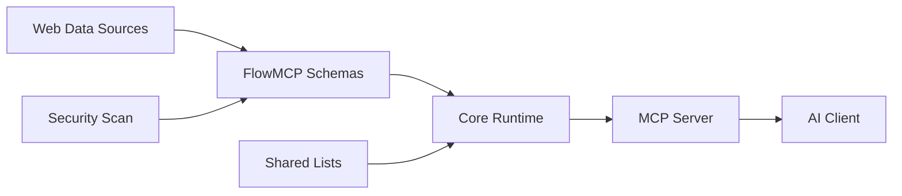

# FlowMCP Specification

 

The FlowMCP Specification defines a **deterministic normalization layer** that converts heterogeneous web data sources into uniform, predictable AI tools. This repository contains the specification documents and reference examples — no executable code.

## Architecture

FlowMCP sits between raw web data sources and AI clients, providing a deterministic translation layer:



**Key insight**: Web data sources (REST APIs, RSS feeds, HTML pages, legacy PHP endpoints) are organized by provider. AI agents need tools organized by application domain. FlowMCP bridges this gap with schemas that normalize any web-accessible source into a uniform format.

## What's New in v2.0.0

| Feature | Description |
|---------|-------------|
| **Two-export format** | `export const main` (hashable) + `export const handlers` (factory with dependency injection) |
| **Dependency Injection** | Handlers receive `sharedLists` and `libraries` via factory — zero import statements |
| **Shared Lists** | Reusable value lists with versioning, dependencies, and filtering |
| **Output Schema** | Per-route output definitions with MIME-Type support |
| **Security Model** | Zero-import policy, library allowlist, static scan |
| **Cherry-Pick Groups** | Tool-level grouping with SHA-256 integrity hashes |
| **Group Prompts** | Markdown workflows that guide AI agents through multi-step tool usage |
| **Preload** | Schema initialization with startup data before first request |
| **Route Tests** | Declarative test format with inline assertions |

## Quickstart

```bash
git clone https://github.com/flowmcp/flowmcp-specification.git
cd flowmcp-specification
```

A minimal v2.0.0 schema looks like this:

```javascript
// Static, declarative, hashable — no imports needed
export const main = {
    namespace: 'coingecko',
    name: 'Ping',
    description: 'Check CoinGecko API server status',
    version: '2.0.0',
    root: 'https://api.coingecko.com/api/v3',
    requiredServerParams: [],
    requiredLibraries: [],
    routes: {
        ping: {
            method: 'GET',
            path: '/ping',
            description: 'Check if CoinGecko API is online',
            parameters: [],
            output: {
                mimeType: 'application/json',
                schema: {
                    type: 'object',
                    properties: {
                        gecko_says: { type: 'string' }
                    }
                }
            }
        }
    }
}

// Optional: handlers factory for data transformation
// export const handlers = ( { sharedLists, libraries } ) => ({...})
```

## Specification Documents

| # | Document | Description |
|---|----------|-------------|
| 00 | [Overview](spec/v2.0.0/00-overview.md) | Problem, solution, positioning, terminology, design principles |
| 01 | [Schema Format](spec/v2.0.0/01-schema-format.md) | `main` + `handlers` structure, required/optional fields, naming conventions |
| 02 | [Parameters](spec/v2.0.0/02-parameters.md) | Input parameters, position/z blocks, shared list interpolation |
| 03 | [Shared Lists](spec/v2.0.0/03-shared-lists.md) | Reusable value lists, dependencies, filtering, registry |
| 04 | [Output Schema](spec/v2.0.0/04-output-schema.md) | Output definitions, MIME-Types, response envelope, JSON Schema subset |
| 05 | [Security](spec/v2.0.0/05-security.md) | Trust boundary, static scan, forbidden patterns, threat model |
| 06 | [Groups](spec/v2.0.0/06-groups.md) | Cherry-pick tool groups, hash calculation, verification |
| 07 | [Tasks](spec/v2.0.0/07-tasks.md) | MCP Tasks async fields (reserved in v2.0.0) |
| 08 | [Migration](spec/v2.0.0/08-migration.md) | v1.2.0 to v2.0.0 migration guide, backward compatibility |
| 09 | [Validation Rules](spec/v2.0.0/09-validation-rules.md) | 79 validation rules across 12 categories |
| 10 | [Route Tests](spec/v2.0.0/10-route-tests.md) | Test format, test execution, assertion rules |
| 11 | [Preload](spec/v2.0.0/11-preload.md) | Schema preload initialization and startup data |
| 12 | [Group Prompts](spec/v2.0.0/12-group-prompts.md) | LLM prompt workflows for tool groups |

## Examples

| File | Description |
|------|-------------|
| [minimal-schema.mjs](examples/minimal-schema.mjs) | Simplest v2.0.0 schema (1 route, no handlers) |
| [shared-list-schema.mjs](examples/shared-list-schema.mjs) | Schema with shared list reference and interpolation |
| [multi-route-schema.mjs](examples/multi-route-schema.mjs) | 4 routes with pre/post handlers |
| [async-schema.mjs](examples/async-schema.mjs) | Async reserved fields for MCP Tasks |
| [shared-list-definition.mjs](examples/shared-list-definition.mjs) | Shared list with field definitions and entries |

## Design Principles

1. **Deterministic over clever** — Same input always produces same API call
2. **Declare over code** — Maximize the `main` block, minimize handlers
3. **Inject over import** — Schemas receive data through `context`, never import
4. **Hash over trust** — Integrity verification through SHA-256 hashes
5. **Constrain over permit** — Security by default, explicit opt-in for capabilities

## Related Repositories

| Repository | Description |
|------------|-------------|
| [flowmcp-core](https://github.com/flowmcp/flowmcp-core) | Core runtime (schema loading, validation, execution) |
| [flowmcp-cli](https://github.com/flowmcp/flowmcp-cli) | CLI tool (search, add, call, validate, migrate) |
| [flowmcp-schemas](https://github.com/flowmcp/flowmcp-schemas) | 187+ API schema definitions |

## Contributing

Contributions welcome. For spec changes, open an issue first to discuss the proposed change.

## License

MIT
