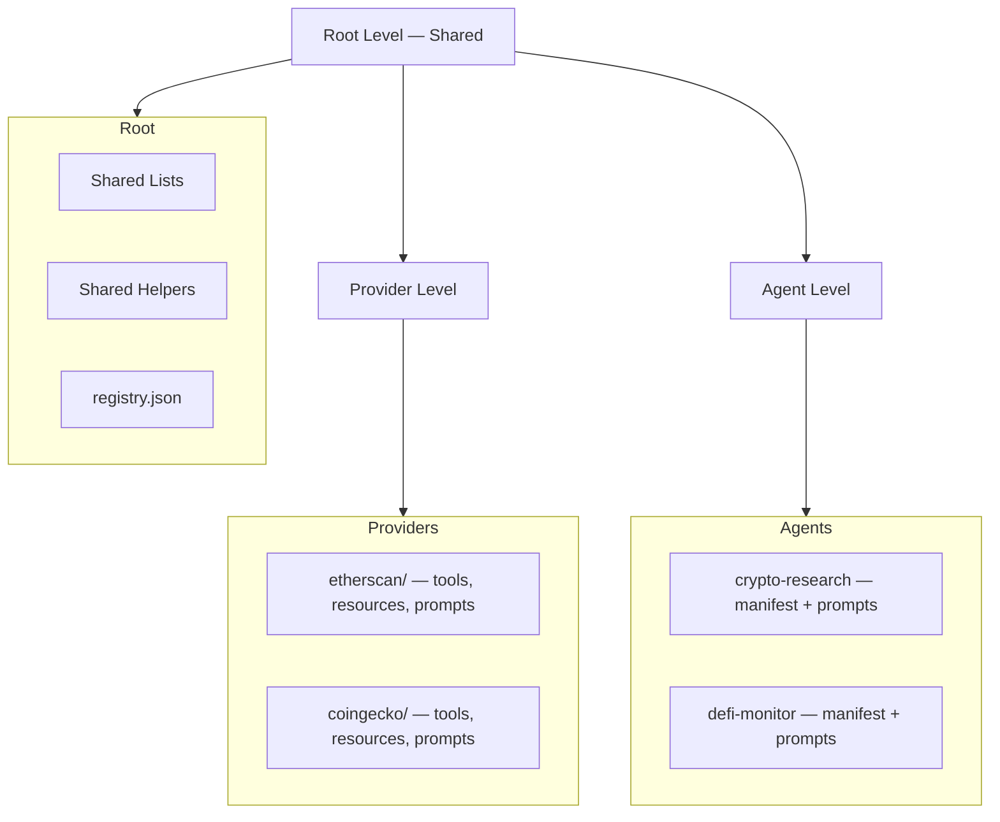

# FlowMCP Specification

 

FlowMCP is a **Tool Catalog with pre-built API templates** and a **Knowledge Base for API workflows**. It unifies access to APIs through two equal channels: **CLI** (direct access) and **MCP/A2A Server** (for agents and MCP clients). This repository contains the specification documents and reference examples — no executable code.

## Architecture

FlowMCP organizes its catalog in three levels:



**Root** holds shared lists, helpers, and the catalog manifest. **Providers** wrap APIs with deterministic tools. **Agents** compose tools from multiple providers for specific tasks.

## What's New in v3.0.0

| Feature | Description |
|---------|-------------|
| **Agents** | Groups evolve into full agent manifests with model binding, system prompts, tests, and tool cherry-picking |
| **Prompt Architecture** | Two-tier system: Provider-Prompts (model-neutral) + Agent-Prompts (model-specific with `testedWith`) |
| **Catalog** | Named directory with `registry.json` manifest. Multiple catalogs coexist independently |
| **ID Schema** | Unified `namespace/type/name` format for referencing tools, resources, and prompts |
| **Placeholder Syntax** | `{{type:name}}` for prompt/skill content — `{{tool:x}}`, `{{input:x}}`, `{{resource:x}}`, `{{skill:x}}` |
| **Test Minimum** | Increased from 1 to 3 per tool, resource query, and agent |
| **Agent Tests** | `expectedTools` (deterministic) + `expectedContent` (assertions) |
| **Three-Level Architecture** | Root (shared) → Provider (one API per namespace) → Agent (compositions) |

## Quickstart

```bash
git clone https://github.com/flowmcp/flowmcp-spec.git
cd flowmcp-spec
```

A minimal v3.0.0 schema:

```javascript
export const main = {
    namespace: 'coingecko',
    name: 'Ping',
    description: 'Check CoinGecko API server status',
    version: '3.0.0',
    root: 'https://api.coingecko.com/api/v3',
    requiredServerParams: [],
    requiredLibraries: [],
    tools: {
        ping: {
            method: 'GET',
            path: '/ping',
            description: 'Check if CoinGecko API is online',
            parameters: [],
            tests: [
                { _description: 'Basic health check', },
                { _description: 'Verify response format', },
                { _description: 'Confirm uptime', }
            ],
            output: {
                mimeType: 'application/json',
                schema: {
                    type: 'object',
                    properties: {
                        gecko_says: { type: 'string' }
                    }
                }
            }
        }
    }
}
```

## Specification Documents

| # | Document | Description |
|---|----------|-------------|
| 00 | [Overview](spec/v3.0.0/00-overview.md) | Vision, three-level architecture, LLM-First philosophy, terminology |
| 01 | [Schema Format](spec/v3.0.0/01-schema-format.md) | `main` + `handlers` structure, tool definitions, naming conventions |
| 02 | [Parameters](spec/v3.0.0/02-parameters.md) | Position/z blocks, shared list interpolation, `{{type:name}}` placeholder syntax |
| 03 | [Shared Lists](spec/v3.0.0/03-shared-lists.md) | Reusable value lists, dependencies, filtering, registry |
| 04 | [Output Schema](spec/v3.0.0/04-output-schema.md) | Output definitions, MIME-Types, response envelope |
| 05 | [Security](spec/v3.0.0/05-security.md) | Zero-import policy, library allowlist, static scan |
| 06 | [Agents](spec/v3.0.0/06-agents.md) | Agent manifests, model binding, system prompts, tool cherry-picking |
| 07 | [Tasks](spec/v3.0.0/07-tasks.md) | MCP Tasks async fields (reserved) |
| 08 | [Migration](spec/v3.0.0/08-migration.md) | v1.2.0 → v2.0.0 → v3.0.0 migration guides |
| 09 | [Validation Rules](spec/v3.0.0/09-validation-rules.md) | Complete validation checklist across all categories |
| 10 | [Tests](spec/v3.0.0/10-tests.md) | Tool tests, resource tests, agent tests, response capture |
| 11 | [Preload](spec/v3.0.0/11-preload.md) | Schema initialization with startup data |
| 12 | [Prompt Architecture](spec/v3.0.0/12-prompt-architecture.md) | Provider-Prompts, Agent-Prompts, composable references |
| 13 | [Resources](spec/v3.0.0/13-resources.md) | SQLite resources, queries, parameter binding |
| 14 | [Skills](spec/v3.0.0/14-skills.md) | Skill .mjs format, placeholders, versioning |
| 15 | [Catalog](spec/v3.0.0/15-catalog.md) | Catalog manifest, registry.json, import flow |
| 16 | [ID Schema](spec/v3.0.0/16-id-schema.md) | Unified `namespace/type/name` format |

## LLM-Consumable Specification

The complete specification is available as a single concatenated file for LLM consumption:

- **[spec/v3.0.0/llms.txt](https://raw.githubusercontent.com/FlowMCP/flowmcp-spec/refs/heads/main/spec/v3.0.0/llms.txt)** — All 17 spec documents in one file

This file is auto-generated by a GitHub Action whenever spec files change.

## Examples

| File | Description |
|------|-------------|
| [Agent Manifest](examples/v3.0.0/agents/crypto-research/agent.mjs) | Complete agent with `export const main`, tool cherry-picking, tests |
| [Agent-Skill](examples/v3.0.0/agents/crypto-research/skills/token-deep-dive.mjs) | Model-specific skill with `testedWith` and `{{tool:x}}` references |
| [Provider-Prompt](examples/v3.0.0/providers/coingecko-com/prompts/price-comparison.mjs) | Model-neutral prompt scoped to one namespace |
| [Registry](examples/v3.0.0/registry.json) | Sample catalog manifest with schemas and agents |

## Design Principles

1. **Deterministic over clever** — Same input always produces same API call
2. **Declare over code** — Maximize the `main` block, minimize handlers
3. **Inject over import** — Schemas receive data through dependency injection, never import
4. **Hash over trust** — Integrity verification through SHA-256 hashes
5. **Constrain over permit** — Security by default, explicit opt-in for capabilities

## Related Repositories

| Repository | Description |
|------------|-------------|
| [flowmcp-core](https://github.com/flowmcp/flowmcp-core) | Core framework — Schema validation, Agent manifest loading, Tool execution |
| [flowmcp-cli](https://github.com/flowmcp/flowmcp-cli) | CLI — Search, activate, and run tools and agents |
| [flowmcp-schemas](https://github.com/flowmcp/flowmcp-schemas) | Schema Library — 370+ API schemas, community catalog, agent definitions |
| [mcp-agent-server](https://github.com/flowmcp/mcp-agent-server) | Agent Server — Deploy FlowMCP agents as MCP/A2A servers |

## Contributing

Contributions welcome. For spec changes, open an issue first to discuss the proposed change.

## License

MIT
