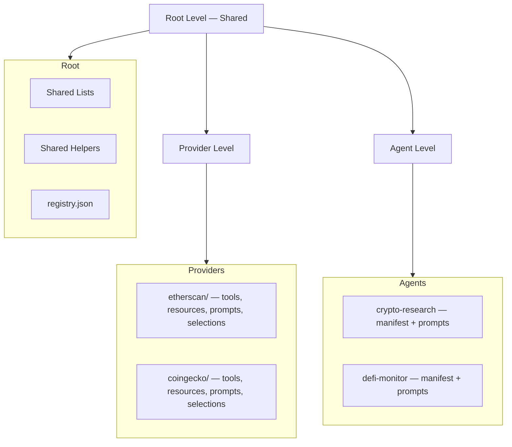

# FlowMCP Specification

 

FlowMCP is a **Tool Catalog with pre-built API templates** and a **Knowledge Base for API workflows**. It unifies access to APIs through two equal channels: **CLI** (direct access) and **MCP/A2A Server** (for agents and MCP clients). This repository contains the specification documents and reference examples — no executable code.

## Architecture

FlowMCP organizes its catalog in three levels:



**Root** holds shared lists, helpers, and the catalog manifest. **Providers** wrap APIs with deterministic tools, resources, prompts, and selections. **Agents** compose tools from multiple providers for specific tasks.

## What's New in v4.0.0

| Feature | Description |
|---------|-------------|
| **Five Primitives** | `tools`, `resources`, `prompts`, `skills`, `selections` — first-class entities at provider level |
| **Selections** | Cross-provider tool/resource compositions with prefill and parameter binding |
| **Prefill** | Schema-side parameter pre-population for downstream tool/resource calls |
| **Optional `meta` Block** | Per-schema metadata: `docs`, `termsOfService`, `dataLicense` — runtime-injected, not persisted in schema |
| **Scoring Protocol v1** | Two-dimension grade (`whenToUse` + `parameters`), 1.0–5.0 scale, Production gate at >= 3.5 |
| **Schema Lifecycle** | Defined stages: Research → Creation → API-Test → Validation → Grade → Production |
| **runSql / describeTables** | First-class resource patterns for SQLite-backed resources |
| **MCP Integration** | Formal MCP server bindings and primitive mapping |

## Quickstart

```bash
git clone https://github.com/FlowMCP/flowmcp-spec.git
cd flowmcp-spec
```

A minimal v4.0.0 schema:

```javascript
export const schema = {
    main: {
        namespace: 'coingecko',
        name: 'Ping',
        description: 'Check CoinGecko API server status',
        version: '4.0.0',
        root: 'https://api.coingecko.com/api/v3',
        requiredServerParams: [],
        requiredLibraries: []
    },
    tools: {
        ping: {
            method: 'GET',
            path: '/ping',
            description: 'Check if CoinGecko API is online',
            parameters: [],
            tests: [
                { _description: 'Basic health check' },
                { _description: 'Verify response format' },
                { _description: 'Confirm uptime' }
            ],
            output: {
                mimeType: 'application/json',
                schema: {
                    type: 'object',
                    properties: {
                        gecko_says: { type: 'string' }
                    }
                }
            }
        }
    }
}
```

## Specification Documents

| # | Document | Description |
|---|----------|-------------|
| 00 | [Overview](spec/v4.0.0/00-overview.md) | Vision, three-level architecture, LLM-First philosophy, terminology |
| 01 | [Schema Format](spec/v4.0.0/01-schema-format.md) | `main` + five primitives, optional `meta` block, naming conventions |
| 02 | [Parameters](spec/v4.0.0/02-parameters.md) | Position/z blocks, shared list interpolation, `{{type:name}}` syntax |
| 03 | [Shared Lists](spec/v4.0.0/03-shared-lists.md) | Reusable value lists, dependencies, filtering, registry |
| 04 | [Output Schema](spec/v4.0.0/04-output-schema.md) | Output definitions, MIME-Types, response envelope |
| 05 | [Security](spec/v4.0.0/05-security.md) | Zero-import policy, library allowlist, static scan |
| 06 | [Agents](spec/v4.0.0/06-agents.md) | Agent manifests, model binding, system prompts, tool cherry-picking |
| 07 | [Tasks](spec/v4.0.0/07-tasks.md) | MCP Tasks async fields (reserved) |
| 08 | [Migration](spec/v4.0.0/08-migration.md) | v1.2.0 → v2.0.0 → v3.0.0 → v4.0.0 migration guides |
| 09 | [Validation Rules](spec/v4.0.0/09-validation-rules.md) | Complete validation checklist across all categories |
| 10 | [Tests](spec/v4.0.0/10-tests.md) | Tool tests, resource tests, agent tests, response capture |
| 11 | [Preload](spec/v4.0.0/11-preload.md) | Schema initialization with startup data |
| 12 | [Prompt Architecture](spec/v4.0.0/12-prompt-architecture.md) | Provider-Prompts, Agent-Prompts, composable references |
| 13 | [Resources](spec/v4.0.0/13-resources.md) | SQLite resources, queries, runSql/describeTables, parameter binding |
| 14 | [Skills](spec/v4.0.0/14-skills.md) | Skill .mjs format, placeholders, versioning |
| 15 | [Catalog](spec/v4.0.0/15-catalog.md) | Catalog manifest, registry.json, import flow |
| 16 | [ID Schema](spec/v4.0.0/16-id-schema.md) | Unified `namespace/type/name` format |
| 17 | [Selections](spec/v4.0.0/17-selections.md) | Cross-provider compositions with prefill |
| 18 | [Prefill](spec/v4.0.0/18-prefill.md) | Schema-side parameter pre-population |
| 19 | [MCP Integration](spec/v4.0.0/19-mcp-integration.md) | MCP server bindings, primitive mapping |
| 20 | [Validation Strategy](spec/v4.0.0/20-validation-strategy.md) | Multi-layer validation: structure, lifecycle, grade |
| 21 | [Schema Lifecycle](spec/v4.0.0/21-schema-lifecycle.md) | Stages, gates, hold/blocked states |
| 22 | [Scoring Protocol](spec/v4.0.0/22-scoring-protocol.md) | GradeReporter scoring v1 — whenToUse + parameters dimensions |

## Legacy Specifications

Historic versions are preserved for backward-compatibility documentation:

- [Spec v3.0.0](spec/v3.0.0/) — 17 documents (frozen)
- [Spec v2.0.0](spec/v2.0.0/) — 13 documents (frozen)

## LLM-Consumable Specification

The complete specification is available as a single concatenated file for LLM consumption:

- **[spec/v4.0.0/llms.txt](https://raw.githubusercontent.com/FlowMCP/flowmcp-spec/refs/heads/main/spec/v4.0.0/llms.txt)** — All 23 spec documents in one file

This file is auto-generated by a GitHub Action whenever spec files change.

## Examples

| File | Description |
|------|-------------|
| [Providers](examples/v4.0.0/providers/) | Reference provider schemas across the five primitives |
| [Selections](examples/v4.0.0/selections/) | Cross-provider composition examples |
| [Registry](examples/v4.0.0/registry.json) | Sample catalog manifest with schemas and agents |

## Design Principles

1. **Deterministic over clever** — Same input always produces same API call
2. **Declare over code** — Maximize the `main` block, minimize handlers
3. **Inject over import** — Schemas receive data through dependency injection, never import
4. **Hash over trust** — Integrity verification through SHA-256 hashes
5. **Constrain over permit** — Security by default, explicit opt-in for capabilities

## Related Repositories

| Repository | Description |
|------------|-------------|
| [flowmcp-core](https://github.com/FlowMCP/flowmcp-core) | Core framework — Schema validation, Agent manifest loading, Tool execution |
| [flowmcp-cli](https://github.com/FlowMCP/flowmcp-cli) | CLI — Develop, validate, grade, deploy MCP schemas |
| [flowmcp-schemas-public](https://github.com/FlowMCP/flowmcp-schemas-public) | Public Schema Library — Production-graded MCP tools |
| [flowmcp.github.io](https://github.com/FlowMCP/flowmcp.github.io) | Documentation site — Specification, ecosystem overview |

## Contributing

Contributions welcome. For spec changes, open an issue first to discuss the proposed change.

## License & Terms of Services

The FlowMCP Specification is **MIT-licensed**. The specification covers the schema definition format and reference examples in this repository.

**Schemas built using this specification** access third-party APIs, each with their own Terms of Services. Users are responsible for reviewing each API provider's terms before use. FlowMCP makes no representation about ToS compliance, data licensing, or fitness for any purpose.

## License

MIT
