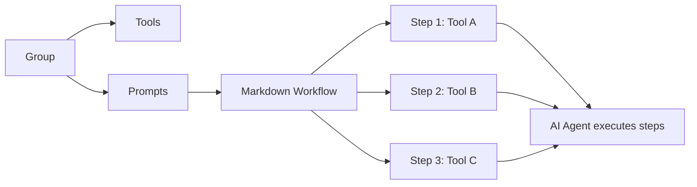
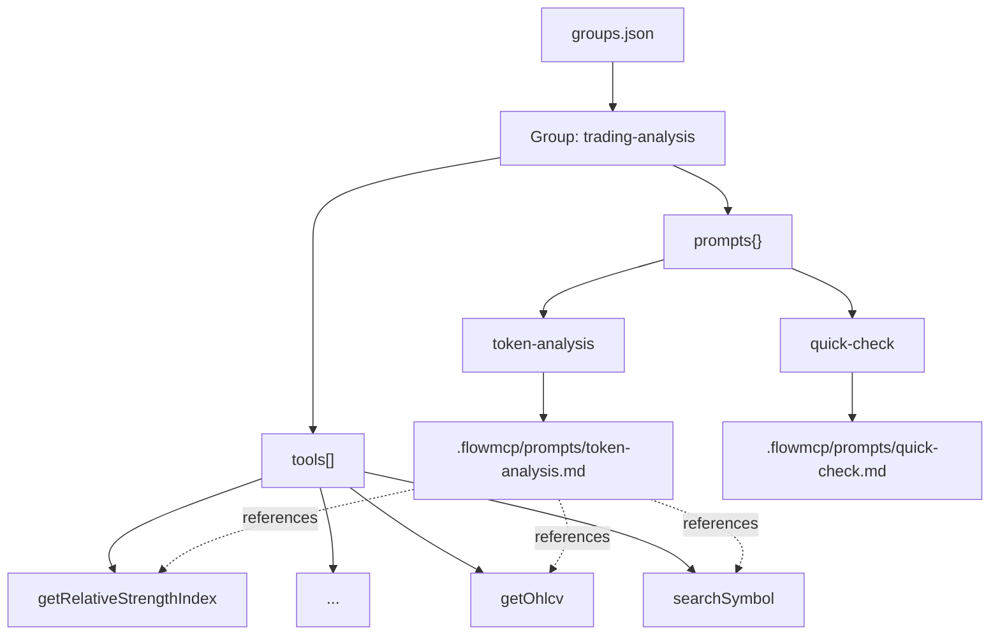

# FlowMCP Specification v2.0.0 — Group Prompts

Prompts bridge the deterministic tool layer (FlowMCP) with non-deterministic AI orchestration. Groups define **which** tools are available; prompts define **how** to use them together. A prompt is a Markdown workflow that guides an AI agent through a multi-step task, referencing specific tools from the group's tool list.

---

## Table of Contents

1. [Introduction](#introduction)
2. [Prompt File Format](#prompt-file-format)
3. [Group Config Extension](#group-config-extension)
4. [Naming Conventions](#naming-conventions)
5. [CLI Commands](#cli-commands)
6. [Validation Rules](#validation-rules)
7. [Complete Example](#complete-example)

---

## Introduction

FlowMCP schemas guarantee that individual tools behave deterministically — the same input always produces the same API call. But real-world tasks rarely involve a single tool. Analyzing a token requires price data, on-chain metrics, technical indicators, and chart generation. An agent needs to know not just which tools exist, but in what order to call them, how to pipe outputs between steps, and what final artifact to produce.

Prompts solve this by attaching reusable, human-readable workflows to groups. Each prompt is a Markdown file that declares inputs, describes a step-by-step workflow referencing tools from the group, and specifies the expected output. The AI agent reads the prompt, resolves the referenced tools from the group's tool list, and executes the workflow.



The diagram shows how a group contains both tools and prompts. Each prompt references tools from the group and defines a workflow that the AI agent executes step by step.

### Separation of Concerns

| Layer | Nature | Responsibility |
|-------|--------|----------------|
| Schema | Deterministic | Defines individual tool behavior (parameters, URL, response) |
| Group | Deterministic | Defines which tools are available (cherry-picked, hash-verified) |
| Prompt | Non-deterministic | Defines how tools are composed into workflows (AI-interpreted) |

Prompts are intentionally non-deterministic. The AI agent interprets the workflow steps, decides how to handle edge cases, and adapts to intermediate results. The deterministic guarantees remain at the tool level — each individual tool call within the workflow is still schema-validated and reproducible.

---

## Prompt File Format

Prompts are stored as `.md` files in `.flowmcp/prompts/`. Each file follows a structured Markdown format with required and optional sections.

### File Location

```
.flowmcp/
├── groups.json
├── prompts/
│   ├── token-analysis.md
│   ├── portfolio-snapshot.md
│   └── whale-alert.md
└── tools/
```

### Required Sections

Every prompt file must contain at minimum `# Title` and `## Workflow`:

| Section | Heading | Required | Description |
|---------|---------|----------|-------------|
| Title | `# <title>` | Yes | Human-readable prompt name. First line of the file. |
| Description | `## Description` | No | What this prompt does, 1-3 sentences. |
| Input | `## Input` | No | Parameters the user provides when invoking the prompt. |
| Workflow | `## Workflow` | Yes | Step-by-step instructions referencing tools from the group. |
| Output | `## Output` | No | What the prompt produces as a final artifact. |

### Section Details

#### Title (`# <title>`)

The first line of every prompt file. Must be a level-1 Markdown heading. This is the human-readable name shown in prompt listings and search results.

```markdown
# Standard Token Analysis
```

#### Description (`## Description`)

A short explanation of what the prompt does. Appears in `flowmcp prompt list` and `flowmcp prompt search` output.

```markdown
## Description
Generate a comprehensive technical analysis report for any financial instrument.
Combines price data, technical indicators, and chart generation into a single Markdown report.
```

#### Input (`## Input`)

Declares parameters the user must provide when invoking the prompt. Each parameter is a list item with a name, type, required/optional flag, and description.

```markdown
## Input
- `tokenName` (string, required): Name or ticker symbol of the instrument
- `period` (number, optional): Number of days for historical data. Default: 200
```

Input parameters are not validated by FlowMCP — they are passed to the AI agent as context. The agent uses them when constructing tool calls within the workflow.

#### Workflow (`## Workflow`)

The core of the prompt. Contains step-by-step instructions that reference tools from the group's tool list. Steps are numbered subsections (`### Step N: <title>`).

```markdown
## Workflow
### Step 1: Symbol Resolution
Search for `{tokenName}` using `searchSymbol`.
Select the first result matching the query.

### Step 2: Fetch Price Data
Using the resolved symbol, call `getOhlcv` with:
- interval: 1d
- period1: 200 days ago from today
```

Workflow steps can be:

- **Deterministic**: "Call `getPrice` with symbol = resolved symbol" — always executed the same way.
- **Conditional**: "If RSI > 70, add an overbought warning to the report" — the AI agent decides based on intermediate results.
- **Iterative**: "For each indicator in the list, compute the value" — the AI agent loops over a dynamic set.

Tool references use the **route name** from the group's tool list (e.g. `searchSymbol`, `getOhlcv`). The route name is the portion after `::` in the fully qualified tool reference. The AI agent resolves the full tool reference from the group context.

#### Output (`## Output`)

Describes the final artifact the prompt produces. This helps the AI agent understand the expected deliverable.

```markdown
## Output
- Markdown document with embedded base64 chart images
- Indicator summary with BUY/SELL/HOLD signals
- Last 10 days data table
```

---

## Group Config Extension

Prompts are declared in the group definition inside `.flowmcp/groups.json`. Each group gains an optional `prompts` field that maps prompt names to their metadata and file paths.

### Extended Group Format

```json
{
    "specVersion": "2.0.0",
    "groups": {
        "trading-analysis": {
            "description": "Technical analysis and charting tools",
            "tools": [
                "yahoofinance/market.mjs::searchSymbol",
                "yahoofinance/market.mjs::getOhlcv",
                "indicators/oscillators.mjs::getRelativeStrengthIndex",
                "indicators/averages.mjs::getSimpleMovingAverage",
                "indicators/averages.mjs::getMovingAverageConvergenceDivergence",
                "indicators/volatility.mjs::getBollingerBands",
                "charting/charts.mjs::generateCandlestickChart",
                "charting/charts.mjs::generateLineChart",
                "charting/charts.mjs::generateMultiLineChart"
            ],
            "hash": "sha256:a1b2c3d4e5f6...",
            "prompts": {
                "token-analysis": {
                    "title": "Standard Token Analysis",
                    "description": "Full technical analysis report for a token",
                    "file": ".flowmcp/prompts/token-analysis.md"
                },
                "quick-check": {
                    "title": "Quick Price Check",
                    "description": "Current price and basic indicators",
                    "file": ".flowmcp/prompts/quick-check.md"
                }
            }
        }
    }
}
```

### Prompt Entry Fields

| Field | Type | Required | Description |
|-------|------|----------|-------------|
| `title` | `string` | Yes | Human-readable prompt title. Displayed in listings and search results. |
| `description` | `string` | Yes | What the prompt does, 1-2 sentences. Used for search matching. |
| `file` | `string` | Yes | Relative path to the Markdown prompt file from the project root. |

### Relationship Between Group, Tools, and Prompts



The diagram shows that a group contains both a `tools` array and a `prompts` object. Each prompt entry points to a Markdown file. The Markdown file references tools by their route name. All referenced tools must exist in the group's `tools` array.

---

## Naming Conventions

| Element | Convention | Pattern | Example |
|---------|-----------|---------|---------|
| Prompt name (key in `prompts`) | Lowercase with hyphens | `^[a-z][a-z0-9-]*$` | `token-analysis` |
| Prompt filename | Matches prompt name + `.md` | `^[a-z][a-z0-9-]*\.md$` | `token-analysis.md` |
| Prompt title (`# <title>`) | Human-readable, title case | Free text | `Standard Token Analysis` |
| Prompt directory | Fixed path | `.flowmcp/prompts/` | `.flowmcp/prompts/token-analysis.md` |

### Name-to-File Mapping

The prompt name in `groups.json` must match the filename (without extension) of the Markdown file:

```
Prompt name:  "token-analysis"
File:         ".flowmcp/prompts/token-analysis.md"
```

This convention ensures predictability — given a prompt name, the file path is deterministic.

---

## CLI Commands

| Command | Description |
|---------|-------------|
| `flowmcp prompt list` | List all prompts across all groups |
| `flowmcp prompt search <query>` | Search prompts by title or description |
| `flowmcp prompt show <group>/<name>` | Display the full prompt content |
| `flowmcp prompt add <group> <name> --file <path>` | Add a prompt to a group |
| `flowmcp prompt remove <group> <name>` | Remove a prompt from a group |

### Command Details

**List** shows all prompts with their group, title, and tool count:

```bash
flowmcp prompt list
# -> trading-analysis/token-analysis    "Standard Token Analysis"     9 tools
# -> trading-analysis/quick-check       "Quick Price Check"           9 tools
# -> defi-monitor/tvl-report            "TVL Monitoring Report"       5 tools
```

**Search** finds prompts by title or description:

```bash
flowmcp prompt search analysis
# -> trading-analysis/token-analysis    "Standard Token Analysis"
# ->   Full technical analysis report for a token
```

**Show** displays the full Markdown content of a prompt:

```bash
flowmcp prompt show trading-analysis/token-analysis
# -> (renders token-analysis.md content)
```

The `<group>/<name>` format uniquely identifies a prompt. The same prompt name can exist in different groups.

**Add** registers a prompt file with a group. The file must already exist:

```bash
flowmcp prompt add trading-analysis token-analysis --file .flowmcp/prompts/token-analysis.md
# -> Added prompt "token-analysis" to group "trading-analysis"
# ->   Title: "Standard Token Analysis"
# ->   File:  .flowmcp/prompts/token-analysis.md
```

On add, the CLI:
1. Verifies the file exists and contains `# Title` and `## Workflow`
2. Validates that all tool references in the workflow exist in the group's tool list
3. Writes the prompt entry to `groups.json`

**Remove** deletes the prompt entry from `groups.json`. The Markdown file is not deleted:

```bash
flowmcp prompt remove trading-analysis token-analysis
# -> Removed prompt "token-analysis" from group "trading-analysis"
# ->   File .flowmcp/prompts/token-analysis.md was NOT deleted
```

---

## Validation Rules

Prompt validation runs on `flowmcp prompt add` and can be triggered explicitly during group verification.

### Validation Checklist

| Rule | Code | Error Message |
|------|------|---------------|
| Prompt name pattern | `PRM001` | `PRM001 "My Prompt": Name must match ^[a-z][a-z0-9-]*$` |
| File exists | `PRM002` | `PRM002 "token-analysis": File not found at .flowmcp/prompts/token-analysis.md` |
| File has title | `PRM003` | `PRM003 "token-analysis": Missing required section # Title (first line)` |
| File has workflow | `PRM004` | `PRM004 "token-analysis": Missing required section ## Workflow` |
| Tool references resolve | `PRM005` | `PRM005 "token-analysis": Tool "getPrice" not found in group "trading-analysis"` |
| Group has tools | `PRM006` | `PRM006 "empty-group": Group must have at least one tool to have prompts` |
| No duplicate names | `PRM007` | `PRM007 "trading-analysis": Duplicate prompt name "token-analysis"` |
| Filename matches name | `PRM008` | `PRM008 "token-analysis": File must be named token-analysis.md, got report.md` |

### Tool Reference Detection

The validator scans the `## Workflow` section for backtick-enclosed tool names. A word inside backticks is considered a tool reference if it matches the route name portion of any tool in the group's `tools` array.

```
Group tools:
  - yahoofinance/market.mjs::searchSymbol
  - yahoofinance/market.mjs::getOhlcv

Workflow text:
  "Search for the token using `searchSymbol`."

Detected tool reference: searchSymbol
Resolved: yahoofinance/market.mjs::searchSymbol -> valid
```

Tool references that do not match any route name in the group produce a `PRM005` warning. This is a **warning**, not an error — the backtick-enclosed word may be a parameter name, a code keyword, or a non-tool reference. The `flowmcp prompt add` command reports these warnings but does not block the add operation.

### Validation Sequence

```
1. Validate prompt name matches ^[a-z][a-z0-9-]*$
2. Validate file exists at declared path
3. Validate filename matches prompt name + .md
4. Parse Markdown file:
   a. Check for # Title on first line
   b. Check for ## Workflow section
5. Validate group has at least one tool
6. Scan ## Workflow for backtick-enclosed tool references
7. For each detected reference:
   a. Check if it matches a route name in the group's tools
   b. Report unresolved references as warnings
```

---

## Complete Example

This example demonstrates a full prompt for technical analysis of a financial instrument. The prompt belongs to the `trading-analysis` group defined in the [Group Config Extension](#group-config-extension) section.

### Group Definition (in `.flowmcp/groups.json`)

```json
{
    "specVersion": "2.0.0",
    "groups": {
        "trading-analysis": {
            "description": "Technical analysis and charting tools",
            "tools": [
                "yahoofinance/market.mjs::searchSymbol",
                "yahoofinance/market.mjs::getOhlcv",
                "indicators/oscillators.mjs::getRelativeStrengthIndex",
                "indicators/averages.mjs::getSimpleMovingAverage",
                "indicators/averages.mjs::getMovingAverageConvergenceDivergence",
                "indicators/volatility.mjs::getBollingerBands",
                "charting/charts.mjs::generateCandlestickChart",
                "charting/charts.mjs::generateLineChart",
                "charting/charts.mjs::generateMultiLineChart"
            ],
            "hash": "sha256:a1b2c3d4e5f6...",
            "prompts": {
                "token-analysis": {
                    "title": "Standard Token Analysis",
                    "description": "Full technical analysis report for a token",
                    "file": ".flowmcp/prompts/token-analysis.md"
                }
            }
        }
    }
}
```

### Prompt File (`.flowmcp/prompts/token-analysis.md`)

```markdown
# Standard Token Analysis

## Description
Generate a comprehensive technical analysis report for any financial instrument.
Combines price data, technical indicators, and chart generation into a single
Markdown report with embedded visualizations.

## Input
- `tokenName` (string, required): Name or ticker symbol of the instrument

## Workflow
### Step 1: Symbol Resolution
Search for `{tokenName}` using `searchSymbol` from yahoofinance.
Select the first result matching the query.

### Step 2: Fetch Price Data
Using the resolved symbol, call `getOhlcv` with:
- interval: 1d
- period1: 200 days ago from today

### Step 3: Compute Indicators
From OHLCV data, compute:
1. `getRelativeStrengthIndex` with closings, period=14
2. `getSimpleMovingAverage` with closings, period=20
3. `getSimpleMovingAverage` with closings, period=200
4. `getMovingAverageConvergenceDivergence` with closings, fast=12, slow=26, signal=9
5. `getBollingerBands` with closings, period=20

### Step 4: Generate Charts
1. `generateCandlestickChart` with OHLCV data + SMA overlays
2. `generateLineChart` for RSI values
3. `generateMultiLineChart` for MACD lines

### Step 5: Report
Produce a Markdown document with:
- Header: symbol, current price, date range
- Summary table of indicator signals
- Embedded chart images
- Last 10 days data table

## Output
- Markdown document with embedded base64 chart images
- Indicator summary with BUY/SELL/HOLD signals
```

### What This Example Demonstrates

1. **Group with prompts** — the `trading-analysis` group defines both a `tools` array and a `prompts` object.
2. **Prompt metadata in groups.json** — the `token-analysis` prompt has a `title`, `description`, and `file` path.
3. **Structured Markdown format** — the prompt file has all five sections: Title, Description, Input, Workflow, Output.
4. **Tool references in workflow** — backtick-enclosed names (`searchSymbol`, `getOhlcv`, `getRelativeStrengthIndex`, etc.) all resolve to tools in the group.
5. **Input parameter placeholders** — `{tokenName}` in the workflow references the `tokenName` input parameter.
6. **Deterministic steps** — "call `getOhlcv` with interval: 1d" leaves no ambiguity.
7. **Conditional interpretation** — "Select the first result matching the query" requires AI judgment.
8. **Multi-tool composition** — the workflow chains 9 tools across 5 steps into a single deliverable.

### CLI Walkthrough

```bash
# Create the prompt file first
# (write .flowmcp/prompts/token-analysis.md with the content above)

# Add the prompt to the group
flowmcp prompt add trading-analysis token-analysis --file .flowmcp/prompts/token-analysis.md
# -> Added prompt "token-analysis" to group "trading-analysis"
# ->   Title: "Standard Token Analysis"
# ->   Resolved tool references: searchSymbol, getOhlcv, getRelativeStrengthIndex,
# ->     getSimpleMovingAverage, getMovingAverageConvergenceDivergence,
# ->     getBollingerBands, generateCandlestickChart, generateLineChart,
# ->     generateMultiLineChart
# ->   All 9 references found in group tools

# List prompts
flowmcp prompt list
# -> trading-analysis/token-analysis    "Standard Token Analysis"     9 tools

# Show prompt content
flowmcp prompt show trading-analysis/token-analysis
# -> (renders the full Markdown content)

# Remove prompt (does not delete the file)
flowmcp prompt remove trading-analysis token-analysis
# -> Removed prompt "token-analysis" from group "trading-analysis"
```
