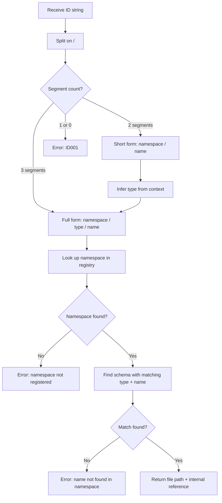

# FlowMCP Specification v3.0.0 — ID Schema

A unified ID system for referencing Tools, Resources, and Prompts across the FlowMCP ecosystem. IDs must be unambiguous, human-readable, and resolvable. This document defines the ID format, component rules, short form conventions, resolution algorithm, placeholder integration, namespace governance, and validation rules.

---

## Purpose

FlowMCP exposes three MCP primitives — Tools, Resources, and Skills (prompts) — across potentially hundreds of schemas from dozens of providers. As the ecosystem grows, references to these primitives appear in multiple contexts: group definitions, skill placeholders, registry entries, CLI commands, and cross-schema dependencies.

Without a unified ID system, references are ambiguous. Does `simplePrice` refer to a tool, a resource, or a prompt? Which provider owns it? Is `evmChains` a tool name or a shared list?

The ID schema solves this by defining a **structured, human-readable identifier format** that uniquely identifies any primitive in the ecosystem. Every tool, resource, prompt, and shared list has exactly one canonical ID.

```mermaid
flowchart LR
    A[Namespace] --> B[/]
    B --> C[Resource Type]
    C --> D[/]
    D --> E[Name]
    E --> F["coingecko/tool/simplePrice"]
```

The diagram shows the three components of a full ID separated by `/` delimiters, forming a single unambiguous reference string.

---

## Format

The canonical ID format is a three-segment string separated by `/`:

```
namespace/resourceType/name
```

### Full Form Examples

| ID | Description |
|----|-------------|
| `coingecko/tool/simplePrice` | Tool from CoinGecko provider |
| `coingecko/resource/supported-coins` | Resource from CoinGecko |
| `coingecko/prompt/price-comparison` | Prompt from CoinGecko |
| `crypto-research/prompt/token-deep-dive` | Agent prompt |
| `shared/list/evmChains` | Shared list reference |

Each segment serves a distinct purpose: the namespace identifies the owner, the resource type discriminates the primitive kind, and the name identifies the specific item within that namespace and type.

---

## Components

| Component | Pattern | Required | Description |
|-----------|---------|----------|-------------|
| namespace | `^[a-z][a-z0-9-]*$` | Yes | Provider or agent identifier. Lowercase letters, digits, and hyphens. Must start with a letter. |
| resourceType | `tool`, `resource`, `prompt`, `list` | Context-dependent | Type discriminator. Required in full form. Omittable in short form when context is unambiguous (see [Short Form](#short-form)). |
| name | `^[a-zA-Z][a-zA-Z0-9-]*$` | Yes | Resource name. camelCase for tools and resources, kebab-case for prompts. Must start with a letter. |

### Component Details

#### Namespace

The namespace identifies the owner of the primitive. It is derived from the provider's domain name or agent name and must be globally unique within a FlowMCP registry.

```
coingecko          ← provider namespace
etherscan          ← provider namespace
defilama           ← provider namespace
crypto-research    ← agent namespace
shared             ← reserved namespace for shared lists
```

Namespace rules:
- Lowercase letters, digits, and hyphens only
- Must start with a letter
- No dots, underscores, or uppercase characters
- `shared` is a reserved namespace (see [Namespace Rules](#namespace-rules))

#### Resource Type

The resource type discriminates between the four kinds of addressable primitives:

| Type | Maps To | Defined In |
|------|---------|-----------|
| `tool` | MCP `server.tool` | `main.tools` |
| `resource` | MCP `server.resource` | `main.resources` |
| `prompt` | MCP `server.prompt` | `main.skills` |
| `list` | Shared list | `list.meta.name` |

#### Name

The name identifies the specific primitive within its namespace and type. Naming conventions follow the same rules as schema element names (see `01-schema-format.md`):

| Primitive | Convention | Example |
|-----------|-----------|---------|
| Tool | camelCase | `simplePrice`, `getContractAbi` |
| Resource | camelCase | `tokenLookup`, `chainConfig` |
| Prompt | kebab-case | `price-comparison`, `token-deep-dive` |
| Shared List | camelCase | `evmChains`, `countryCodes` |

---

## Short Form

When the resource type is unambiguous from context, the `resourceType` segment can be omitted:

```
coingecko/simplePrice          ← tool (default in tool contexts)
coingecko/price-comparison     ← prompt (when in prompt context)
```

### Short Form Rules

| Context | Default Type | Example |
|---------|-------------|---------|
| `manifest.tools[]` | `tool` | `coingecko/simplePrice` |
| CLI `flowmcp call` | `tool` | `flowmcp call coingecko/simplePrice` |
| `{{type:name}}` placeholder in skill content | Determined by type prefix | `{{tool:simplePrice}}` resolves to tool |
| Validation rules | Full form required | `coingecko/tool/simplePrice` |
| `registry.json` | Full form required | `coingecko/tool/simplePrice` |
| Group definitions | Full form required | `coingecko/tool/simplePrice` |

### When Short Form Is Allowed

- In tool contexts (`manifest.tools[]`, CLI call commands), the default type is `tool`
- In prompt content (`{{type:name}}` references), the type is determined by the placeholder prefix (`tool:`, `resource:`, `skill:`, `input:`)
- Short form is a convenience — it does not change the canonical ID

### When Full Form Is Required

- In `registry.json` entries — the registry is the source of truth and must be unambiguous
- In validation rules and error messages — precision matters for debugging
- In group definitions — groups compose primitives across schemas and types
- In any context where multiple types share the same namespace

---

## Resolution

How IDs are resolved to actual files, schemas, and internal references.

### Resolution Algorithm



The diagram shows the resolution flow from receiving an ID string through parsing, namespace lookup, and name matching to the final file path reference.

### Resolution Steps

1. **Parse** — split the ID string on `/` to extract segments. If three segments: namespace, type, name. If two segments: namespace, name (type inferred from context). If fewer than two segments: validation error ID001.
2. **Find** — look up the namespace in the loaded registry or schema catalog. The registry maps namespaces to schema file locations.
3. **Match** — within the namespace, find the schema, tool, resource, or prompt with the matching name and type.
4. **Return** — produce the resolved reference: file path to the schema file and the internal key path (e.g., `main.tools.simplePrice`).

### Resolution Context

The resolution context determines how short-form IDs are expanded:

| Caller | Context | Short Form Expansion |
|--------|---------|---------------------|
| CLI (`flowmcp call`) | Tool execution | `namespace/name` becomes `namespace/tool/name` |
| Skill placeholder (`{{type:name}}`) | Content rendering | Type determined by placeholder prefix (`tool:`, `resource:`, `skill:`, `input:`) |
| Group definition | Group loading | Full form required — no expansion |
| Validator | Schema validation | Full form required — no expansion |

---

## Usage in Placeholders

The ID schema connects to the `{{type:name}}` placeholder syntax used in skill content (see `14-skills.md`). Skill content uses typed placeholders with a `type:` prefix to reference tools, resources, skills, and input parameters.

| Placeholder | Interpretation |
|-------------|---------------|
| `{{tool:getContractAbi}}` | Tool reference — resolved to a tool in the same schema's `main.tools` |
| `{{resource:verifiedContracts}}` | Resource reference — resolved to a resource in the same schema's `main.resources` |
| `{{skill:quick-summary}}` | Skill reference — resolved to a skill in the same schema's `main.skills` |
| `{{input:address}}` | Input parameter — value provided by the user at runtime |

### Resolution in Skills

When a skill's `content` field contains `{{tool:name}}`, `{{resource:name}}`, or `{{skill:name}}` placeholders, the runtime:

1. Parses the placeholder type prefix to determine the primitive kind
2. Resolves the name to a registered primitive within the same schema
3. Injects the primitive's description or metadata into the rendered content

The ID schema provides the canonical identifier format (`namespace/type/name`) used in registries, group definitions, and cross-schema references. Within skill content, the `{{type:name}}` syntax references primitives scoped to the same schema.

---

## Namespace Rules

Namespaces are the top-level organizational unit. They must be unique within a registry and follow strict governance rules.

### Namespace Assignment

| Source | Namespace Derivation | Example |
|--------|---------------------|---------|
| API Provider | Domain-derived name | `coingecko`, `etherscan`, `defilama` |
| Agent | Agent name | `crypto-research`, `defi-monitor` |
| Shared resources | Reserved `shared` | `shared/list/evmChains` |

### Provider Namespaces

Providers use their domain-derived name as the namespace. The derivation follows these rules:

- Remove the TLD (`.com`, `.io`, `.org`, etc.)
- Lowercase the remainder
- Replace dots with hyphens
- Remove `www.` prefix if present

```
api.coingecko.com   → coingecko
etherscan.io        → etherscan
defillama.com       → defilama
pro-api.coinmarketcap.com → coinmarketcap
```

### Agent Namespaces

Agents use their agent name as the namespace. Agent namespaces follow the same pattern constraints as provider namespaces (`^[a-z][a-z0-9-]*$`).

```
crypto-research     ← agent that performs token research
defi-monitor        ← agent that monitors DeFi protocols
```

### Reserved Namespaces

| Namespace | Purpose |
|-----------|---------|
| `shared` | Shared lists referenced across schemas. Only `list` type is valid under this namespace. |

The `shared` namespace is reserved by the FlowMCP specification. Schema authors must not use `shared` as a provider or agent namespace.

---

## Validation Rules

| Code | Severity | Rule |
|------|----------|------|
| ID001 | error | ID must contain at least one `/` separator |
| ID002 | error | Namespace must match `^[a-z][a-z0-9-]*$` |
| ID003 | error | ResourceType (if present) must be one of: `tool`, `resource`, `prompt`, `list` |
| ID004 | error | Name must not be empty |
| ID005 | warning | Short form should only be used in unambiguous contexts |
| ID006 | error | Full form is required in `registry.json` and validation rules |

### Validation Output Examples

```
flowmcp validate --id "coingecko/tool/simplePrice"

  0 errors, 0 warnings
  ID is valid
```

```
flowmcp validate --id "COINGECKO/tool/simplePrice"

  ID002 error   Namespace "COINGECKO" must match ^[a-z][a-z0-9-]*$

  1 error, 0 warnings
  ID is invalid
```

```
flowmcp validate --id "simplePrice"

  ID001 error   ID must contain at least one "/" separator

  1 error, 0 warnings
  ID is invalid
```

---

## Examples

### Tool Reference

```
coingecko/tool/simplePrice
```

- **Namespace**: `coingecko` — the CoinGecko provider
- **Type**: `tool` — an MCP tool (API endpoint)
- **Name**: `simplePrice` — the specific tool name (camelCase)

### Resource Reference

```
coingecko/resource/supported-coins
```

- **Namespace**: `coingecko` — the CoinGecko provider
- **Type**: `resource` — an MCP resource (SQLite data)
- **Name**: `supported-coins` — the specific resource

### Prompt Reference

```
crypto-research/prompt/token-deep-dive
```

- **Namespace**: `crypto-research` — an agent namespace
- **Type**: `prompt` — an MCP prompt (skill)
- **Name**: `token-deep-dive` — the specific prompt (kebab-case)

### Shared List Reference

```
shared/list/evmChains
```

- **Namespace**: `shared` — reserved namespace
- **Type**: `list` — a shared list
- **Name**: `evmChains` — the specific list (camelCase)

---

## Relationship to Existing Identifiers

The ID schema unifies several existing identification mechanisms:

| Existing Mechanism | ID Schema Equivalent | Migration |
|-------------------|---------------------|-----------|
| `namespace/file::tool` (group format) | `namespace/tool/name` | Replace `file::tool` with `tool/name` |
| `::resource::namespace/file::query` (group format) | `namespace/resource/name` | Replace prefix + `file::query` with `resource/name` |
| Skill `requires.tools` entries | `namespace/tool/name` | Add namespace prefix |
| Shared list `ref` field | `shared/list/name` | Wrap in `shared/list/` prefix |

The ID schema provides a single, consistent format that replaces these context-specific referencing styles. Backward compatibility with existing formats is maintained during migration — see `08-migration.md`.
