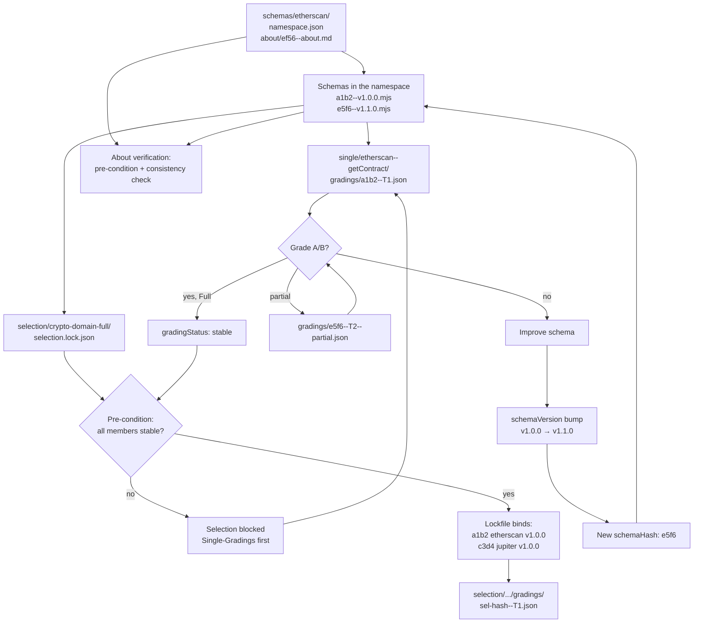

# 18 — Flywheel Loop (§16)

| Field | Value |
|-------|-------|
| Status | Normative — NEW in 1.1.0 |
| Version | `gradingSpec/1.1.0` |
| Depends on | [`00-overview.md`](./00-overview.md), [`06-determinism-and-tier.md`](./06-determinism-and-tier.md), [`08-grading-model.md`](./08-grading-model.md), [`15-versioning-axes.md`](./15-versioning-axes.md), [`16-selection-lockfile.md`](./16-selection-lockfile.md) |
| Related | [`14-kanban-data-contract.md`](./14-kanban-data-contract.md), [`19-folder-layout.md`](./19-folder-layout.md), [`21-pre-conditions.md`](./21-pre-conditions.md), [`11-about-convention.md`](./11-about-convention.md) |

> **Spec:** `gradingSpec/1.1.0`
> **Status:** stable (additive extension of 1.0.0)
> **Changes vs. 1.0.0:** entirely new section §16 (flywheel loop with Mermaid diagram).

> Conformance language (MUST/SHOULD/MAY) follows BCP 14 [RFC2119]/[RFC8174] as defined in [`00-overview.md`](./00-overview.md). The binding source is the FlowMCP Schemas Specification v4.1.0.

---

## §16 Flywheel Loop

The grading process follows an iteration pattern: Single-Grading → evaluation →
schema fix (bump) → re-grade → stable → Selection pre-condition met. The
pattern is self-reinforcing — every improvement raises the aggregate quality
of the Selections that contain the schema.

### §16.1 Mermaid Diagram

### §16.2 Reading Direction

**Reading direction:** top-down (`flowchart TD`) follows the iteration flow.
The pre-condition gate and the stable back-reference make the flywheel effect
visible: every new stable Single opens the door for Selection-Gradings, and
every Selection run identifies the weakest schemas in the namespace.

### §16.3 Reference Fields per Node

| Node | Reference |
|------|-----------|
| NS | [`19-folder-layout.md`](./19-folder-layout.md) §17 folder layout, [`11-about-convention.md`](./11-about-convention.md) §19 About-Pages |
| SCHEMA | [`08-grading-model.md`](./08-grading-model.md) §5 data model, [`15-versioning-axes.md`](./15-versioning-axes.md) §10 version axes |
| SINGLE/SGRADE | [`14-kanban-data-contract.md`](./14-kanban-data-contract.md) §14 Kanban lanes |
| PRECOND | [`21-pre-conditions.md`](./21-pre-conditions.md) §20 pre-conditions |
| STABLE | [`06-determinism-and-tier.md`](./06-determinism-and-tier.md) §8 tier trim (partial vs. full) |
| FIX/V/NEWHASH | [`15-versioning-axes.md`](./15-versioning-axes.md) §10 bump tables |
| SLOCK | [`16-selection-lockfile.md`](./16-selection-lockfile.md) §11.2 lockfile schema |
| ABOUT | [`11-about-convention.md`](./11-about-convention.md) §19, [`21-pre-conditions.md`](./21-pre-conditions.md) §20.3 |

### §16.4 Self-Reinforcing Effect

The flywheel is self-reinforcing along three loops:

1. **Quality loop per schema**: SINGLE → CHECK → FIX → V → NEWHASH → SCHEMA → SINGLE. Each iteration bumps `schemaVersion`, produces a new `schemaHash`, and the next Single-Grading tests the improved schema variant.
2. **Aggregation loop per Selection**: SLOCK → SGRADE → (on member change) PRECOND → SLOCK. Every re-grading of a member invalidates the old lockfile; a new lockfile binds the current hashes.
3. **About-verification loop**: ABOUT (pre-condition + consistency check) → on change a new `aboutHash` → new `namespaceHash` → re-check.

### §16.5 Anti-Patterns

The following patterns break the flywheel and are excluded by the spec:

- **Partial gradings without a concluding full grading**: `gradingStatus` stays `pending`, the Selection stays blocked (see [`06-determinism-and-tier.md`](./06-determinism-and-tier.md) §8.2)
- **Schema edit without a version bump**: the consistency check (see [`15-versioning-axes.md`](./15-versioning-axes.md) §10.4) blocks the commit
- **Selection grading with `pending` members**: the pre-condition (see [`21-pre-conditions.md`](./21-pre-conditions.md) §20) blocks step 0

### §16.6 Cross-Refs

- Iteration pattern → [`06-determinism-and-tier.md`](./06-determinism-and-tier.md) §8.2 (partial vs. full)
- Version bump → [`15-versioning-axes.md`](./15-versioning-axes.md) §10
- Pre-condition → [`21-pre-conditions.md`](./21-pre-conditions.md) §20
- Folder layout (iteration file names) → [`19-folder-layout.md`](./19-folder-layout.md) §17.2
