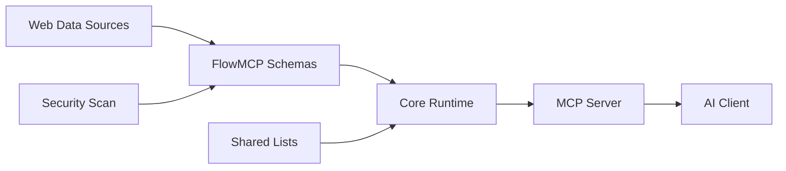

# FlowMCP Specification v3.0.0 — Overview

FlowMCP is a deterministic normalization layer that converts heterogeneous web data sources into uniform, AI-consumable tools. This document provides the conceptual foundation, positioning, terminology, and document index for the v3.0.0 specification.

---

## Problem

Web data sources are organized by **provider** — Etherscan exposes smart contract endpoints, CoinGecko exposes market data, DeFi Llama exposes TVL metrics, government portals publish RSS feeds, legacy PHP sites return HTML tables. Each source has its own interface style, authentication scheme, URL structure, response format, and error handling.

AI agents, however, need tools organized by **application domain** — token prices, contract ABIs, TVL data, wallet balances. An agent solving a user's question about a token's market cap should not need to know whether the answer comes from CoinGecko, CoinCap, or DeFi Llama — or whether the source returns JSON, XML, or HTML.

Manual integration per source is unsustainable at scale. With 187+ schemas across dozens of providers, the combinatorial complexity of authentication, parameter formatting, response parsing, and error handling makes hand-written integrations fragile and expensive to maintain.

---

## Solution

FlowMCP introduces a **schema-driven normalization layer** between web data sources and AI clients. Each schema is a `.mjs` file that declaratively defines:

- **Tools** with input parameters, Zod-based validation (type, constraints, enum values), URL construction rules, and response transformation
- **Resources** with embedded SQLite databases for local, deterministic data access
- **Skills** with reusable instructions for AI agents, mapping to MCP prompts
- **Security constraints** (no imports, no filesystem access, no eval)

The runtime reads these schemas and exposes them through the three MCP primitives: **Tools** (API endpoints), **Resources** (local data), and **Skills** (agent instructions via MCP prompts). The AI client sees a flat catalog of tools, queryable resources, and composable skills — the underlying source complexity (REST, RSS, HTML scraping, legacy APIs, embedded databases) is completely abstracted away.

The diagram shows the data flow from raw web data sources (REST APIs, RSS feeds, HTML pages, legacy endpoints) through schemas into the Core Runtime, which resolves shared lists and enforces security, then exposes tools via the MCP Server to the AI Client.

---

## Positioning

FlowMCP is the **deterministic anchor** in a system that pairs it with non-deterministic AI agents.

| Layer | Nature | Responsibility |
|-------|--------|----------------|
| AI Client / Agent | Non-deterministic | Decides *which* tool to use, follows skill instructions, *how* to interpret results |
| FlowMCP Tools | Deterministic | Guarantees the tool itself behaves identically every time |
| FlowMCP Resources | Deterministic | Provides local, read-only data via SQLite — always available, no network |
| FlowMCP Skills | Non-deterministic | Reusable instructions for AI agents — declares dependencies, defines workflows |
| Web Data Sources | External | Provides the raw data — REST, RSS, HTML, legacy APIs (uncontrolled) |

While AI decides strategy and interprets semantics, FlowMCP guarantees that:

- The same input parameters always produce the same API call
- Parameter validation is enforced before any network request
- Response transformations are consistent and reproducible
- Security constraints are verified at load-time, not runtime

This separation means schema authors can focus on correct API mapping without worrying about AI behavior, and AI developers can trust that tools will not produce surprises.

---

## Terminology

| Term | Definition |
|------|-----------|
| **Schema** | A `.mjs` file with two named exports: `main` (static) and optionally `handlers` (factory function). Defines tools, resources, and/or skills. |
| **Tool** | A single API endpoint within a schema (formerly called "Route" in v2). Maps to the MCP `server.tool` primitive. Each tool has parameters, a method, a path, and optional handlers. Defined in `main.tools`. |
| **Route** | Deprecated alias for Tool. `main.routes` is accepted in v3.0.0 with a deprecation warning but will be removed in v3.2.0. Schemas must not define both `tools` and `routes`. |
| **Resource** | Embedded, read-only data access via SQLite databases. Maps to the MCP `server.resource` primitive. Defined in `main.resources`. See `13-resources.md`. |
| **Skill** | Reusable instructions for AI agents. Maps to the MCP `server.prompt` primitive. Each skill is a `.mjs` file with `export const skill`, referenced in `main.skills`. Uses `flowmcp-skill/1.0.0` versioning. See `14-skills.md`. |
| **Namespace** | Provider identifier, lowercase letters only (e.g. `etherscan`, `coingecko`). Groups schemas by data source. |
| **Handler** | An async function returned by the `handlers` factory. Performs pre- or post-processing for a tool or resource query. Receives dependencies via injection. |
| **Modifier** | Handler subtype: `preRequest` transforms input before the API call, `postRequest` transforms output after the API call (or after a resource query). |
| **Shared List** | A reusable, versioned value list (e.g. EVM chain identifiers, country codes) referenced by schemas and injected at load-time. |
| **Group** | A named collection of cherry-picked tools and resources with an integrity hash. Used for project-level activation. May include skills. |
| **Main Export** | `export const main = {...}` — the declarative, JSON-serializable part of a schema. Contains `tools`, `resources`, and `skills`. Hashable for integrity verification. |
| **Handlers Export** | `export const handlers = ({ sharedLists, libraries }) => ({...})` — factory function receiving injected dependencies. Subject to security scanning. |

---

## Specification Document Index

| Document | Title | Description |
|----------|-------|-------------|
| `00-overview.md` | Overview | Problem, solution, positioning, terminology, design principles (this document) |
| `01-schema-format.md` | Schema Format | File structure, main/handlers split, tool definitions, naming conventions |
| `02-parameters.md` | Parameters | Position block, Z block validation, shared list interpolation, API key injection, resource and skill parameters |
| `03-shared-lists.md` | Shared Lists | List format, versioning, field definitions, filtering, resolution lifecycle |
| `04-output-schema.md` | Output Schema | Response type declarations, field mapping, flattening rules |
| `05-security.md` | Security Model | Zero-import policy, library allowlist, static scan, dependency injection |
| `06-groups.md` | Groups | Group format, cherry-picking, integrity verification, type discriminators, resources and skills in groups |
| `07-tasks.md` | Tasks | Deferred — MCP Tasks integration placeholder |
| `08-migration.md` | Migration | v1.2.0 to v2.0.0 and v2.0.0 to v3.0.0 migration guides, backward compatibility |
| `09-validation-rules.md` | Validation Rules | Complete validation checklist for schemas, lists, groups, resources, and skills |
| `10-tests.md` | Tests | Test format for tools and resources, design principles, response capture lifecycle, output schema generation |
| `12-group-skills.md` | Group Skills | Schema-level skills, group-level skills, cross-schema skill composition |
| `13-resources.md` | Resources | SQLite resource format, queries, parameters, SQL security, handler integration |
| `14-skills.md` | Skills | Skill .mjs format, fields, placeholders, versioning, validation rules |

---

## Design Principles

### 1. Deterministic over clever

Same input always produces the same API call. No randomness, no caching heuristics, no adaptive behavior inside the schema layer. If a schema's `preRequest` handler receives the same `payload`, it must produce the same `struct` every time.

### 2. Declare over code

Maximize the `main` block, minimize handlers. Every field that can be expressed declaratively (URL patterns, parameter types, enum values) must live in `main`. Handlers exist only for transformations that cannot be expressed as static data — never for logic that could be a parameter default or a path template.

### 3. Inject over import

Schemas receive data through dependency injection, never import. A handler that needs EVM chain data does not `import` a chain list — it receives `sharedLists.evmChains` via the factory function. Libraries are declared in `requiredLibraries` and injected by the runtime from an allowlist. Schema files contain zero import statements.

### 4. Hash over trust

Integrity verification through SHA-256 hashes. The `main` block is hashable because it is pure JSON-serializable data. Groups store hashes of their member tools. Changes to a schema invalidate the hash, signaling that review is needed.

### 5. Constrain over permit

Security by default, explicit opt-in for capabilities. Schema files have zero import statements — all dependencies are declared in `requiredLibraries` and injected from a runtime allowlist. The security scanner rejects schemas with forbidden patterns at load-time, before any tool is exposed to an AI client.

---

## Version History

| Version | Date | Changes |
|---------|------|---------|
| 1.0.0 | 2025-06 | Initial schema format. Flat structure with inline parameters and direct URL construction. |
| 1.2.0 | 2025-11 | Added handlers (preRequest/postRequest), Zod-based parameter validation, modifier pattern for input/output transformation. |
| 2.0.0 | 2026-02 | Two-export format (`main` + `handlers` factory). Dependency injection via allowlist. Shared lists for reusable values. Output schema declarations. Zero-import security model. Groups with integrity hashes. Maximum routes reduced from 10 to 8. |
| 3.0.0 | 2026-03 | Three MCP primitives: Tools (renamed from Routes), Resources (SQLite), Skills (.mjs format). `main.routes` deprecated in favor of `main.tools`. `flowmcp-skill/1.0.0` versioning for skills. Group type discriminators for resources and skills. |

---

## What Changed in v3.0.0

The v3.0.0 release extends FlowMCP to cover all three MCP primitives and introduces a consistent terminology:

- **Tools replace Routes** — `main.tools` is the primary key. `main.routes` is accepted as a deprecated alias with a warning (removed in v3.2.0). Schemas must not define both `tools` and `routes`.
- **Resources** — embedded SQLite databases for local, deterministic data access. Defined in `main.resources`. See `13-resources.md`.
- **Skills** — reusable AI agent instructions in `.mjs` format with `export const skill`. Uses independent `flowmcp-skill/1.0.0` versioning. Defined in `main.skills`. See `14-skills.md`.
- **Groups with type discriminators** — `::tool::` and `::resource::` prefixes for unambiguous references in groups. Default (no prefix) is tool for backward compatibility.
- **0-tool schemas are valid** — resource-only or skill-only schemas are allowed (E1).

The migration path from v2.0.0 to v3.0.0 is documented in `08-migration.md`.

---

## What Changed in v2.0.0

The v2.0.0 release restructures the schema format around a fundamental insight: **the declarative parts of a schema should be separable from the executable parts**. This enables:

- **Integrity hashing** of the `main` block without including function bodies
- **Security scanning** of the `handlers` block as an isolated concern
- **Shared lists** that inject reusable data at load-time instead of hardcoding enum values
- **Output schemas** that declare expected response shapes for downstream consumers
- **Groups** that compose tools across schemas with verifiable integrity

The migration path from v1.2.0 to v2.0.0 is documented in `08-migration.md`.
