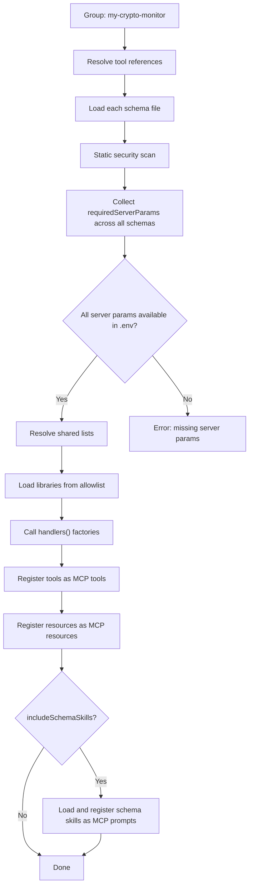

# FlowMCP Specification v3.0.0 — Cherry-Pick Groups

Groups allow users to create named collections of specific tools and resources from across multiple schemas. Instead of activating entire schemas, users cherry-pick individual tools and resources they need.

---

## Purpose

A typical FlowMCP installation has hundreds of schemas with thousands of routes. Most projects only need a handful of specific tools. Groups solve this by letting users:

1. **Select specific tools and resources** from any schema
2. **Name the collection** for reuse
3. **Verify integrity** with cryptographic hashes
4. **Share collections** across projects and teams
5. **Include skills** from schema-level definitions or as group-level compositions

---

## Group Definition

Groups are defined in a project's `.flowmcp/groups.json`:

```json
{
    "specVersion": "3.0.0",
    "groups": {
        "my-crypto-monitor": {
            "description": "Crypto price and TVL monitoring tools",
            "tools": [
                "etherscan/contracts.mjs::getContractAbi",
                "coingecko/coins.mjs::getSimplePrice",
                "coingecko/coins.mjs::getCoinMarkets",
                "defillama/protocols.mjs::getTvlProtocol"
            ],
            "resources": [
                "::resource::tokens/TokenRegistry.mjs::tokenLookup"
            ],
            "includeSchemaSkills": true,
            "hash": "sha256:a1b2c3d4e5f6..."
        },
        "defi-analytics": {
            "description": "DeFi protocol analysis tools",
            "tools": [
                "defillama/protocols.mjs::getProtocols",
                "defillama/protocols.mjs::getTvlProtocol",
                "dune/queries.mjs::executeQuery"
            ],
            "resources": [],
            "hash": "sha256:f6e5d4c3b2a1..."
        }
    }
}
```

The `specVersion` field declares which FlowMCP specification version the groups file conforms to. This allows future versions to extend the format without breaking existing files.

---

## Reference Format

### Tool References

Tools are referenced as: `namespace/schemaFile::toolName`

| Part | Description | Example |
|------|-------------|---------|
| `namespace` | Provider namespace | `etherscan` |
| `schemaFile` | Schema filename | `contracts.mjs` |
| `toolName` | Tool name within the schema | `getContractAbi` |

Full reference: `etherscan/contracts.mjs::getContractAbi`

Tool references in the `tools` array do not require a type discriminator — they are tools by default (backward compatible with v2.0.0).

### Resource References

Resources use the `::resource::` type discriminator prefix:

```
::resource::namespace/schemaFile::resourceName
```

| Part | Description | Example |
|------|-------------|---------|
| `::resource::` | Type discriminator (required) | `::resource::` |
| `namespace` | Provider namespace | `tokens` |
| `schemaFile` | Schema filename | `TokenRegistry.mjs` |
| `resourceName` | Resource name within the schema | `tokenLookup` |

Full reference: `::resource::tokens/TokenRegistry.mjs::tokenLookup`

The `::resource::` prefix is **required** for resources. Without a prefix, the reference is treated as a tool. Resources are listed in their own `resources` array in the group definition, not in the `tools` array.

### Type Discriminator Summary

| Prefix | Type | Where Listed | Required |
|--------|------|-------------|----------|
| (none) | Tool | `tools` array | No — default |
| `::tool::` | Tool | `tools` array | No — explicit but optional |
| `::resource::` | Resource | `resources` array | Yes — always required |

The `::tool::` prefix is supported for explicitness but is never required. Both `etherscan/contracts.mjs::getContractAbi` and `::tool::etherscan/contracts.mjs::getContractAbi` are equivalent.

### Reference Resolution

When a tool reference is resolved, the runtime:

```
1. Parse reference into { namespace, schemaFile, toolName }
2. Locate schema at schemas/{version}/{namespace}/{schemaFile}
3. Load schema and extract main.tools[toolName]
4. If any step fails -> report unresolvable reference
```

When a resource reference is resolved, the runtime:

```
1. Strip ::resource:: prefix
2. Parse reference into { namespace, schemaFile, resourceName }
3. Locate schema at schemas/{version}/{namespace}/{schemaFile}
4. Load schema and extract main.resources[resourceName]
5. If any step fails -> report unresolvable reference
```

A tool reference is **valid** if and only if:
- The schema file exists in the schemas directory
- The schema file passes the security scan
- The tool name exists in the schema's `main.tools`

A resource reference is **valid** if and only if:
- The `::resource::` prefix is present
- The schema file exists in the schemas directory
- The resource name exists in the schema's `main.resources`

---

## Hash Calculation

Integrity hashes ensure that group definitions haven't changed unexpectedly. When a schema is updated (new parameters, different version, changed shared list references), the hash changes and the group verification fails. This alerts users to review the changes before continuing.

### Per-Tool Hash

Calculated from the `main` block only (deterministic, no handler code):

```
toolHash = SHA-256( JSON.stringify( {
    namespace: 'etherscan',
    version: '3.0.0',
    route: {
        name: 'getContractAbi',
        method: 'GET',
        path: '/api',
        parameters: [ /* full parameter definitions */ ],
        output: { /* output schema if present */ }
    },
    sharedListRefs: [
        { ref: 'evmChains', version: '1.0.0' }
    ]
} ) )
```

The hash input includes:
- `namespace` from `main`
- `version` from `main`
- The specific `route` definition (name, method, path, parameters, output schema)
- All `sharedListRefs` that the route uses (resolved from `main.sharedLists`)

Handler code is excluded from the hash because it does not affect the tool's interface. A handler change (e.g., improved response transformation) does not invalidate the group.

### Per-Group Hash

Calculated from sorted tool references and their individual hashes:

```
groupHash = SHA-256( JSON.stringify(
    tools
        .sort()
        .map( ( toolRef ) => {
            const hash = getToolHash( toolRef )

            return { ref: toolRef, hash }
        } )
) )
```

Sorting ensures deterministic output regardless of the order tools were added to the group.

---

## Verification

CLI command to verify group integrity:

```bash
flowmcp group verify my-crypto-monitor
```

Output on success:

```
Group "my-crypto-monitor": 4 tools, all hashes valid
```

Output on hash mismatch:

```
Group "my-crypto-monitor": HASH MISMATCH
  - etherscan/contracts.mjs::getContractAbi: expected sha256:abc... got sha256:def...
  - Schema version changed from 2.0.0 to 2.1.0
```

Output on unresolvable reference:

```
Group "my-crypto-monitor": RESOLUTION ERROR
  - etherscan/contracts.mjs::getContractAbi: Schema file not found
  - coingecko/coins.mjs::getMarketData: Route "getMarketData" not found in schema
```

---

## Group Operations

| Operation | Command | Description |
|-----------|---------|-------------|
| Create | `flowmcp group create <name>` | Create empty group |
| Add tool | `flowmcp group add <name> <tool-ref>` | Add tool and recalculate hash |
| Remove tool | `flowmcp group remove <name> <tool-ref>` | Remove tool and recalculate hash |
| Verify | `flowmcp group verify <name>` | Check all hashes |
| List | `flowmcp group list` | Show all groups |
| Export | `flowmcp group export <name>` | Export group as shareable JSON |
| Import | `flowmcp group import <file>` | Import group from JSON |

### Operation Details

**Create** initializes a new group with an empty tools array and a null hash:

```bash
flowmcp group create my-crypto-monitor
# -> Created group "my-crypto-monitor" (0 tools)
```

**Add** resolves the tool reference, calculates its hash, appends it, and recalculates the group hash:

```bash
flowmcp group add my-crypto-monitor etherscan/contracts.mjs::getContractAbi
# -> Added "etherscan/contracts.mjs::getContractAbi" to "my-crypto-monitor" (1 tool)
# -> Group hash: sha256:a1b2c3...
```

**Remove** removes the tool reference and recalculates the group hash:

```bash
flowmcp group remove my-crypto-monitor etherscan/contracts.mjs::getContractAbi
# -> Removed "etherscan/contracts.mjs::getContractAbi" from "my-crypto-monitor" (0 tools)
# -> Group hash: sha256:e4f5g6...
```

**List** shows all groups with tool counts:

```bash
flowmcp group list
# -> my-crypto-monitor    4 tools    "Crypto price and TVL monitoring tools"
# -> defi-analytics        3 tools    "DeFi protocol analysis tools"
```

---

## Group Constraints

1. Group names must match `^[a-z][a-z0-9-]*$` (lowercase, hyphens allowed, must start with a letter)
2. Maximum 50 tools per group
3. Maximum 10 resources per group
4. All referenced tools must be resolvable (schema + tool exists)
5. All referenced resources must be resolvable (schema + resource exists) and use the `::resource::` prefix
6. Duplicate tool references within a group are an error
7. Duplicate resource references within a group are an error
8. A tool or resource can belong to multiple groups
9. Groups are local to the project (`.flowmcp/groups.json`)

### Constraint Error Messages

| Constraint | Error Message |
|------------|---------------|
| Invalid name | `GRP001 "My Group": Name must match ^[a-z][a-z0-9-]*$` |
| Too many tools | `GRP002 "my-group": Maximum 50 tools per group (currently 51)` |
| Unresolvable tool | `GRP003 "my-group": Tool "etherscan/foo.mjs::bar" not found` |
| Duplicate tool | `GRP004 "my-group": Duplicate tool "etherscan/contracts.mjs::getContractAbi"` |
| Too many resources | `GRP009 "my-group": Maximum 10 resources per group (currently 11)` |
| Unresolvable resource | `GRP010 "my-group": Resource "::resource::tokens/foo.mjs::bar" not found` |
| Missing resource prefix | `GRP011 "my-group": Resource reference must use ::resource:: prefix` |
| Duplicate resource | `GRP012 "my-group": Duplicate resource "::resource::tokens/TokenRegistry.mjs::tokenLookup"` |

---

## Sharing Groups

Groups can be exported and shared between projects and teams:

```bash
# Export
flowmcp group export my-crypto-monitor > my-crypto-monitor.json

# Import (verifies hashes on import)
flowmcp group import my-crypto-monitor.json
```

### Export Format

The exported JSON contains the group definition plus metadata:

```json
{
    "specVersion": "3.0.0",
    "exportedAt": "2026-03-11T12:00:00.000Z",
    "group": {
        "name": "my-crypto-monitor",
        "description": "Crypto price and TVL monitoring tools",
        "tools": [
            "etherscan/contracts.mjs::getContractAbi",
            "coingecko/coins.mjs::getSimplePrice",
            "coingecko/coins.mjs::getCoinMarkets",
            "defillama/protocols.mjs::getTvlProtocol"
        ],
        "hash": "sha256:a1b2c3d4e5f6...",
        "toolHashes": {
            "etherscan/contracts.mjs::getContractAbi": "sha256:111...",
            "coingecko/coins.mjs::getSimplePrice": "sha256:222...",
            "coingecko/coins.mjs::getCoinMarkets": "sha256:333...",
            "defillama/protocols.mjs::getTvlProtocol": "sha256:444..."
        }
    }
}
```

The `toolHashes` field is included only in exports (not in `groups.json`) to enable per-tool comparison during import.

### Import Behavior

On import, hash verification runs automatically:

```
1. Parse imported JSON
2. Validate specVersion compatibility
3. For each tool reference:
   a. Resolve locally (schema + route must exist)
   b. Calculate local tool hash
   c. Compare with exported tool hash
4. If all match -> import group as-is
5. If hashes differ -> warn user with per-tool diff
6. If tool not resolvable -> reject import with error
```

The user can force import with `--force` to skip hash verification:

```bash
flowmcp group import my-crypto-monitor.json --force
# -> WARNING: Imported "my-crypto-monitor" with 2 hash mismatches (forced)
```

---

## Group Activation Lifecycle

When a group is activated (e.g. via `flowmcp group activate my-crypto-monitor`), the runtime performs these steps for each tool in the group:



### Server Params Resolution

Each schema in the group declares its own `requiredServerParams`. The runtime collects **all unique params** across the group and verifies they exist in the environment:

```
Group "my-crypto-monitor" requires:
  - ETHERSCAN_API_KEY    (from etherscan/contracts.mjs)
  - COINGECKO_API_KEY    (from coingecko/coins.mjs)
  - (none)               (defillama/protocols.mjs has no requiredServerParams)

Checking .env... ETHERSCAN_API_KEY=set, COINGECKO_API_KEY=set
All server params available. Group activated.
```

If any param is missing, activation fails with a clear error listing which schemas need which params:

```
Error: Group "my-crypto-monitor" cannot activate.
  Missing server params:
  - COINGECKO_API_KEY (required by coingecko/coins.mjs)
```

### Schema Directory Structure

Schemas are resolved from the global schema registry at `~/.flowmcp/schemas/`:

```
~/.flowmcp/schemas/
├── v3.0.0/
│   ├── etherscan/
│   │   ├── contracts.mjs
│   │   └── gas.mjs
│   ├── coingecko/
│   │   └── coins.mjs
│   └── defillama/
│       └── protocols.mjs
└── _lists/
    ├── evm-chains.mjs
    └── _registry.json
```

The tool reference `etherscan/contracts.mjs::getContractAbi` resolves to `~/.flowmcp/schemas/v3.0.0/etherscan/contracts.mjs`, tool `getContractAbi`.

---

## Skills in Groups

Groups can include skills in two ways: automatically via `includeSchemaSkills`, or explicitly via group-level skill definitions. See `12-group-skills.md` for the full specification.

### `includeSchemaSkills` Flag

When `includeSchemaSkills` is `true`, all skills defined in `main.skills` of the schemas referenced by the group's tools are automatically included:

```json
{
    "my-group": {
        "tools": [ "etherscan/contracts.mjs::getContractAbi" ],
        "includeSchemaSkills": true,
        "hash": "sha256:..."
    }
}
```

If `etherscan/contracts.mjs` defines skills in `main.skills`, those skills are loaded and registered as MCP prompts when the group is activated. Default is `false` — skills are not included unless explicitly requested.

### Group-Level Skills

Groups can also define their own skills that compose tools across schemas. These are declared in a `skills` field within the group definition and reference skill files in `.flowmcp/skills/`. Group-level skills can use cross-schema namespace references in their content (e.g., `{{tool:etherscan/contracts.mjs::getContractAbi}}`). See `12-group-skills.md` for details.
