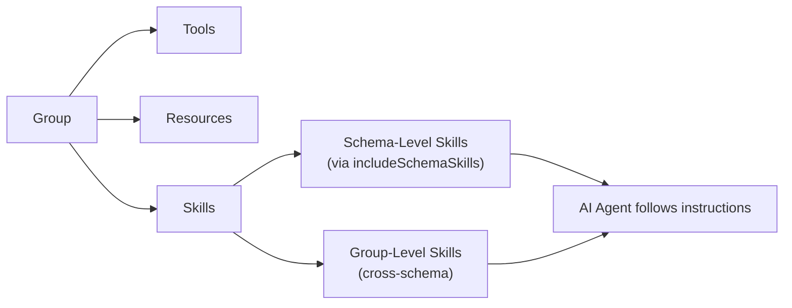
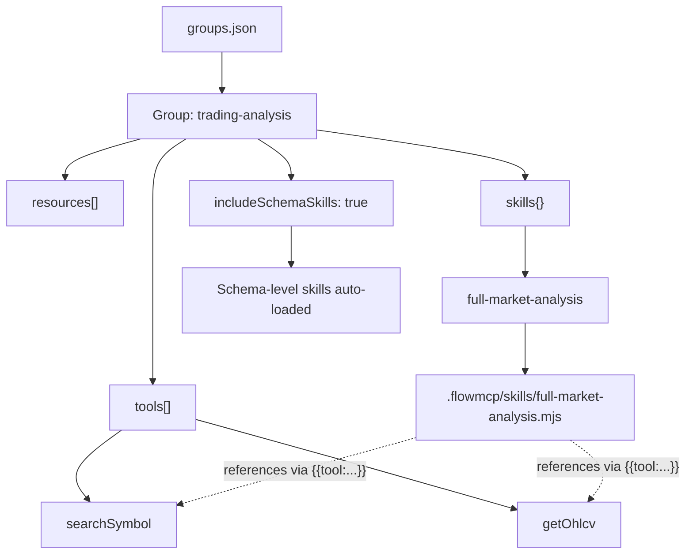

# FlowMCP Specification v3.0.0 — Group Skills

Skills bridge the deterministic tool layer (FlowMCP) with non-deterministic AI orchestration. Groups define **which** tools and resources are available; skills define **how** to use them together. Skills exist at two levels: schema-level (defined in `main.skills`, scoped to one schema) and group-level (defined in `groups.json`, can reference tools across schemas).

---

## Table of Contents

1. [Introduction](#introduction)
2. [Schema-Level Skills](#schema-level-skills)
3. [Group-Level Skills](#group-level-skills)
4. [The `includeSchemaSkills` Flag](#the-includeschemaskills-flag)
5. [Cross-Schema Namespace References](#cross-schema-namespace-references)
6. [Skill Composition (1 Level Deep)](#skill-composition-1-level-deep)
7. [Group Config Extension](#group-config-extension)
8. [CLI Commands](#cli-commands)
9. [Validation Rules](#validation-rules)
10. [Complete Example](#complete-example)

---

## Introduction

FlowMCP schemas guarantee that individual tools behave deterministically -- the same input always produces the same API call. But real-world tasks rarely involve a single tool. Analyzing a token requires price data, on-chain metrics, technical indicators, and chart generation. An agent needs to know not just which tools exist, but in what order to call them, how to pipe outputs between steps, and what final artifact to produce.

Skills solve this by providing reusable instruction sets for AI agents. Each skill is a `.mjs` file with structured metadata and Markdown instructions. Skills declare their dependencies (tools, resources, external capabilities), define typed input parameters, and contain step-by-step content that the AI agent follows.



The diagram shows how a group contains tools, resources, and skills. Skills come from two sources: schema-level skills included via the `includeSchemaSkills` flag, and group-level skills defined directly in the group configuration.

### Separation of Concerns

| Layer | Nature | Responsibility |
|-------|--------|----------------|
| Schema | Deterministic | Defines individual tool behavior (parameters, URL, response) |
| Group | Deterministic | Defines which tools and resources are available (cherry-picked, hash-verified) |
| Skill | Non-deterministic | Defines how tools are composed into workflows (AI-interpreted) |

Skills are intentionally non-deterministic. The AI agent interprets the instructions, decides how to handle edge cases, and adapts to intermediate results. The deterministic guarantees remain at the tool level -- each individual tool call within the workflow is still schema-validated and reproducible.

### Skills vs v2.0.0 Group Prompts

v3.0.0 replaces the v2.0.0 "Group Prompts" concept with skills. The key differences:

| Aspect | v2.0.0 Group Prompts | v3.0.0 Skills |
|--------|---------------------|---------------|
| File format | Markdown `.md` files | `.mjs` files with `export const skill` |
| Metadata | Title and description in `groups.json` | Structured metadata in the skill file itself |
| Input | Informal `## Input` section in Markdown | Typed `input` array with key, type, description, required |
| Dependencies | Implicit -- backtick tool references | Explicit -- `requires.tools`, `requires.resources`, `requires.external` |
| Versioning | None | `flowmcp-skill/1.0.0` |
| Scope levels | Group-level only | Schema-level AND group-level |
| MCP Mapping | No direct mapping | Maps to `server.prompt` primitive |
| Validation | Backtick scanning in Markdown | Placeholder validation (`{{tool:name}}`, `{{resource:name}}`, `{{input:key}}`) |

---

## Schema-Level Skills

Schema-level skills are defined in the `main.skills` field of a schema file and stored as `.mjs` files in a `skills/` subdirectory. They can only reference tools and resources from the same schema.

```javascript
export const main = {
    namespace: 'etherscan',
    name: 'SmartContractExplorer',
    version: '3.0.0',
    root: 'https://api.etherscan.io',
    tools: {
        getContractAbi: { /* ... */ },
        getSourceCode: { /* ... */ }
    },
    skills: {
        'full-contract-audit': { file: './skills/full-contract-audit.mjs' },
        'quick-summary': { file: './skills/quick-summary.mjs' }
    }
}
```

Schema-level skills are the primary skill mechanism. They are schema-scoped, validated against the schema's own tools and resources, and loaded via `import()`. See `14-skills.md` for the complete skill file format, fields, placeholders, and validation rules.

### Schema-Level Scope Rules

| Reference Type | Allowed | Example |
|---------------|---------|---------|
| `{{tool:name}}` | Tools in same schema only | `{{tool:getContractAbi}}` |
| `{{resource:name}}` | Resources in same schema only | `{{resource:verifiedContracts}}` |
| `{{skill:name}}` | Skills in same schema only (1 level) | `{{skill:quick-summary}}` |
| `{{input:key}}` | Input params of same skill only | `{{input:address}}` |

---

## Group-Level Skills

Group-level skills are defined in the group configuration inside `.flowmcp/groups.json`. They extend the concept of schema-level skills by allowing **cross-schema references** -- a group-level skill can reference tools from any schema in the group.

### Group-Level Skill Files

Group-level skill `.mjs` files are stored in `.flowmcp/skills/`:

```
.flowmcp/
├── groups.json
├── skills/
│   ├── full-market-analysis.mjs
│   └── cross-chain-audit.mjs
└── tools/
```

### Group-Level Skill Declaration

```json
{
    "specVersion": "3.0.0",
    "groups": {
        "trading-analysis": {
            "description": "Technical analysis and charting tools",
            "tools": [
                "yahoofinance/market.mjs::searchSymbol",
                "yahoofinance/market.mjs::getOhlcv",
                "coingecko/coins.mjs::getSimplePrice"
            ],
            "resources": [],
            "skills": {
                "full-market-analysis": {
                    "description": "Full market analysis combining Yahoo Finance and CoinGecko data",
                    "file": ".flowmcp/skills/full-market-analysis.mjs"
                }
            },
            "hash": "sha256:a1b2c3d4e5f6..."
        }
    }
}
```

### Group-Level Skill Entry Fields

| Field | Type | Required | Description |
|-------|------|----------|-------------|
| key (skill name) | `string` | Yes | Must match `^[a-z][a-z0-9-]{0,63}$`. Must match the `name` field inside the skill file. |
| `description` | `string` | Yes | What the skill does. Used for search matching. |
| `file` | `string` | Yes | Relative path to the skill `.mjs` file from the project root. Must end with `.mjs`. |

---

## The `includeSchemaSkills` Flag

When `includeSchemaSkills` is `true` in a group definition, all schema-level skills from schemas referenced by the group's tools are automatically included.

```json
{
    "trading-analysis": {
        "tools": [
            "etherscan/contracts.mjs::getContractAbi",
            "etherscan/contracts.mjs::getSourceCode"
        ],
        "includeSchemaSkills": true,
        "hash": "sha256:..."
    }
}
```

If `etherscan/contracts.mjs` defines skills in `main.skills` (e.g., `full-contract-audit`), those skills are automatically loaded and registered as MCP prompts when the group is activated.

### `includeSchemaSkills` Behavior

| Value | Behavior |
|-------|----------|
| `true` | Load all skills from all schemas referenced by the group's tools |
| `false` (default) | Schema-level skills are not included unless explicitly added as group-level skills |

### Combining Schema and Group Skills

A group can have both `includeSchemaSkills: true` and its own `skills` entries. In this case:

1. Schema-level skills are loaded first (from all referenced schemas)
2. Group-level skills are loaded second
3. If a group-level skill has the same name as a schema-level skill, the group-level skill takes precedence

---

## Cross-Schema Namespace References

Group-level skills can reference tools from different schemas using fully qualified namespace prefixes in their `content`:

```javascript
const content = `
## Step 1: Get Contract Data
Call {{tool:etherscan/contracts.mjs::getContractAbi}} with the contract address.

## Step 2: Get Token Price
Call {{tool:coingecko/coins.mjs::getSimplePrice}} with the token ID.
`
```

### Cross-Schema Reference Format

| Context | Placeholder Format | Example |
|---------|-------------------|---------|
| Schema-level skill | `{{tool:name}}` (bare name) | `{{tool:getContractAbi}}` |
| Group-level skill | `{{tool:namespace/file.mjs::name}}` (fully qualified) | `{{tool:etherscan/contracts.mjs::getContractAbi}}` |

Group-level skills use the same placeholder syntax (`{{tool:...}}`, `{{resource:...}}`) but with the fully qualified tool reference instead of a bare name. The runtime resolves these against the group's tool list.

### Cross-Schema Validation

The validator checks that:
1. Each fully qualified `{{tool:namespace/file.mjs::name}}` reference exists in the group's `tools` array
2. Each fully qualified `{{resource:namespace/file.mjs::name}}` reference exists in the group's `resources` array
3. The `requires.tools` array in the skill lists all referenced tools (using fully qualified names)

---

## Skill Composition (1 Level Deep)

A skill can reference another skill via `{{skill:name}}`. This is limited to **one level deep**:

```javascript
// Allowed: skill-a references skill-b
// skill-a content: "For a quick version, follow {{skill:quick-summary}}"
// quick-summary content: "Summarize the ABI using {{tool:getContractAbi}}"

// Forbidden: skill-b references skill-c (would make skill-a -> skill-b -> skill-c)
// quick-summary content: "See also {{skill:another-skill}}"  // SKL023 error
```

The one-level-deep restriction prevents:
- **Circular references** -- skill A referencing skill B referencing skill A
- **Deep nesting** -- unbounded chains of skill references that are hard to follow
- **Context explosion** -- each level adds content, which can exceed context limits

### Composition Rules

| Scenario | Allowed |
|----------|---------|
| Skill A references Skill B (same schema) | Yes |
| Skill B contains `{{tool:...}}` only | Yes |
| Skill B contains `{{skill:C}}` | No (SKL023 error) |
| Group skill references schema skill | Yes (if `includeSchemaSkills` or skill is in group) |

---

## Group Config Extension

Skills are declared in the group definition inside `.flowmcp/groups.json`. Each group gains optional `skills` and `includeSchemaSkills` fields.

### Extended Group Format

```json
{
    "specVersion": "3.0.0",
    "groups": {
        "trading-analysis": {
            "description": "Technical analysis and charting tools",
            "tools": [
                "yahoofinance/market.mjs::searchSymbol",
                "yahoofinance/market.mjs::getOhlcv",
                "indicators/oscillators.mjs::getRelativeStrengthIndex",
                "indicators/averages.mjs::getSimpleMovingAverage",
                "charting/charts.mjs::generateCandlestickChart"
            ],
            "resources": [],
            "includeSchemaSkills": true,
            "skills": {
                "full-market-analysis": {
                    "description": "Full market analysis combining multiple data sources",
                    "file": ".flowmcp/skills/full-market-analysis.mjs"
                }
            },
            "hash": "sha256:a1b2c3d4e5f6..."
        }
    }
}
```

### Relationship Between Group, Tools, Resources, and Skills



The diagram shows that a group contains tools, resources, skills, and the `includeSchemaSkills` flag. Group-level skills reference tools from the group via fully qualified placeholders. Schema-level skills are auto-loaded when the flag is set.

---

## CLI Commands

| Command | Description |
|---------|-------------|
| `flowmcp skill list` | List all skills across all groups |
| `flowmcp skill search <query>` | Search skills by name or description |
| `flowmcp skill show <group>/<name>` | Display the full skill content |
| `flowmcp skill add <group> <name> --file <path>` | Add a group-level skill |
| `flowmcp skill remove <group> <name>` | Remove a skill from a group |

### Command Details

**List** shows all skills with their group, description, and dependency count:

```bash
flowmcp skill list
# -> trading-analysis/full-market-analysis    "Full market analysis..."         5 tools
# -> trading-analysis/full-contract-audit     "Comprehensive audit..."          2 tools (schema)
```

Skills from schemas (via `includeSchemaSkills`) are marked with `(schema)`.

**Add** registers a skill file with a group:

```bash
flowmcp skill add trading-analysis full-market-analysis --file .flowmcp/skills/full-market-analysis.mjs
# -> Added skill "full-market-analysis" to group "trading-analysis"
# ->   Requires tools: searchSymbol, getOhlcv, getRelativeStrengthIndex
# ->   All references found in group tools
```

On add, the CLI:
1. Loads the `.mjs` file via `import()` and extracts the `skill` export
2. Validates all skill fields (name, version, description, input, output, content)
3. Validates that all `{{tool:...}}` references resolve to tools in the group
4. Writes the skill entry to `groups.json`

---

## Validation Rules

Skill validation runs on `flowmcp skill add` and during group verification.

### Group-Level Skill Rules

| Code | Severity | Rule |
|------|----------|------|
| GSK001 | error | Skill name must match `^[a-z][a-z0-9-]{0,63}$` |
| GSK002 | error | Skill file must exist at declared path |
| GSK003 | error | Skill file must export `skill` as named export |
| GSK004 | error | Skill `name` must match the key in group `skills` |
| GSK005 | error | `{{tool:namespace/file::name}}` must exist in group's `tools` array |
| GSK006 | error | `{{resource:namespace/file::name}}` must exist in group's `resources` array |
| GSK007 | error | Group must have at least one tool or resource to have skills |
| GSK008 | error | No duplicate skill names within a group (including schema-level skills) |

### Schema-Level Skill Rules

Schema-level skills are validated by the rules defined in `14-skills.md` (SKL001-SKL025). When included in a group via `includeSchemaSkills`, no additional validation is needed -- the skills were already validated when the schema was loaded.

---

## Complete Example

A group with tools from two providers, a group-level skill that composes them, and schema-level skills auto-included.

### Group Definition (in `.flowmcp/groups.json`)

```json
{
    "specVersion": "3.0.0",
    "groups": {
        "contract-analysis": {
            "description": "Smart contract analysis tools from Etherscan and CoinGecko",
            "tools": [
                "etherscan/contracts.mjs::getContractAbi",
                "etherscan/contracts.mjs::getSourceCode",
                "coingecko/coins.mjs::getSimplePrice"
            ],
            "resources": [],
            "includeSchemaSkills": true,
            "skills": {
                "contract-with-price": {
                    "description": "Audit a contract and include its token price context",
                    "file": ".flowmcp/skills/contract-with-price.mjs"
                }
            },
            "hash": "sha256:a1b2c3d4e5f6..."
        }
    }
}
```

### Group-Level Skill File (`.flowmcp/skills/contract-with-price.mjs`)

```javascript
const content = `
## Step 1: Get Contract ABI
Call {{tool:etherscan/contracts.mjs::getContractAbi}} with the contract address {{input:address}}.

## Step 2: Get Source Code
Call {{tool:etherscan/contracts.mjs::getSourceCode}} with the same address {{input:address}}.

## Step 3: Get Token Price
Call {{tool:coingecko/coins.mjs::getSimplePrice}} with the token ID {{input:tokenId}} to get current market context.

## Step 4: Analyze
Combine the contract data with the price context:
- ABI complexity and function count
- Source code security patterns
- Current market valuation for risk assessment

## Step 5: Report
Produce a Markdown report with contract analysis and market context sections.
`


export const skill = {
    name: 'contract-with-price',
    version: 'flowmcp-skill/1.0.0',
    description: 'Audit a smart contract and enrich the report with current token price data.',
    requires: {
        tools: [
            'etherscan/contracts.mjs::getContractAbi',
            'etherscan/contracts.mjs::getSourceCode',
            'coingecko/coins.mjs::getSimplePrice'
        ],
        resources: [],
        external: []
    },
    input: [
        { key: 'address', type: 'string', description: 'Ethereum contract address (0x-prefixed)', required: true },
        { key: 'tokenId', type: 'string', description: 'CoinGecko token ID for price lookup', required: true }
    ],
    output: 'Markdown report with contract audit findings and current market valuation.',
    content
}
```

### What This Example Demonstrates

1. **Group with tools from two providers** -- Etherscan and CoinGecko tools in one group.
2. **`includeSchemaSkills: true`** -- if Etherscan's contracts.mjs defines schema-level skills (e.g., `full-contract-audit`), they are auto-loaded.
3. **Group-level skill** -- `contract-with-price` composes tools from both providers.
4. **Cross-schema references** -- `{{tool:etherscan/contracts.mjs::getContractAbi}}` and `{{tool:coingecko/coins.mjs::getSimplePrice}}` use fully qualified names.
5. **Typed input** -- `address` and `tokenId` parameters with type `string` and `required: true`.
6. **`requires.tools` with fully qualified names** -- the skill declares all cross-schema dependencies.
7. **`.mjs` format** -- consistent with schema files and schema-level skills. Loaded via `import()`.
8. **MCP mapping** -- this skill registers as an MCP prompt available to the AI agent when the group is activated.
