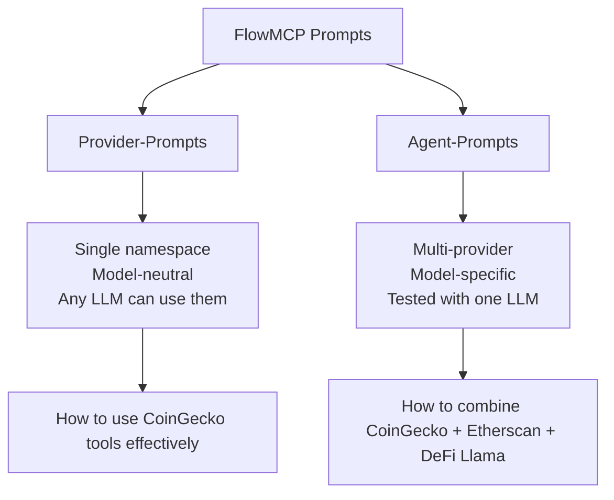
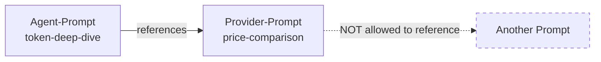
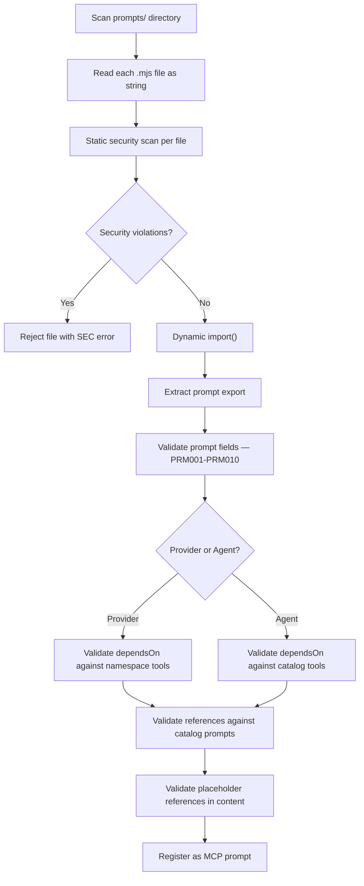

# FlowMCP Specification v3.0.0 — Prompt Architecture

FlowMCP uses a two-tier prompt system to bridge deterministic tools with non-deterministic AI orchestration. **Provider-Prompts** explain how to use a single provider's tools effectively. **Agent-Prompts** compose tools from multiple providers into tested workflows. Both types are `.mjs` files with `export const prompt = { ... }` and use the `[[...]]` placeholder syntax for references and parameters.

---

## Purpose

Individual tools are deterministic — same input, same API call. But real-world tasks rarely involve a single tool. Analyzing a token requires price data from CoinGecko, on-chain metrics from Etherscan, and TVL data from DeFi Llama. An agent needs to know not just which tools exist, but in what order to call them, how to pass results between steps, and when to fall back to alternative providers.

Prompts encode this knowledge. They are the non-deterministic layer that teaches LLMs **tool combinatorics** — which tools to call in which order, how to chain outputs to inputs, and what alternatives exist when a provider is unavailable. This is knowledge that would take hours to figure out manually by reading API docs and experimenting with endpoints.



The diagram shows the two tiers: Provider-Prompts are scoped to one namespace and work with any model. Agent-Prompts span multiple providers and are optimized for a specific model.

---

## Provider-Prompt vs Agent-Prompt

The two prompt types serve different purposes and operate at different levels of the architecture.

| Aspect | Provider-Prompt | Agent-Prompt |
|--------|----------------|--------------|
| Scope | Single namespace | Multi-provider |
| Model dependency | Model-neutral — works with any LLM | Model-specific — tested against a particular LLM |
| Scoping field | `namespace` | `agent` |
| Tested with | Any model (no `testedWith` field) | Specific model (`testedWith` required) |
| Location in catalog | `providers/{namespace}/prompts/` | `agents/{agent-name}/prompts/` |
| Tool references | Own namespace tools only (bare names in `dependsOn`) | Tools from any provider (full ID format in `dependsOn`) |
| Primary use case | Teach effective use of one provider's API | Orchestrate multi-provider workflows |

### When to Use Which

**Provider-Prompts** are the right choice when the instructions are about a single API — how to paginate CoinGecko results, how to interpret Etherscan's response codes, or how to combine two endpoints from the same provider for richer data.

**Agent-Prompts** are the right choice when the instructions span multiple providers — combining CoinGecko pricing with Etherscan contract data and DeFi Llama TVL metrics into a unified analysis workflow.

---

## Prompt File Format

Both Provider-Prompts and Agent-Prompts use the same `.mjs` file format with `export const prompt`. The `content` field is defined as a separate variable by convention, keeping instructions visually separated from metadata.

```javascript
const content = `
Use [[coingecko/tool/simplePrice]] to fetch current prices.
Then compare with [[coingecko/tool/coinMarkets]] for market cap data.

Analyze the metrics for [[token]] in [[currency]].
`


export const prompt = {
    name: 'price-comparison',
    version: 'flowmcp-prompt/1.0.0',
    namespace: 'coingecko',
    description: 'Compare prices across multiple coins using CoinGecko data',
    dependsOn: [ 'simplePrice', 'coinMarkets' ],
    content
}
```

### Why `.mjs` Files

Prompt files use the same `.mjs` format as schema and skill files for three reasons:

1. **Consistent loading.** The runtime loads prompts via `import()` — the same mechanism used for schemas and skills. No separate parser needed.
2. **Static security scanning.** The same `SecurityScanner` that checks schema files also checks prompt files. The zero-import policy applies uniformly.
3. **Multiline content.** Template literals handle multiline prompt content naturally without escaping issues.

---

## Provider-Prompt Format

A Provider-Prompt is scoped to a single namespace. It describes how to use that provider's tools effectively, without assuming any specific LLM model.

```javascript
const content = `
Use [[coingecko/tool/simplePrice]] to fetch current prices for the requested coins.
Then use [[coingecko/tool/coinMarkets]] to get market cap data.

Compare the following metrics for [[coins]]:
- Current price in [[currency]]
- 24h price change
- Market cap ranking

If the user asks for historical data, note that simplePrice only returns current
prices. Suggest using coinMarkets with the order parameter for trending analysis.
`


export const prompt = {
    name: 'price-comparison',
    version: 'flowmcp-prompt/1.0.0',
    namespace: 'coingecko',
    description: 'Compare prices across multiple coins',
    dependsOn: [ 'simplePrice', 'coinMarkets' ],
    content
}
```

### Provider-Prompt Characteristics

- **`namespace` field** identifies the provider. Must match the provider's namespace in the catalog.
- **`dependsOn` uses bare tool names** — since the scope is a single namespace, fully qualified IDs are unnecessary. `'simplePrice'` is sufficient because it can only refer to `coingecko/tool/simplePrice`.
- **No `testedWith` field** — Provider-Prompts are model-neutral. Any LLM can benefit from them.
- **No `agent` field** — the `namespace` field indicates this is a Provider-Prompt.
- **`[[...]]` references** in `content` may use full form (`[[coingecko/tool/simplePrice]]`) or short form (`[[coingecko/simplePrice]]`), but must reference tools within the same namespace.

---

## Agent-Prompt Format

An Agent-Prompt is scoped to an agent. It describes multi-provider workflows and is tested against a specific LLM model.

```javascript
const content = `
First, get the contract details using [[etherscan/tool/getContractAbi]] for address [[address]].
Then fetch pricing data using [[coingecko/tool/simplePrice]].

For price comparison context, follow the approach in [[coingecko/prompt/price-comparison]].

Analyze the [[token]] considering:
- Contract verification status
- Current price and volume
- Historical price trends

If Etherscan returns an unverified contract, skip the ABI analysis and focus on
the pricing data. Use [[coingecko/tool/coinMarkets]] as a fallback for additional
market context.
`


export const prompt = {
    name: 'token-deep-dive',
    version: 'flowmcp-prompt/1.0.0',
    agent: 'crypto-research',
    description: 'Deep analysis of a token across multiple data sources',
    testedWith: 'anthropic/claude-sonnet-4-5-20250929',
    dependsOn: [
        'coingecko/tool/simplePrice',
        'coingecko/tool/coinMarkets',
        'etherscan/tool/getContractAbi'
    ],
    references: [ 'coingecko/prompt/price-comparison' ],
    content
}
```

### Agent-Prompt Characteristics

- **`agent` field** identifies the owning agent. Must match an agent name in the catalog.
- **`dependsOn` uses full ID format** — since Agent-Prompts span multiple providers, each tool reference must be unambiguous. `'coingecko/tool/simplePrice'` specifies both the namespace and the tool name.
- **`testedWith` is required** — documents which LLM model the prompt was tested and optimized for.
- **No `namespace` field** — the `agent` field indicates this is an Agent-Prompt.
- **`references` array** allows including content from other prompts (see [Composable Prompts](#composable-prompts)).
- **`[[...]]` references** in `content` use full form IDs to reference tools across namespaces.

---

## Prompt Fields

The `export const prompt` object contains all metadata and instructions. Some fields are shared across both types, others are exclusive to one type.

| Field | Type | Provider-Prompt | Agent-Prompt | Description |
|-------|------|----------------|--------------|-------------|
| `name` | `string` | Required | Required | Kebab-case identifier. Must match `^[a-z][a-z0-9-]*$`. |
| `version` | `string` | Required | Required | Must be `flowmcp-prompt/1.0.0`. |
| `namespace` | `string` | Required | Forbidden | Provider namespace this prompt belongs to. |
| `agent` | `string` | Forbidden | Required | Agent name this prompt belongs to. |
| `description` | `string` | Required | Required | What the prompt teaches. Maximum 1024 characters. |
| `testedWith` | `string` | Forbidden | Required | OpenRouter model ID (must contain `/`). |
| `dependsOn` | `string[]` | Required | Required | Tool dependencies. Bare names for Provider-Prompts, full IDs for Agent-Prompts. |
| `references` | `string[]` | Optional | Optional | Other prompts to compose. Full ID format. |
| `content` | `string` | Required | Required | Prompt instructions with `[[...]]` placeholders. Must not be empty. |

### Field Details

#### `name`

The prompt name is the primary identifier. It is used in the catalog, in `[[...]]` placeholder references, and in MCP prompt registration. Only lowercase letters, numbers, and hyphens are allowed.

```javascript
// Valid
name: 'price-comparison'
name: 'token-deep-dive'
name: 'quick-check'

// Invalid
name: 'Price-Comparison'    // uppercase not allowed
name: '3d-analysis'         // must start with letter
name: 'my_prompt'           // underscore not allowed
```

#### `version`

The version string identifies the prompt format specification. In this release, the only valid value is `'flowmcp-prompt/1.0.0'`. The prefix `flowmcp-prompt/` distinguishes prompt versioning from schema versioning (`3.x.x`), skill versioning (`flowmcp-skill/1.0.0`), and shared list versioning.

```javascript
// Valid
version: 'flowmcp-prompt/1.0.0'

// Invalid
version: '1.0.0'                  // missing prefix
version: 'flowmcp-prompt/2.0.0'   // version 2.0.0 does not exist yet
version: 'flowmcp-skill/1.0.0'    // wrong prefix (this is a skill version)
```

#### `namespace` vs `agent`

These two fields are mutually exclusive. Exactly one must be set — not both, not neither. The presence of `namespace` marks a Provider-Prompt. The presence of `agent` marks an Agent-Prompt.

```javascript
// Provider-Prompt
namespace: 'coingecko'
// agent field must NOT be present

// Agent-Prompt
agent: 'crypto-research'
// namespace field must NOT be present
```

#### `testedWith`

Required for Agent-Prompts, forbidden for Provider-Prompts. Uses OpenRouter model syntax, which always contains a `/` separator between organization and model name.

```javascript
// Valid
testedWith: 'anthropic/claude-sonnet-4-5-20250929'
testedWith: 'openai/gpt-4o'
testedWith: 'google/gemini-2.0-flash'

// Invalid
testedWith: 'claude-sonnet'      // missing organization prefix
testedWith: 'gpt-4o'             // must contain /
```

The `testedWith` field documents which model the prompt was optimized for. Other models may work but are not guaranteed to produce the same quality of results. This is especially relevant for complex multi-step workflows where models differ in their ability to chain tool calls and handle intermediate results.

#### `dependsOn`

Lists the tools that the prompt references. Every tool mentioned in the prompt's `content` via `[[...]]` placeholders should appear in `dependsOn`. This enables validation — the runtime checks that all declared dependencies resolve to existing tools.

**Provider-Prompts** use bare tool names (same namespace is implied):

```javascript
// Provider-Prompt for coingecko
dependsOn: [ 'simplePrice', 'coinMarkets' ]
// Resolves to: coingecko/tool/simplePrice, coingecko/tool/coinMarkets
```

**Agent-Prompts** use full ID format (namespace is required):

```javascript
// Agent-Prompt spanning coingecko and etherscan
dependsOn: [
    'coingecko/tool/simplePrice',
    'coingecko/tool/coinMarkets',
    'etherscan/tool/getContractAbi'
]
```

#### `references`

An optional array of prompt IDs that this prompt composes. See [Composable Prompts](#composable-prompts) for full details.

```javascript
// Agent-Prompt referencing a Provider-Prompt
references: [ 'coingecko/prompt/price-comparison' ]
```

#### `content`

The prompt instructions that the AI agent follows. Contains `[[...]]` placeholders for tool references and user parameters. Must not be empty. See [Placeholder Syntax](#placeholder-syntax) for the full reference.

---

## Placeholder Syntax

Prompts use the `[[...]]` placeholder syntax defined in `02-parameters.md`. This section summarizes the key rules — see `02-parameters.md` for the complete specification including validation rules PH001-PH004.

### Two Categories

The content inside `[[ ]]` determines whether the placeholder is a **reference** or a **parameter**. The rule is simple: if it contains a `/`, it is a reference. If it does not, it is a parameter.

| Content Pattern | Category | Resolution |
|-----------------|----------|------------|
| Contains `/` | **Reference** | Resolved via ID Schema (`16-id-schema.md`) to a registered tool, resource, or prompt |
| No `/` | **Parameter** | Value provided by the user at runtime |

### References

A placeholder containing a `/` points to a registered primitive in the catalog:

```
[[coingecko/simplePrice]]                    <- short form (type inferred)
[[coingecko/tool/simplePrice]]               <- full form (type explicit)
[[etherscan/resource/verifiedContracts]]      <- resource reference
[[coingecko/prompt/price-comparison]]         <- prompt reference
```

### Parameters

A placeholder without a `/` is a user-input parameter:

```
[[token]]         <- user provides a token symbol
[[address]]       <- user provides a contract address
[[currency]]      <- user provides a currency code
```

### Example

```
Analyze the token [[token]] on chain [[chainId]].

First, fetch the current price using [[coingecko/tool/simplePrice]].
Then retrieve the contract ABI via [[etherscan/tool/getContractAbi]].
```

In this example, `[[token]]` and `[[chainId]]` are parameters (no `/`). `[[coingecko/tool/simplePrice]]` and `[[etherscan/tool/getContractAbi]]` are references (contain `/`).

### Relationship to `{{...}}` Syntax

The `[[...]]` and `{{...}}` placeholder systems serve different layers and never overlap:

| Syntax | Context | Purpose |
|--------|---------|---------|
| `{{...}}` | Schema `main` blocks (`main.tools`, `main.resources`) | HTTP request construction, SQL parameter binding, shared list interpolation |
| `[[...]]` | Prompt `content` fields | Tool/resource/prompt references and user input in prompts |

`{{...}}` never appears in prompt content. `[[...]]` never appears in schema `main` blocks.

---

## Tool Combinatorics

The primary purpose of prompts is teaching LLMs **tool combinatorics** — the knowledge of how to combine multiple tools into effective workflows. This includes:

### Call Order

Which tools to call first, second, third. Some tools depend on output from previous calls:

```
First call [[coingecko/tool/simplePrice]] to get the current price.
Use the coin ID from the response to call [[coingecko/tool/coinMarkets]]
for detailed market data.
```

### Result Passing

How to extract values from one tool's response and pass them to the next:

```
Extract the "id" field from [[coingecko/tool/coinList]] response.
Pass that ID as the "ids" parameter to [[coingecko/tool/simplePrice]].
```

### Fallback Strategies

What to do when a tool fails or returns incomplete data:

```
If [[etherscan/tool/getContractAbi]] returns "Contract source code not verified",
skip the ABI analysis and use [[etherscan/tool/getContractCreation]] instead
to get basic contract metadata.
```

### Cross-Provider Enrichment

How to combine data from different providers for richer analysis:

```
Get the token price from [[coingecko/tool/simplePrice]].
Get the contract details from [[etherscan/tool/getContractAbi]].
Get the protocol TVL from [[defillama/tool/getTvlProtocol]].

Cross-reference: if the token has high TVL but low price, it may indicate
a yield farming opportunity. If the contract is unverified but has high
volume, flag it as a potential risk.
```

This combinatoric knowledge is what would take hours to acquire manually — reading multiple API docs, experimenting with endpoints, discovering which response fields map to which request parameters, and building mental models of how different data sources complement each other.

---

## Composable Prompts

The `references[]` array enables prompt composition — one prompt can incorporate another prompt's content without duplication.

### How It Works

When a prompt declares `references`, the runtime loads each referenced prompt and makes its content available to the AI agent alongside the primary prompt. Referenced prompts are **not** inlined into the content — they are provided as additional context that the agent can draw from.

```javascript
export const prompt = {
    name: 'token-deep-dive',
    agent: 'crypto-research',
    // ...
    references: [ 'coingecko/prompt/price-comparison' ],
    content: `
Perform a deep analysis of [[token]].

For price comparison methodology, follow [[coingecko/prompt/price-comparison]].

Then add on-chain analysis using [[etherscan/tool/getContractAbi]].
`
}
```

When the runtime renders `token-deep-dive`, it also loads `coingecko/prompt/price-comparison` and provides both to the agent.

### Composition Rules



The diagram shows that composition is limited to one level. The referencing prompt can include another prompt, but that referenced prompt cannot itself reference further prompts.

| Rule | Description |
|------|-------------|
| **One level deep** | A referenced prompt must not itself have `references[]`. No chains: A -> B -> C is forbidden. |
| **Agent -> Provider** | Agent-Prompts can reference Provider-Prompts (cross-scope). |
| **Provider -> Provider** | Provider-Prompts can reference other prompts within the same namespace only. |
| **Provider -> Agent** | Provider-Prompts cannot reference Agent-Prompts (Agent-Prompts are model-specific, Provider-Prompts are model-neutral). |
| **Full ID format** | All entries in `references[]` use the full ID format: `namespace/prompt/name` or `agent/prompt/name`. |

### Why One Level Deep

The one-level restriction prevents three problems:

1. **Circular references** — prompt A references prompt B references prompt A
2. **Context explosion** — each level adds content, which can exceed LLM context limits
3. **Unpredictable behavior** — deeply nested prompts become difficult to reason about and test

---

## `testedWith` Field

The `testedWith` field documents which LLM model an Agent-Prompt was tested and optimized for. It uses the OpenRouter model identifier format.

### Format

The value must contain a `/` separator between the organization and model name:

```
organization/model-name
```

### Examples

| Value | Organization | Model |
|-------|-------------|-------|
| `anthropic/claude-sonnet-4-5-20250929` | Anthropic | Claude Sonnet 4.5 |
| `openai/gpt-4o` | OpenAI | GPT-4o |
| `google/gemini-2.0-flash` | Google | Gemini 2.0 Flash |
| `meta-llama/llama-3.1-405b-instruct` | Meta | Llama 3.1 405B |

### Implications

- **Required for Agent-Prompts** — every Agent-Prompt must declare which model it was tested with.
- **Forbidden for Provider-Prompts** — Provider-Prompts are model-neutral by design.
- **Not a restriction** — the field documents testing history, not a runtime requirement. Other models may work, but the prompt author has only verified behavior with the declared model.
- **Model-specific optimizations** — different models handle tool chaining, JSON parsing, and multi-step reasoning differently. An Agent-Prompt tested with Claude may structure instructions differently than one tested with GPT-4o.

---

## Directory Structure

Prompts are stored in `prompts/` subdirectories at the provider and agent levels:

```
providers/
└── coingecko/
    ├── simple-price.mjs              # Schema with tools
    ├── coin-markets.mjs              # Schema with tools
    └── prompts/
        └── price-comparison.mjs       # Provider-Prompt

agents/
└── crypto-research/
    ├── manifest.json                  # Agent manifest
    └── prompts/
        └── token-deep-dive.mjs        # Agent-Prompt
```

### File Organization Rules

| Level | Directory | Contains |
|-------|-----------|----------|
| Provider | `providers/{namespace}/prompts/` | Provider-Prompts scoped to the namespace |
| Agent | `agents/{agent-name}/prompts/` | Agent-Prompts scoped to the agent |

- Prompt filenames use kebab-case and match the prompt's `name` field: `price-comparison.mjs` contains `name: 'price-comparison'`.
- Provider-Prompts live alongside their provider's schema files.
- Agent-Prompts live alongside their agent's manifest.

---

## Prompts vs Skills

Prompts and Skills are both non-deterministic guidance for AI agents, but they serve different purposes and use different formats. Skills remain as defined in `14-skills.md` — this document does not replace them.

| Aspect | Prompts (`12-prompt-architecture.md`) | Skills (`14-skills.md`) |
|--------|---------------------------------------|------------------------|
| Export | `export const prompt` | `export const skill` |
| Version prefix | `flowmcp-prompt/1.0.0` | `flowmcp-skill/1.0.0` |
| Scope | Provider-level or Agent-level | Schema-level |
| Placeholder syntax | `[[...]]` (double bracket) | `{{tool:name}}`, `{{input:key}}` (double brace) |
| Tool references | Via ID Schema (`[[namespace/tool/name]]`) | Bare names within same schema (`{{tool:name}}`) |
| Input declaration | Parameters as `[[paramName]]` in content | Typed `input` array with key, type, description, required |
| Cross-provider | Agent-Prompts can span providers | Not directly (only via group-level skills) |
| Model binding | Agent-Prompts require `testedWith` | No model binding |
| Composition | `references[]` array | `{{skill:name}}` placeholder |
| Primary purpose | Tool combinatorics and workflow guidance | Structured instructions with typed inputs |

Skills are schema-scoped instruction sets with explicit input typing and structured metadata. Prompts are catalog-level guidance focused on tool combinatorics and cross-provider workflows. Both map to the MCP `server.prompt` primitive.

---

## Validation Rules

### Structural Rules

| Code | Severity | Rule |
|------|----------|------|
| PRM001 | error | `name` is required, must be a string, must match `^[a-z][a-z0-9-]*$` |
| PRM002 | error | `version` is required and must be `'flowmcp-prompt/1.0.0'` |
| PRM003 | error | Exactly one of `namespace` or `agent` must be set (not both, not neither) |
| PRM004 | error | `testedWith` is required when `agent` is set, forbidden when `namespace` is set |
| PRM005 | error | `testedWith` value must contain `/` (OpenRouter model ID format) |
| PRM006 | error | Each `dependsOn` entry must resolve to an existing tool in the catalog |
| PRM007 | error | Each `references[]` entry must resolve to an existing prompt in the catalog |
| PRM008 | error | Referenced prompts must not themselves have `references[]` (one level deep only) |
| PRM009 | error | `[[...]]` references in `content` must resolve to registered primitives (see PH002 in `02-parameters.md`) |
| PRM010 | error | `content` is required and must be a non-empty string |

### Rule Details

**PRM001** — The name is the primary identifier. It appears in MCP prompt listings, ID references, and filenames. Kebab-case is enforced to ensure URL-safe, filesystem-safe identifiers.

**PRM002** — The version string enables the validator to apply the correct rule set. Future versions of the prompt format will increment this value.

**PRM003** — A prompt must be either a Provider-Prompt (has `namespace`) or an Agent-Prompt (has `agent`). Having both or neither is invalid. This rule enforces the two-tier architecture.

**PRM004** — Provider-Prompts are model-neutral, so `testedWith` would be misleading. Agent-Prompts are model-specific, so `testedWith` is mandatory to document the testing context.

**PRM005** — OpenRouter model IDs always contain a `/` between organization and model name (e.g., `anthropic/claude-sonnet-4-5-20250929`). A value without `/` indicates an incorrect format.

**PRM006** — Every tool listed in `dependsOn` must exist in the catalog. For Provider-Prompts, bare names are resolved within the prompt's namespace. For Agent-Prompts, full IDs are resolved across the catalog.

**PRM007** — Every prompt listed in `references[]` must exist in the catalog. References use full ID format (`namespace/prompt/name`).

**PRM008** — If prompt A references prompt B, prompt B must not have its own `references[]` array. This enforces one-level-deep composition.

**PRM009** — All `[[...]]` reference placeholders (those containing `/`) in the `content` field must resolve to registered tools, resources, or prompts. Parameter placeholders (no `/`) are not validated against the catalog — they are user inputs.

**PRM010** — A prompt without content has no purpose.

### Validation Output Examples

```
flowmcp validate providers/coingecko/prompts/price-comparison.mjs

  0 errors, 0 warnings
  Prompt is valid
```

```
flowmcp validate agents/crypto-research/prompts/token-deep-dive.mjs

  PRM004 error   Agent-Prompt "token-deep-dive" requires testedWith field
  PRM006 error   dependsOn entry "etherscan/tool/nonExistent" does not resolve

  2 errors, 0 warnings
  Prompt is invalid
```

```
flowmcp validate providers/coingecko/prompts/bad-prompt.mjs

  PRM003 error   Prompt "bad-prompt" has both namespace and agent set
  PRM005 error   testedWith "claude-sonnet" must contain /

  2 errors, 0 warnings
  Prompt is invalid
```

---

## Loading

Prompts are loaded as part of the catalog loading sequence. Provider-Prompts are loaded when their provider's schemas are loaded. Agent-Prompts are loaded when their agent's manifest is loaded.

### Loading Sequence



The diagram shows how prompt loading integrates into the catalog loading pipeline. Security scanning happens before any code execution, followed by field validation and reference resolution.

### Security

Prompt files are subject to the same zero-import security model as schema and skill files. The static security scan checks for all forbidden patterns listed in `05-security.md` before the file is loaded via `import()`.

```javascript
// Allowed
const content = `Instructions with [[coingecko/tool/simplePrice]]...`
export const prompt = { /* metadata */ }

// Forbidden — import statement (SEC001)
import { something } from 'somewhere'

// Forbidden — require call (SEC002)
const lib = require( 'lib' )
```

---

## Complete Examples

### Provider-Prompt: CoinGecko Price Comparison

**File:** `providers/coingecko/prompts/price-comparison.mjs`

```javascript
const content = `
Use [[coingecko/tool/simplePrice]] to fetch current prices for the requested coins.
Pass the coin IDs as a comma-separated string in the "ids" parameter and the target
currency in the "vs_currencies" parameter.

Then use [[coingecko/tool/coinMarkets]] to get detailed market data. Pass the same
currency as "vs_currency" and set "order" to "market_cap_desc" for ranked results.

Compare the following metrics for [[coins]]:
- Current price in [[currency]]
- 24h price change percentage
- Market cap ranking
- 24h trading volume

Present the comparison as a Markdown table with one row per coin. Sort by market
cap descending. Include a summary paragraph highlighting the top performer and any
coins with unusual 24h volume relative to market cap.

If simplePrice returns a coin ID that coinMarkets does not recognize, skip that
coin in the comparison table and note it at the bottom of the report.
`


export const prompt = {
    name: 'price-comparison',
    version: 'flowmcp-prompt/1.0.0',
    namespace: 'coingecko',
    description: 'Compare prices, market caps, and volumes across multiple coins using CoinGecko data',
    dependsOn: [ 'simplePrice', 'coinMarkets' ],
    content
}
```

### Agent-Prompt: Cross-Provider Token Analysis

**File:** `agents/crypto-research/prompts/token-deep-dive.mjs`

```javascript
const content = `
First, get the contract details using [[etherscan/tool/getContractAbi]] for address [[address]].
If the contract is verified, parse the ABI to identify the token standard (ERC-20, ERC-721, etc.)
and extract key function signatures.

Then fetch pricing data using [[coingecko/tool/simplePrice]] with the token's CoinGecko ID.
If the token ID is unknown, try searching with the contract address or token symbol.

For price comparison context, follow the approach in [[coingecko/prompt/price-comparison]].
Compare the target token against the top 3 tokens in the same category.

Use [[coingecko/tool/coinMarkets]] to get 24h volume and market cap data for broader context.

Analyze [[token]] considering:
- Contract verification status (from Etherscan)
- Token standard and key functions (from ABI)
- Current price and 24h change (from CoinGecko)
- Trading volume relative to market cap
- Market cap ranking in category

If [[etherscan/tool/getContractAbi]] returns "Contract source code not verified",
note this as a risk factor but continue with the price analysis. Unverified contracts
are not necessarily malicious but warrant caution.

Produce a Markdown report with sections: Contract Overview, Price Analysis,
Market Position, and Risk Assessment.
`


export const prompt = {
    name: 'token-deep-dive',
    version: 'flowmcp-prompt/1.0.0',
    agent: 'crypto-research',
    description: 'Deep analysis of a token across multiple data sources combining on-chain and market data',
    testedWith: 'anthropic/claude-sonnet-4-5-20250929',
    dependsOn: [
        'coingecko/tool/simplePrice',
        'coingecko/tool/coinMarkets',
        'etherscan/tool/getContractAbi'
    ],
    references: [ 'coingecko/prompt/price-comparison' ],
    content
}
```

### What These Examples Demonstrate

1. **Provider-Prompt** — `price-comparison` is scoped to `coingecko`, uses bare tool names in `dependsOn`, has no `testedWith` or `agent` field.
2. **Agent-Prompt** — `token-deep-dive` is scoped to `crypto-research`, uses full IDs in `dependsOn`, requires `testedWith`.
3. **Placeholder syntax** — `[[coingecko/tool/simplePrice]]` is a reference (contains `/`), `[[token]]` is a parameter (no `/`).
4. **Composable prompts** — `token-deep-dive` references `coingecko/prompt/price-comparison` via the `references` array.
5. **Tool combinatorics** — both prompts describe call order, result passing, and fallback strategies.
6. **Fallback instructions** — both prompts handle edge cases (unrecognized coin IDs, unverified contracts).
7. **Content variable pattern** — the `content` variable is defined above the export and referenced by name.
8. **Zero imports** — neither file contains import statements.

### File Structure

```
providers/
└── coingecko/
    ├── simple-price.mjs
    ├── coin-markets.mjs
    └── prompts/
        └── price-comparison.mjs       # Provider-Prompt

agents/
└── crypto-research/
    ├── manifest.json
    └── prompts/
        └── token-deep-dive.mjs        # Agent-Prompt
```
