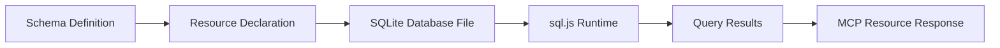
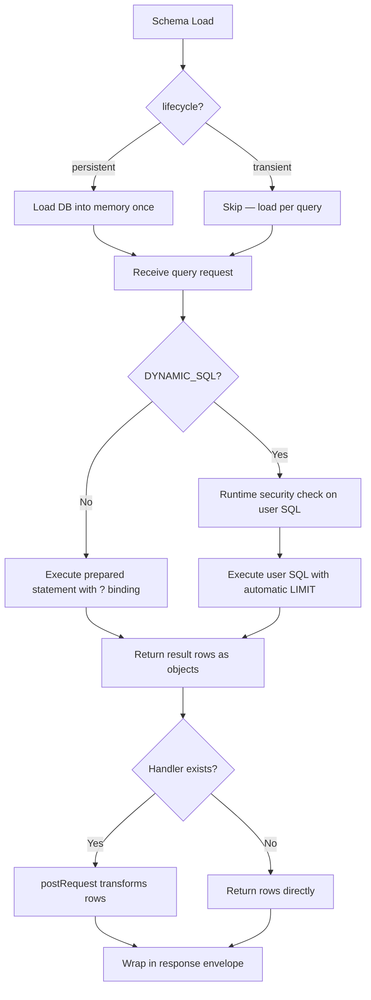
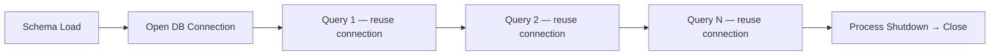
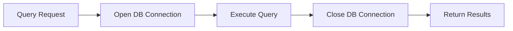

# FlowMCP Specification v3.0.0 — Resources

Resources provide deterministic, read-only data access via SQLite databases. They map to the MCP `server.resource` primitive and are defined in `main.resources` alongside `main.tools`. This document defines the resource format, query definitions, parameter binding, SQL security constraints, handler integration, database bundling, and validation rules.

---

## Purpose

Tools fetch data from external APIs over the network — they depend on third-party availability, rate limits, and response format stability. Some use cases require data that is **local, deterministic, and always available**: token metadata lookups, chain ID mappings, contract registries, country code tables.

Resources solve this by embedding SQLite databases directly in the schema package. The schema author provides a pre-built `.db` file, and the runtime executes parameterized queries against it. No network calls, no API keys, no rate limits.



The diagram shows the data flow from the schema's resource declaration through the bundled SQLite database into query results exposed as MCP resources.

### When to Use Resources

| Use Case | Mechanism | Example |
|----------|-----------|---------|
| Live API data | Tool (route) | Current token price from CoinGecko |
| Static reference data | Resource | Token metadata by symbol or contract address |
| Chain configuration | Resource | EVM chain IDs, RPC URLs, explorer URLs |
| Code lookups | Resource | Country codes, currency codes, standard identifiers |

Resources are for **read-only, bundled datasets** that the schema author controls. If the data comes from an external API at call-time, use a tool (route). If the data is static or slow-changing and ships with the schema, use a resource.

---

## Resource Definition

Resources are defined in the `resources` field of the `main` export. Each key is a resource name in camelCase:

```javascript
export const main = {
    namespace: 'tokens',
    name: 'TokenRegistry',
    description: 'Token metadata lookup from local database',
    version: '3.0.0',
    resources: {
        tokenLookup: {
            source: 'sqlite',
            description: 'Token metadata lookup by symbol or contract address.',
            database: './data/tokens.db',
            queries: {
                bySymbol: {
                    sql: 'SELECT * FROM tokens WHERE symbol = ? COLLATE NOCASE',
                    description: 'Find tokens by ticker symbol (case-insensitive)',
                    parameters: [
                        {
                            position: { key: 'symbol', value: '{{USER_PARAM}}' },
                            z: { primitive: 'string()', options: [ 'min(1)' ] }
                        }
                    ],
                    output: {
                        mimeType: 'application/json',
                        schema: {
                            type: 'array',
                            items: {
                                type: 'object',
                                properties: {
                                    symbol: { type: 'string', description: 'Token ticker symbol' },
                                    name: { type: 'string', description: 'Full token name' },
                                    address: { type: 'string', description: 'Contract address' },
                                    chainId: { type: 'number', description: 'Chain identifier' },
                                    decimals: { type: 'number', description: 'Token decimals' }
                                }
                            }
                        }
                    },
                    tests: [
                        { _description: 'Find USDC token entries', symbol: 'USDC' }
                    ]
                },
                byAddress: {
                    sql: 'SELECT * FROM tokens WHERE address = ? AND chain_id = ?',
                    description: 'Find token by contract address and chain',
                    parameters: [
                        {
                            position: { key: 'address', value: '{{USER_PARAM}}' },
                            z: { primitive: 'string()', options: [ 'min(42)', 'max(42)' ] }
                        },
                        {
                            position: { key: 'chainId', value: '{{USER_PARAM}}' },
                            z: { primitive: 'number()', options: [ 'min(1)' ] }
                        }
                    ],
                    output: {
                        mimeType: 'application/json',
                        schema: {
                            type: 'array',
                            items: {
                                type: 'object',
                                properties: {
                                    symbol: { type: 'string', description: 'Token ticker symbol' },
                                    name: { type: 'string', description: 'Full token name' },
                                    address: { type: 'string', description: 'Contract address' },
                                    chainId: { type: 'number', description: 'Chain identifier' },
                                    decimals: { type: 'number', description: 'Token decimals' }
                                }
                            }
                        }
                    },
                    tests: [
                        {
                            _description: 'USDC on Ethereum mainnet',
                            address: '0xA0b86991c6218b36c1d19D4a2e9Eb0cE3606eB48',
                            chainId: 1
                        }
                    ]
                }
            }
        }
    }
}
```

The `resources` field lives in the `main` block and is therefore part of the hashable, JSON-serializable schema surface. It must not contain functions or dynamic expressions.

---

## Resource Fields

| Field | Type | Required | Description |
|-------|------|----------|-------------|
| `source` | `string` | Yes | Data source type. Must be `'sqlite'`. See [Source Adapters](#source-adapters) for future extensions. |
| `lifecycle` | `string` | No | Database connection lifecycle. `'persistent'` (default) or `'transient'`. See [Database Lifecycle](#database-lifecycle). |
| `description` | `string` | Yes | What this resource provides. Appears in resource discovery. |
| `database` | `string` | Yes | Path to the `.db` file. Relative paths are resolved from the schema file location. Absolute paths and `~` home directory expansion are also supported for system-level databases. Must end with `.db`. |
| `queries` | `object` | Yes | Query definitions. Keys are query names in camelCase. Maximum 6 queries per resource. |

### Field Details

#### `source`

Currently only `'sqlite'` is supported. This field acts as a discriminator that determines which adapter handles the resource. See [Source Adapters](#source-adapters) for the extension roadmap.

```javascript
// Valid
source: 'sqlite'

// Invalid
source: 'postgres'    // not supported
source: 'mysql'       // not supported
source: 'json'        // reserved, not yet implemented
```

#### `lifecycle`

Controls how the database connection is managed at runtime. Defaults to `'persistent'` when omitted.

| Value | Behavior | Use When |
|-------|----------|----------|
| `'persistent'` | Database is loaded **once** at schema load-time and kept in memory. All queries reuse the same connection. This is the default. | Most databases (< 100 MB). Fast query response, no per-query I/O. |
| `'transient'` | Database connection is opened per query execution and closed immediately after. | Very large databases (> 100 MB) that should not remain in memory permanently. |

```javascript
// Default — persistent (can be omitted)
resources: {
    tokenLookup: {
        source: 'sqlite',
        lifecycle: 'persistent',
        database: './data/tokens.db',
        // ...
    }
}

// Explicit transient — for large databases
resources: {
    largeRegistry: {
        source: 'sqlite',
        lifecycle: 'transient',
        database: '~/.flowmcp/data/openregister.db',
        // ...
    }
}
```

**Why expose this as a field?** The schema author knows the database size and access pattern. A 50 KB token lookup should stay in memory (persistent). A 2.5 GB company registry may not (transient). The runtime cannot make this decision — only the schema author can.

#### `description`

Describes the resource's purpose. This appears in MCP resource discovery and helps AI clients understand what data is available without inspecting individual queries.

```javascript
// Good — explains what data is available
description: 'Token metadata lookup by symbol or contract address.'
description: 'EVM chain configuration including RPC endpoints and explorer URLs.'

// Bad — too vague
description: 'Database queries.'
description: 'Data lookup.'
```

#### `database`

Path to the SQLite database file. Must end with `.db`. Three path types are supported:

**Relative paths** — resolved from the schema file's directory. Used for databases bundled with the schema.

**Home directory paths** — paths starting with `~/` are expanded to the user's home directory. Used for system-level databases that are too large to bundle with the schema (e.g., downloaded open data sets).

**Absolute paths** — full filesystem paths. Used for databases at known system locations.

```javascript
// Valid — relative (bundled with schema)
database: './data/tokens.db'
database: './tokens.db'

// Valid — home directory (system-level database)
database: '~/.flowmcp/data/openregister.db'
database: '~/.flowmcp/data/ofac-sdn.db'

// Valid — absolute path
database: '/opt/data/gtfs-de.db'

// Invalid
database: './data/tokens.sqlite'         // must end with .db
database: './data/tokens'                // must end with .db
```

**Bundled vs. System-Level Databases:**

| Type | Path Style | Size | Distribution |
|------|-----------|------|-------------|
| Bundled | `'./data/tokens.db'` | < 50 MB | Ships with schema package |
| System-level | `'~/.flowmcp/data/openregister.db'` | Any size | Downloaded separately, referenced by schema |

System-level databases are not distributed with the schema. The schema author provides download instructions in the schema description or documentation. If the database file is missing at load-time, the runtime produces a warning (not an error) to allow schema validation without the database present.

#### `queries`

An object mapping query names to query definitions. Keys must be camelCase (`^[a-z][a-zA-Z0-9]*$`). Maximum 6 queries per resource — this allows domain-specific queries plus the recommended standard queries (`getSchema`, `freeQuery`). If more queries are needed, split into separate resources.

---

## Query Definition

Each query defines a SQL prepared statement, its parameters, output schema, and tests.

| Field | Type | Required | Description |
|-------|------|----------|-------------|
| `sql` | `string` | Yes | SQL prepared statement with `?` placeholders for parameter binding. |
| `description` | `string` | Yes | What this query does. Appears in the MCP resource description. |
| `parameters` | `array` | Yes | Parameter definitions using the `position` + `z` system. Can be empty `[]` for no-parameter queries. |
| `output` | `object` | Yes | Output schema declaring expected result shape. Uses the same format as route output schemas (see `04-output-schema.md`). |
| `tests` | `array` | Yes | Executable test cases. At least 1 per query. |

### Query Field Details

#### `sql`

A SQL prepared statement using `?` as the placeholder for bound parameters. Parameters are bound in the order they appear in the `parameters` array — the first parameter binds to the first `?`, the second to the second `?`, and so on.

```javascript
// Single parameter
sql: 'SELECT * FROM tokens WHERE symbol = ? COLLATE NOCASE'

// Multiple parameters — bound in array order
sql: 'SELECT * FROM tokens WHERE address = ? AND chain_id = ?'

// No parameters
sql: 'SELECT DISTINCT chain_id, chain_name FROM tokens ORDER BY chain_id'
```

Only `SELECT` statements are allowed. Common Table Expressions (CTEs) starting with `WITH` are also permitted, as they always resolve to a `SELECT`. See [SQL Security](#sql-security) for the complete list of blocked patterns.

#### `description`

Describes what this specific query does — not what the resource provides (that is the resource's `description`), but what this particular query returns.

```javascript
// Good — explains the specific query
description: 'Find tokens by ticker symbol (case-insensitive)'
description: 'Find token by contract address and chain'
description: 'List all distinct chains that have token entries'

// Bad — generic
description: 'Query tokens'
description: 'Database lookup'
```

#### `output`

Output schema for query results. Uses the same format defined in `04-output-schema.md`. Resource queries always return arrays (zero or more matching rows), so the top-level `schema.type` is always `'array'`.

```javascript
output: {
    mimeType: 'application/json',
    schema: {
        type: 'array',
        items: {
            type: 'object',
            properties: {
                symbol: { type: 'string', description: 'Token ticker symbol' },
                name: { type: 'string', description: 'Full token name' },
                decimals: { type: 'number', description: 'Token decimals' }
            }
        }
    }
}
```

The `output` field is required for every query. Unlike tool routes where `output` is optional (see `04-output-schema.md`), resource queries always have a known, stable schema because the database structure is controlled by the schema author.

---

## Parameters

Resource parameters use the same `position` + `z` system as tool parameters (see `02-parameters.md`), with one key difference: **resource parameters have no `location` field**.

### Why No `location`

Tool parameters need `location` (`query`, `body`, `insert`) because they are placed into HTTP requests. Resource parameters are bound to SQL `?` placeholders — their position is determined by array order, not by an HTTP request structure.

### Parameter Structure

```javascript
{
    position: { key: 'symbol', value: '{{USER_PARAM}}' },
    z: { primitive: 'string()', options: [ 'min(1)' ] }
}
```

| Field | Type | Required | Description |
|-------|------|----------|-------------|
| `position.key` | `string` | Yes | Parameter name exposed to the AI client. |
| `position.value` | `string` | Yes | Must be `'{{USER_PARAM}}'` for user-provided values, or a fixed string. |
| `z.primitive` | `string` | Yes | Zod-based type declaration. Same primitives as tool parameters. |
| `z.options` | `string[]` | Yes | Validation constraints. Same options as tool parameters. |

### Binding Order

Parameters are bound to `?` placeholders in array order. The first parameter in the array binds to the first `?` in the SQL statement, the second to the second `?`, and so on.

```javascript
// SQL: SELECT * FROM tokens WHERE address = ? AND chain_id = ?
//                                             ^               ^
//                                     parameter[0]     parameter[1]

parameters: [
    {
        position: { key: 'address', value: '{{USER_PARAM}}' },
        z: { primitive: 'string()', options: [ 'min(42)', 'max(42)' ] }
    },
    {
        position: { key: 'chainId', value: '{{USER_PARAM}}' },
        z: { primitive: 'number()', options: [ 'min(1)' ] }
    }
]
```

The number of parameters must match the number of `?` placeholders in the SQL statement. A mismatch is a validation error.

### Value Types

| Value Pattern | Description | Visible to User |
|---------------|-------------|-----------------|
| `{{USER_PARAM}}` | Value provided by the user at call-time | Yes |
| Any other string | Fixed value, bound automatically | No |

Resource parameters do not support `{{SERVER_PARAM:...}}` injection. SQL queries operate on local data and do not require API keys or server secrets.

### Supported Primitives

Resource parameters support the same Zod primitives as tool parameters:

| Primitive | Description | Example |
|-----------|-------------|---------|
| `string()` | String value | `'string()'` |
| `number()` | Numeric value | `'number()'` |
| `boolean()` | Boolean value | `'boolean()'` |
| `enum(A,B,C)` | One of the listed values | `'enum(ethereum,polygon,arbitrum)'` |

The `array()` and `object()` primitives are not supported for resource parameters — SQL parameter binding accepts only scalar values.

### Supported Options

| Option | Description | Example |
|--------|-------------|---------|
| `min(n)` | Minimum value/length | `'min(1)'` |
| `max(n)` | Maximum value/length | `'max(100)'` |
| `length(n)` | Exact length | `'length(42)'` |
| `optional()` | Parameter is not required | `'optional()'` |
| `default(value)` | Default value when omitted | `'default(1)'` |

---

## SQL Security

Resource queries execute SQL against a local database. To prevent misuse, the runtime enforces strict SQL security constraints. All checks are case-insensitive and applied at load-time before any query is executed.

### Blocked Patterns

The following SQL patterns are forbidden. If a query's `sql` field matches any of these patterns (case-insensitive), the schema is rejected at load-time:

| Pattern | Reason |
|---------|--------|
| `ATTACH DATABASE` | Prevents accessing external database files |
| `LOAD_EXTENSION` | Prevents loading native code extensions |
| `PRAGMA` | Prevents modifying database configuration |
| `CREATE` | No DDL — database is read-only |
| `ALTER` | No DDL — database is read-only |
| `DROP` | No DDL — database is read-only |
| `INSERT` | No DML writes — database is read-only |
| `UPDATE` | No DML writes — database is read-only |
| `DELETE` | No DML writes — database is read-only |
| `REPLACE` | No DML writes — database is read-only |
| `TRUNCATE` | No DML writes — database is read-only |

### Allowed Statements

Only `SELECT` statements and `WITH` (CTE) expressions are allowed. The runtime verifies that the SQL statement begins with `SELECT` or `WITH` (after trimming whitespace) before accepting it. CTEs are useful when the same parameter value is needed in multiple places (e.g., UNION queries), since each `?` placeholder maps to a separate parameter.

```javascript
// Valid
sql: 'SELECT * FROM tokens WHERE symbol = ?'
sql: 'SELECT symbol, name, decimals FROM tokens WHERE chain_id = ? ORDER BY symbol'
sql: 'SELECT DISTINCT chain_id FROM tokens'
sql: 'SELECT t.symbol, c.name FROM tokens t JOIN chains c ON t.chain_id = c.id WHERE t.symbol = ?'
sql: "WITH search AS (SELECT ? AS term) SELECT * FROM sdn, search WHERE sdn_name LIKE '%' || search.term || '%'"

// Invalid — blocked patterns
sql: 'INSERT INTO tokens (symbol) VALUES (?)'          // INSERT blocked
sql: 'DROP TABLE tokens'                                // DROP blocked
sql: 'PRAGMA table_info(tokens)'                        // PRAGMA blocked
sql: 'SELECT * FROM tokens; DROP TABLE tokens'          // DROP blocked (multi-statement)
sql: "ATTACH DATABASE '/etc/passwd' AS leak"            // ATTACH blocked
```

### SQL Injection Prevention

All user-provided values are bound via prepared statement `?` placeholders. The runtime never interpolates user input into SQL strings. This is enforced by design — there is no mechanism for string interpolation in the SQL field.

### Dynamic SQL (`{{DYNAMIC_SQL}}`)

For resources where the AI client needs to write its own SQL queries (e.g., exploratory data analysis), the special placeholder `{{DYNAMIC_SQL}}` signals that the SQL comes from the user at runtime rather than being declared in the schema.

```javascript
freeQuery: {
    sql: '{{DYNAMIC_SQL}}',
    description: 'Execute a custom read-only SQL query against the database.',
    parameters: [
        {
            position: { key: 'sql', value: '{{USER_PARAM}}' },
            z: { primitive: 'string()', options: [ 'min(6)' ] }
        },
        {
            position: { key: 'limit', value: '{{USER_PARAM}}' },
            z: { primitive: 'number()', options: [ 'optional()', 'default(100)', 'max(1000)' ] }
        }
    ],
    output: {
        mimeType: 'application/json',
        schema: { type: 'array', items: { type: 'object' } }
    },
    tests: [
        { _description: 'Count all rows', sql: 'SELECT COUNT(*) as count FROM tokens', limit: 1 }
    ]
}
```

#### `{{DYNAMIC_SQL}}` Rules

1. **Runtime security checks** — the same blocked patterns apply at runtime (not just load-time). The user-provided SQL must start with `SELECT` and must not contain any blocked patterns.
2. **No prepared statement binding** — because the SQL itself comes from the user, `?` placeholders are not used. The `parameters` array provides the SQL string and optional limit, not values to bind into the SQL.
3. **Automatic LIMIT** — the runtime appends `LIMIT {n}` to the user's SQL if no LIMIT clause is present. Default: 100, maximum: 1000.
4. **The `sql` parameter** — the first parameter must have `key: 'sql'` and provides the user's SQL query.
5. **The `limit` parameter** — optional second parameter with `key: 'limit'` controls the automatic LIMIT.

#### When to use `{{DYNAMIC_SQL}}`

Use `{{DYNAMIC_SQL}}` when the database has a complex schema and the AI client benefits from writing its own queries. This is common for large open data databases where the schema author cannot anticipate all useful queries.

**Always pair with `getSchema`** — provide a `getSchema` query so the AI client can discover the database structure before writing SQL.

---

## Recommended Standard Queries

Every SQLite resource SHOULD (not MUST) provide two standard queries that enable AI-driven data exploration:

### `getSchema` — Database Structure Discovery

Returns the database schema so AI clients can understand what tables and columns are available.

```javascript
getSchema: {
    sql: "SELECT name, sql FROM sqlite_master WHERE type='table' ORDER BY name",
    description: 'Returns the database schema (table names and CREATE statements).',
    parameters: [],
    output: {
        mimeType: 'application/json',
        schema: {
            type: 'array',
            items: {
                type: 'object',
                properties: {
                    name: { type: 'string', description: 'Table name' },
                    sql: { type: 'string', description: 'CREATE TABLE statement' }
                }
            }
        }
    },
    tests: [
        { _description: 'Get all table definitions' }
    ]
}
```

**Why this matters:** Without `getSchema`, an AI client has no way to discover what data is available in the database. It must rely on the schema description and query descriptions alone. With `getSchema`, the AI can inspect table structures and write informed `freeQuery` SQL.

### `freeQuery` — AI-Driven SQL Queries

Allows the AI client to write custom read-only SQL queries against the database. See [Dynamic SQL](#dynamic-sql-dynamic_sql) for the `{{DYNAMIC_SQL}}` mechanism.

### Standard Query Naming

The names `getSchema` and `freeQuery` are reserved conventions. If a resource provides these queries, they MUST use exactly these names and follow the patterns shown above.

---

## Source Adapters

The `source` field acts as a discriminator that determines which adapter handles the resource. v3.0.0 defines one adapter:

| Source | Status | Adapter | Description |
|--------|--------|---------|-------------|
| `sqlite` | v3.0.0 | SQLiteAdapter | Local SQLite database, sql.js or better-sqlite3 runtime |
| `csv` | Reserved | — | CSV files with header-based column mapping |
| `json` | Reserved | — | Static JSON files with JSONPath queries |
| `parquet` | Reserved | — | Apache Parquet via DuckDB or Arrow |

Reserved source values are not yet implemented. Using a reserved value produces a validation error in v3.0.0. They are listed here to guide future extension design.

### Adapter Interface

Every source adapter must implement the following operations:

```
interface ResourceAdapter {
    load( { databasePath } ) → instance
    execute( { instance, sql, parameters } ) → rows[]
    close( { instance } ) → void
    getSchema( { instance } ) → tableDefinitions[]
}
```

The `load` method is called once at schema load-time for `lifecycle: 'persistent'` resources, or per-query for `lifecycle: 'transient'` resources. The `close` method is called when the runtime shuts down (persistent) or after each query (transient).

### SQLite Adapter Details

The SQLite adapter supports two runtime implementations:

| Implementation | Use Case | Trade-off |
|----------------|----------|-----------|
| `sql.js` | Cross-platform, no native compilation | WASM-based, loads entire DB into memory buffer |
| `better-sqlite3` | Node.js server environments | Native C++ bindings, memory-mapped I/O, handles large DBs |

The runtime selects the appropriate implementation based on the environment. Schema authors do not need to specify which implementation to use — the `source: 'sqlite'` declaration is sufficient.

---

## Handler Integration

Resources support optional handlers for post-processing query results. Resource handlers are defined in the `handlers` export, nested under the resource name and query name:

```javascript
export const handlers = ( { sharedLists, libraries } ) => ( {
    tokenLookup: {
        bySymbol: {
            postRequest: async ( { response, struct, payload } ) => {
                const enriched = response
                    .map( ( row ) => ( {
                        ...row,
                        explorerUrl: `https://etherscan.io/token/${row.address}`
                    } ) )

                return { response: enriched }
            }
        }
    }
} )
```

### Handler Structure

Resource handlers are nested one level deeper than tool handlers:

```
handlers
  └── {resourceName}          (tool handlers are at this level)
       └── {queryName}
            └── postRequest   (same signature as tool postRequest)
```

### Handler Type

| Handler | When | Input | Must Return |
|---------|------|-------|-------------|
| `postRequest` | After query execution | `{ response, struct, payload }` | `{ response }` |

Resource handlers only support `postRequest`. There is no `preRequest` for resources because there is no HTTP request to modify — the query is executed directly against the local database.

### Handler Parameters

| Parameter | Type | Description |
|-----------|------|-------------|
| `response` | `array` | Array of row objects returned by the SQL query. Each row is a plain object with column names as keys. |
| `struct` | `object` | The query metadata: resource name, query name, SQL statement, bound parameters. Read-only. |
| `payload` | `object` | The user's validated input parameters as key-value pairs. |

### Handler Rules

1. **Handlers are optional.** Queries without handlers return the raw SQL result rows directly.
2. **Only `postRequest` is supported.** Resource handlers transform query results, not query construction.
3. **Same security restrictions apply.** Resource handlers follow the same rules as tool handlers: no imports, no restricted globals, pure transformations only. See `05-security.md`.
4. **Return shape must match.** `postRequest` must return `{ response }`. The returned `response` is wrapped in the standard envelope (see `04-output-schema.md`).
5. **Output schema describes post-handler shape.** If a handler transforms the query results, the `output.schema` must describe the shape after transformation — not the raw SQL rows.

---

## Database Bundling

### File Location

The SQLite database file is bundled alongside the schema `.mjs` file. The `database` path is relative to the schema file location.

```
schemas/v3.0.0/tokens/
├── TokenRegistry.mjs          # Schema file
└── data/
    └── tokens.db              # SQLite database
```

### Path Resolution

The runtime resolves the `database` path relative to the directory containing the schema file:

```javascript
// Schema at: schemas/v3.0.0/tokens/TokenRegistry.mjs
// database: './data/tokens.db'
// Resolved: schemas/v3.0.0/tokens/data/tokens.db
```

### Path Constraints

| Constraint | Example Valid | Example Invalid |
|------------|-------------|-----------------|
| Must end with `.db` | `'./tokens.db'`, `'~/.flowmcp/data/tokens.db'` | `'./tokens.sqlite'` |
| Relative: no parent traversal | `'./data/tokens.db'` | `'../shared/tokens.db'` |
| Home dir: must start with `~/` | `'~/.flowmcp/data/tokens.db'` | `'~/../../etc/passwd.db'` |

### Database Requirements

| Requirement | Description |
|-------------|-------------|
| Format | SQLite 3 database file |
| Size | No hard limit, but databases should be reasonably sized for distribution. Recommended maximum: 50 MB. |
| Content | Schema author's responsibility. The runtime does not validate database contents at load-time. |
| Read-only | The runtime opens the database as a read-only in-memory buffer. No writes are possible. |

### Author Responsibility

The schema author is responsible for:

1. **Creating the database** with appropriate tables and indices
2. **Populating the data** from authoritative sources
3. **Keeping the data current** by releasing updated schema versions with refreshed databases
4. **Ensuring data quality** — the runtime does not validate data correctness

---

## Runtime

### SQLite Runtime

Resources use a SQLite adapter to execute queries against local databases. Two runtime implementations are supported:

| Implementation | Environment | Description |
|----------------|-------------|-------------|
| [sql.js](https://github.com/sql-js/sql.js) | Cross-platform | Pure JavaScript/WASM SQLite. No native compilation. Reads entire DB into WASM memory buffer. |
| [better-sqlite3](https://github.com/JoshuaWise/better-sqlite3) | Node.js | Native C++ bindings. Memory-mapped I/O. Handles large databases efficiently. |

The runtime selects the appropriate implementation automatically. Schema authors use `source: 'sqlite'` regardless of which implementation is used.

### Execution Flow



### Step-by-step

1. **Load database** — for `lifecycle: 'persistent'`, the database is loaded once at schema load-time and kept in memory. For `lifecycle: 'transient'`, loading is deferred to step 3.
2. **Receive query** — the runtime receives a resource query request with validated user parameters.
3. **Open connection (transient only)** — if the lifecycle is `transient`, a new database connection is opened now.
4. **Execute query** — for standard queries, the SQL is executed as a prepared statement with bound `?` parameters. For `{{DYNAMIC_SQL}}` queries, the user-provided SQL is security-checked and executed with an automatic LIMIT.
5. **Return rows** — query results are returned as an array of plain objects with column names as keys.
6. **Handler (optional)** — if a `postRequest` handler exists for this query, the rows are passed through it.
7. **Envelope** — the result is wrapped in the standard response envelope (`{ status, messages, data }`).
8. **Close connection (transient only)** — if the lifecycle is `transient`, the database connection is closed now.

### Database Lifecycle

The `lifecycle` field controls database connection management:

#### Persistent (default)

The database is loaded **once** at schema load-time and kept in memory for the lifetime of the runtime process. Multiple queries against the same resource reuse the same database instance. The `.db` file on disk is not accessed after initial load.

This follows the same caching pattern as shared lists: loaded once, kept in memory, reused across all requests.



#### Transient

The database connection is opened per query execution and closed immediately after. This is suitable for very large databases (> 100 MB) that should not remain in memory permanently.



---

## Tests

Resource queries use the same test format as tool routes (see `10-route-tests.md`). Each test provides parameter values for a query execution against the bundled database.

```javascript
queries: {
    bySymbol: {
        sql: 'SELECT * FROM tokens WHERE symbol = ? COLLATE NOCASE',
        description: 'Find tokens by ticker symbol',
        parameters: [
            {
                position: { key: 'symbol', value: '{{USER_PARAM}}' },
                z: { primitive: 'string()', options: [ 'min(1)' ] }
            }
        ],
        output: { /* ... */ },
        tests: [
            { _description: 'Well-known stablecoin (USDC)', symbol: 'USDC' },
            { _description: 'Major L1 token (ETH)', symbol: 'ETH' },
            { _description: 'Case-insensitive match (lowercase)', symbol: 'wbtc' }
        ]
    }
}
```

### Test Fields

| Field | Type | Required | Description |
|-------|------|----------|-------------|
| `_description` | `string` | Yes | What this test demonstrates |
| `{paramKey}` | matches parameter type | Yes (per required param) | Value for each `{{USER_PARAM}}` parameter |

### Test Design Principles

The same design principles from `10-route-tests.md` apply:

1. **Express the breadth** — test different parameter values that exercise different database rows
2. **Teach through examples** — each test should demonstrate a different lookup scenario
3. **No personal data** — use well-known, publicly verifiable values
4. **Reproducible results** — tests run against the bundled database, so results are always deterministic

### Test Execution

Unlike tool route tests (which call external APIs), resource tests execute against the local database file. This means:

- Tests are always executable without API keys or network access
- Results are deterministic — the same test always produces the same output
- Tests serve as documentation of what data the database contains

### Test Count

| Scenario | Minimum | Recommended |
|----------|---------|-------------|
| Query with no parameters | 1 | 1 |
| Query with 1-2 parameters | 1 | 2-3 |
| Query with enum parameters | 1 | 2-3 (different enum values) |

Minimum: 1 test per query is required. A query without tests is a validation error.

---

## Limits

| Constraint | Value | Rationale |
|------------|-------|-----------|
| Max resources per schema | 2 | Keeps schemas focused. Resources should be tightly scoped to one data domain. |
| Max queries per resource | 6 | Allows up to 4 domain queries + `getSchema` + `freeQuery` standard queries. |
| Query name pattern | `^[a-z][a-zA-Z0-9]*$` | camelCase, consistent with route names. |
| Resource name pattern | `^[a-z][a-zA-Z0-9]*$` | camelCase, consistent with route names. |
| Database file extension | `.db` | Standardized file extension for SQLite databases. |
| Database path traversal | No `..` in relative paths | Prevents accessing files outside the schema directory tree. |
| SQL statement type | `SELECT` only | Read-only access. All write operations are blocked. |
| SQL for `{{DYNAMIC_SQL}}` | Runtime security check | Same blocked patterns enforced at runtime, not just load-time. |
| Parameter count match | Must equal `?` count | Number of parameters must match number of SQL placeholders. Does not apply to `{{DYNAMIC_SQL}}` queries. |
| `source` value | `'sqlite'` only | Only SQLite is supported in v3.0.0. Other values are reserved. |
| `lifecycle` value | `'persistent'` or `'transient'` | Controls database connection management. Default: `'persistent'`. |
| `freeQuery` LIMIT | Default 100, max 1000 | Prevents unbounded result sets from `{{DYNAMIC_SQL}}` queries. |

---

## Hash Calculation

Resource definitions participate in schema hash calculation with specific inclusion and exclusion rules:

### Included in Hash

The following fields are part of the `main` export and therefore included in the schema hash (via `JSON.stringify()`):

- Resource name (object key)
- `source`
- `description`
- `database` (the path string, not the file contents)
- Query definitions (`sql`, `description`, `parameters`, `output`, `tests`)

### Excluded from Hash

| Excluded | Reason |
|----------|--------|
| Database file contents | Data updates should not invalidate the schema hash. The schema structure is what matters for integrity — data is the author's responsibility. |
| Handler code | Consistent with tool handler exclusion. Handler functions are in the `handlers` export, not in `main`. |

### Rationale

This approach is consistent with how tools handle hashing:

- **Tool route definitions** (in `main`) are included in the hash
- **Tool handler code** (in `handlers`) is excluded from the hash
- **Resource definitions** (in `main`) are included in the hash
- **Resource handler code** (in `handlers`) is excluded from the hash
- **Database file contents** are excluded — similar to how external API response data is not part of a tool's hash

A schema author can update the database contents (refresh token data, add new entries) without changing the schema hash. If the schema structure changes (new queries, modified SQL, changed parameters), the hash changes and signals that review is needed.

---

## Naming Conventions

Resources follow the same naming conventions as other schema elements (see `01-schema-format.md`):

| Element | Convention | Pattern | Example |
|---------|-----------|---------|---------|
| Resource name | camelCase | `^[a-z][a-zA-Z0-9]*$` | `tokenLookup`, `chainConfig` |
| Query name | camelCase | `^[a-z][a-zA-Z0-9]*$` | `bySymbol`, `byAddress`, `listAll` |
| Parameter key | camelCase | `^[a-z][a-zA-Z0-9]*$` | `symbol`, `chainId` |
| Database filename | lowercase with hyphens | `^[a-z][a-z0-9-]*\.db$` | `tokens.db`, `evm-chains.db` |

---

## Coexistence with Tools

A schema can define both `routes` (tools) and `resources` in the same `main` export:

```javascript
export const main = {
    namespace: 'tokens',
    name: 'TokenExplorer',
    description: 'Token data from API and local database',
    version: '3.0.0',
    root: 'https://api.coingecko.com/api/v3',
    routes: {
        getPrice: {
            method: 'GET',
            path: '/simple/price',
            description: 'Get current token price from CoinGecko API',
            parameters: [ /* ... */ ],
            tests: [ /* ... */ ]
        }
    },
    resources: {
        tokenMetadata: {
            source: 'sqlite',
            description: 'Token metadata from local database',
            database: './data/tokens.db',
            queries: {
                bySymbol: {
                    sql: 'SELECT * FROM tokens WHERE symbol = ? COLLATE NOCASE',
                    description: 'Find tokens by symbol',
                    parameters: [ /* ... */ ],
                    output: { /* ... */ },
                    tests: [ /* ... */ ]
                }
            }
        }
    }
}
```

### Coexistence Rules

1. **`routes` and `resources` are independent.** A schema can have routes only, resources only, or both.
2. **Limits are separate.** The 8-route limit and 2-resource limit are independent constraints.
3. **Handlers are namespaced.** Tool handlers are keyed by route name, resource handlers are keyed by resource name then query name. There is no collision because resource handlers are nested one level deeper.
4. **`root` is not required when a schema has only resources.** The `root` field provides the base URL for HTTP routes. A resource-only schema does not make HTTP calls and may omit `root`.

---

## Validation Rules

The following rules are enforced when validating resource definitions:

| Code | Severity | Rule |
|------|----------|------|
| RES001 | error | `source` must be `'sqlite'`. No other values are accepted. |
| RES002 | error | `description` must be a non-empty string. |
| RES003 | error | `database` must be a relative path ending with `.db`. |
| RES004 | error | `database` relative path must not contain `..` segments. |
| RES005 | error | Maximum 2 resources per schema. |
| RES006 | error | Maximum 6 queries per resource. |
| RES007 | error | Each query must have a `sql` field of type string. |
| RES008 | error | Each query must have a `description` field of type string. |
| RES009 | error | Each query must have a `parameters` array. |
| RES010 | error | Each query must have an `output` object with `mimeType` and `schema`. |
| RES011 | error | Each query must have at least 1 test. |
| RES012 | error | SQL statement must begin with `SELECT` or `WITH` (CTE) (case-insensitive, after whitespace trim). |
| RES013 | error | SQL statement must not contain blocked patterns: `ATTACH DATABASE`, `LOAD_EXTENSION`, `PRAGMA`, `CREATE`, `ALTER`, `DROP`, `INSERT`, `UPDATE`, `DELETE`, `REPLACE`, `TRUNCATE`. |
| RES014 | error | Number of parameters must match number of `?` placeholders in the SQL statement. |
| RES015 | error | Resource parameters must not have a `location` field in `position`. |
| RES016 | error | Resource parameters must not use `{{SERVER_PARAM:...}}` values. |
| RES017 | error | Resource name must match `^[a-z][a-zA-Z0-9]*$` (camelCase). |
| RES018 | error | Query name must match `^[a-z][a-zA-Z0-9]*$` (camelCase). |
| RES019 | error | Resource parameter primitives must be scalar: `string()`, `number()`, `boolean()`, or `enum()`. No `array()` or `object()`. |
| RES020 | warning | Database file should exist at validation time. Missing file produces a warning, not an error, to allow schema validation before database creation. |
| RES021 | error | `output.schema.type` must be `'array'` for resource queries. Queries always return zero or more rows. |
| RES022 | error | Test parameter values must pass the corresponding `z` validation. |
| RES023 | error | Test objects must be JSON-serializable. |
| RES024 | error | `lifecycle` must be `'persistent'` or `'transient'` if present. |
| RES025 | error | `{{DYNAMIC_SQL}}` query must have a `sql` parameter with `key: 'sql'`. |
| RES026 | error | `{{DYNAMIC_SQL}}` query must not have `?` placeholders in the sql field (the SQL comes from the user). |
| RES027 | warning | Resource should include a `getSchema` query for database structure discovery. |
| RES028 | error | `{{DYNAMIC_SQL}}` test SQL must pass all runtime security checks (SELECT only, no blocked patterns). |
| RES029 | error | `source` must not be a reserved but unimplemented value (`csv`, `json`, `parquet`). |

---

## Complete Example

A full schema with one resource containing two queries and a `postRequest` handler:

```javascript
export const main = {
    namespace: 'tokens',
    name: 'TokenRegistry',
    description: 'Lookup token metadata from a local SQLite database',
    version: '3.0.0',
    tags: [ 'tokens', 'metadata', 'evm' ],
    resources: {
        tokenLookup: {
            source: 'sqlite',
            description: 'Token metadata lookup by symbol or contract address.',
            database: './data/tokens.db',
            queries: {
                bySymbol: {
                    sql: 'SELECT symbol, name, address, chain_id, decimals FROM tokens WHERE symbol = ? COLLATE NOCASE',
                    description: 'Find tokens by ticker symbol (case-insensitive)',
                    parameters: [
                        {
                            position: { key: 'symbol', value: '{{USER_PARAM}}' },
                            z: { primitive: 'string()', options: [ 'min(1)' ] }
                        }
                    ],
                    output: {
                        mimeType: 'application/json',
                        schema: {
                            type: 'array',
                            items: {
                                type: 'object',
                                properties: {
                                    symbol: { type: 'string', description: 'Token ticker symbol' },
                                    name: { type: 'string', description: 'Full token name' },
                                    address: { type: 'string', description: 'Contract address' },
                                    chainId: { type: 'number', description: 'Chain identifier' },
                                    decimals: { type: 'number', description: 'Token decimals' },
                                    explorerUrl: { type: 'string', description: 'Block explorer URL for the token' }
                                }
                            }
                        }
                    },
                    tests: [
                        { _description: 'Well-known stablecoin (USDC)', symbol: 'USDC' },
                        { _description: 'Major DeFi token (UNI)', symbol: 'UNI' },
                        { _description: 'Case-insensitive match (lowercase)', symbol: 'weth' }
                    ]
                },
                byAddress: {
                    sql: 'SELECT symbol, name, address, chain_id, decimals FROM tokens WHERE address = ? AND chain_id = ?',
                    description: 'Find token by contract address and chain ID',
                    parameters: [
                        {
                            position: { key: 'address', value: '{{USER_PARAM}}' },
                            z: { primitive: 'string()', options: [ 'min(42)', 'max(42)' ] }
                        },
                        {
                            position: { key: 'chainId', value: '{{USER_PARAM}}' },
                            z: { primitive: 'number()', options: [ 'min(1)' ] }
                        }
                    ],
                    output: {
                        mimeType: 'application/json',
                        schema: {
                            type: 'array',
                            items: {
                                type: 'object',
                                properties: {
                                    symbol: { type: 'string', description: 'Token ticker symbol' },
                                    name: { type: 'string', description: 'Full token name' },
                                    address: { type: 'string', description: 'Contract address' },
                                    chainId: { type: 'number', description: 'Chain identifier' },
                                    decimals: { type: 'number', description: 'Token decimals' }
                                }
                            }
                        }
                    },
                    tests: [
                        {
                            _description: 'USDC on Ethereum mainnet',
                            address: '0xA0b86991c6218b36c1d19D4a2e9Eb0cE3606eB48',
                            chainId: 1
                        },
                        {
                            _description: 'USDC on Polygon',
                            address: '0x3c499c542cEF5E3811e1192ce70d8cC03d5c3359',
                            chainId: 137
                        }
                    ]
                }
            }
        }
    }
}


export const handlers = ( { sharedLists, libraries } ) => ( {
    tokenLookup: {
        bySymbol: {
            postRequest: async ( { response, struct, payload } ) => {
                const enriched = response
                    .map( ( row ) => {
                        const { address, chain_id } = row
                        const explorerUrl = chain_id === 1
                            ? `https://etherscan.io/token/${address}`
                            : `https://blockscan.com/token/${address}`

                        return { ...row, chainId: chain_id, explorerUrl }
                    } )

                return { response: enriched }
            }
        }
    }
} )
```

### What this example demonstrates

1. **Resource-only schema** — no `routes`, no `root`. The schema provides only local database lookups.
2. **Two queries** (`bySymbol`, `byAddress`) offering different lookup strategies for the same data.
3. **Parameter binding** — `bySymbol` has one `?` placeholder and one parameter; `byAddress` has two `?` placeholders and two parameters in matching order.
4. **Case-insensitive search** — the `bySymbol` SQL uses `COLLATE NOCASE`, and the tests demonstrate this with a lowercase test value.
5. **A `postRequest` handler** on `bySymbol` that enriches query results with a computed `explorerUrl` field.
6. **No handler** on `byAddress` — the raw SQL result rows are returned directly.
7. **Output schema describes post-handler shape** — the `bySymbol` output includes `explorerUrl` (added by the handler), while `byAddress` output matches the raw SQL columns.
8. **Tests with well-known values** — USDC, UNI, WETH are publicly known tokens. Contract addresses are public.
9. **Zero import statements** — dependencies (`sharedLists`, `libraries`) are injected through the factory function.
10. **Database path** — `./data/tokens.db` is relative to the schema file, within the same directory tree.
