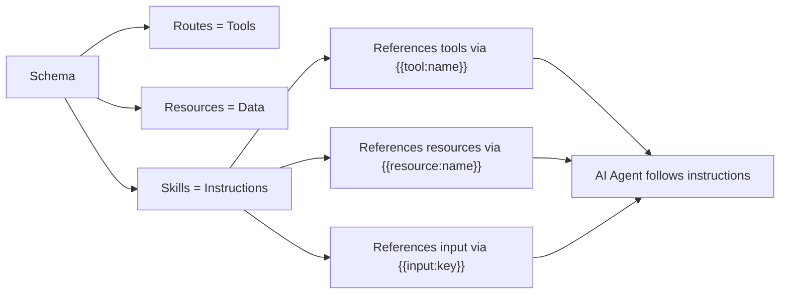
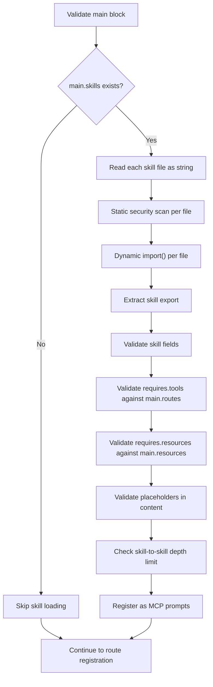

# FlowMCP Specification v2.0.0 — Skills

Skills are reusable instructions for AI agents. They map to the MCP `server.prompt` primitive. Each skill is a `.mjs` file with a structured `export const skill` object that combines Markdown instructions with typed metadata. This document defines the skill file format, field specifications, placeholder syntax, schema integration, scope rules, security constraints, and validation rules.

---

## Purpose

Routes define individual tools. Group prompts define multi-step workflows that compose tools. Skills occupy a different layer — they are **self-contained instruction sets** that an AI agent can load and follow. A skill declares what tools and resources it needs, what input it expects, and what output it produces. The instructions themselves are Markdown content with placeholder references to tools, resources, and input parameters.



The diagram shows that a schema contains routes (exposed as MCP tools), resources (exposed as MCP resources), and skills (exposed as MCP prompts). Skills reference tools and resources from the same schema through placeholders. The AI agent resolves these references and follows the instructions.

### Skills vs Group Prompts

| Aspect | Group Prompts (`12-group-prompts.md`) | Skills |
|--------|---------------------------------------|--------|
| Scope | Group-level — references tools across schemas | Schema-level — references tools within the same schema |
| Format | Markdown `.md` files in `.flowmcp/prompts/` | `.mjs` files with `export const skill` |
| Metadata | Title and description in `groups.json` | Structured metadata in the skill file itself |
| Input | Informal `## Input` section in Markdown | Typed `input` array with validation constraints |
| Dependencies | Implicit — backtick tool references in workflow | Explicit — `requires.tools` and `requires.resources` arrays |
| MCP Mapping | No direct MCP mapping | Maps to `server.prompt` primitive |
| Loading | File read at runtime | Dynamic `import()` — consistent with schema loading |

Group prompts are workflows that compose tools across schemas. Skills are schema-scoped instruction sets with typed metadata that map directly to the MCP prompt primitive.

---

## Skill File Format

A skill is an ES module file (`.mjs`) with two parts: a `content` variable containing Markdown instructions, and an `export const skill` object containing structured metadata.

```javascript
const content = `
## Instructions

Look up the contract ABI for {{input:address}} using {{tool:getContractAbi}}.
Then retrieve the full source code using {{tool:getSourceCode}}.

## Analysis

Compare the ABI function signatures against the source code.
Identify any discrepancies between declared and implemented functions.

## Report

Produce a Markdown report with:
- Contract name and compiler version
- Function count (from ABI vs source)
- List of external calls
- Security observations
`

export const skill = {
    name: 'full-contract-audit',
    version: 'flowmcp-skill/1.0.0',
    description: 'Retrieve ABI and source code for a smart contract audit.',
    requires: {
        tools: [ 'getContractAbi', 'getSourceCode' ],
        resources: [],
        external: []
    },
    input: [
        {
            key: 'address',
            type: 'string',
            description: 'Ethereum contract address (0x-prefixed, 42 characters)',
            required: true
        }
    ],
    output: 'Markdown report with ABI summary, source analysis, and security observations.',
    content
}
```

### Why `.mjs` Files

Skill files use the same `.mjs` format as schema files for three reasons:

1. **Consistent loading.** The runtime loads skills via `import()` — the same mechanism used for schemas. No separate file parser or YAML library is needed.
2. **Static security scanning.** The same `SecurityScanner` that checks schema files also checks skill files. The zero-import policy applies uniformly.
3. **Multiline content.** Template literals in JavaScript handle multiline Markdown content naturally, without escaping issues that JSON or YAML would introduce.

### Content Variable Pattern

The `content` field in the `skill` export is a string. By convention, this string is defined as a `const content` variable above the export, then referenced by name:

```javascript
const content = `
## Step 1
...
`

export const skill = {
    // ...
    content
}
```

This pattern keeps the Markdown instructions visually separated from the metadata. The variable name must be `content`. Other names are permitted by the language but rejected by the validator — see validation rule SKL010.

---

## Skill Fields

The `export const skill` object contains all metadata and instructions for the skill.

### Required Fields

| Field | Type | Constraints | Description |
|-------|------|-------------|-------------|
| `name` | `string` | Must match `^[a-z][a-z0-9-]{0,63}$` | Unique identifier within the schema. Lowercase letters, numbers, and hyphens. Maximum 64 characters. |
| `version` | `string` | Must be `'flowmcp-skill/1.0.0'` | Skill format version. See [Versioning](#versioning). |
| `description` | `string` | Maximum 1024 characters | Human-readable explanation of what the skill does. Appears in MCP prompt listings. |
| `output` | `string` | Must not be empty | Description of what the skill produces as a final artifact. |
| `content` | `string` | Must not be empty | Markdown instructions for the AI agent. Contains placeholders referencing tools, resources, and input parameters. |

### Optional Fields

| Field | Type | Default | Constraints | Description |
|-------|------|---------|-------------|-------------|
| `requires` | `object` | `{}` | See below | Declares dependencies on tools, resources, and external capabilities. |
| `requires.tools` | `string[]` | `[]` | Each must be a route name in the same schema's `main.routes` | Tools the skill needs. |
| `requires.resources` | `string[]` | `[]` | Each must be a resource name in the same schema's `main.resources` | Resources the skill reads. |
| `requires.external` | `string[]` | `[]` | Free-form strings | External capabilities the skill assumes (e.g. `'playwright'`, `'file-system'`). Informational — not validated against the runtime. |
| `input` | `object[]` | `[]` | See below | Parameters the user provides when invoking the skill. |

### Field Details

#### `name`

The skill name is the primary identifier. It is used in the MCP prompt registration, in `{{skill:name}}` placeholder references, and in `main.skills` entries. Only lowercase letters, numbers, and hyphens are allowed. The name must start with a letter.

```javascript
// Valid
name: 'full-contract-audit'
name: 'quick-check'
name: 'tvl-comparison-report'

// Invalid
name: 'Full-Contract-Audit'    // uppercase not allowed
name: '3d-chart'               // must start with letter
name: 'my_skill'               // underscore not allowed
name: ''                       // empty not allowed
```

#### `version`

The version string identifies the skill format specification. In this release, the only valid value is `'flowmcp-skill/1.0.0'`. The prefix `flowmcp-skill/` distinguishes skill versioning from schema versioning (`2.x.x`) and shared list versioning.

```javascript
// Valid
version: 'flowmcp-skill/1.0.0'

// Invalid
version: '1.0.0'               // missing prefix
version: 'flowmcp-skill/2.0.0' // version 2.0.0 does not exist yet
version: '2.0.0'               // this is a schema version, not a skill version
```

Why separate versioning: skill format changes (new fields, new placeholder types, new validation rules) happen independently of schema format changes. A skill at `flowmcp-skill/1.0.0` works with schemas at `2.0.0` or any future `2.x.x`. When the skill format changes in a breaking way, the version increments to `flowmcp-skill/2.0.0` — enabling validators to apply the correct rules and runtimes to support upgrade paths.

#### `description`

A human-readable summary of what the skill does. This text appears in MCP prompt listings and search results. Maximum 1024 characters.

```javascript
// Good — explains what the skill does and what it produces
description: 'Retrieve ABI and source code for a smart contract audit.'
description: 'Compare TVL across DeFi protocols and generate a ranked summary table.'

// Bad — too vague or too long
description: 'A skill.'
description: 'This skill does many things including...' // (1024+ chars)
```

#### `requires`

The `requires` object declares what the skill depends on. All three sub-fields are optional. If `requires` is omitted entirely, the skill has no declared dependencies.

```javascript
// Skill that needs two tools and no resources
requires: {
    tools: [ 'getContractAbi', 'getSourceCode' ],
    resources: [],
    external: []
}

// Skill that needs a tool and an external capability
requires: {
    tools: [ 'getChainData' ],
    resources: [ 'chainList' ],
    external: [ 'playwright' ]
}

// Skill with no dependencies (informational skill)
requires: {}
```

**`requires.tools`** — Each entry must be a route name that exists in the same schema's `main.routes`. The validator checks this at load time (SKL005). These references tell the runtime which tools the skill needs and allow consumers to verify that all dependencies are available.

**`requires.resources`** — Each entry must be a resource name that exists in the same schema's `main.resources`. The validator checks this at load time (SKL006).

**`requires.external`** — Free-form strings declaring external capabilities. These are informational only — the runtime does not validate them against available capabilities. They help consumers understand what environment the skill expects.

#### `input`

An array of parameter definitions. Each parameter describes one piece of information the user must (or may) provide when invoking the skill. Input parameters are referenced in the `content` via `{{input:key}}` placeholders.

```javascript
input: [
    {
        key: 'address',
        type: 'string',
        description: 'Ethereum contract address (0x-prefixed, 42 characters)',
        required: true
    },
    {
        key: 'chainName',
        type: 'enum',
        description: 'Target blockchain network',
        required: true,
        values: [ 'ethereum', 'polygon', 'arbitrum', 'base' ]
    },
    {
        key: 'includeSource',
        type: 'boolean',
        description: 'Whether to include full source code in the report',
        required: false
    }
]
```

### Input Parameter Fields

Each object in the `input` array has the following fields:

| Field | Type | Required | Constraints | Description |
|-------|------|----------|-------------|-------------|
| `key` | `string` | Yes | Must match `^[a-z][a-zA-Z0-9]*$` (camelCase) | Parameter name. Referenced via `{{input:key}}` in content. |
| `type` | `string` | Yes | One of: `string`, `number`, `boolean`, `enum` | Parameter data type. |
| `description` | `string` | Yes | Must not be empty | What this parameter means. |
| `required` | `boolean` | Yes | Must be `true` or `false` | Whether the parameter is mandatory. |
| `values` | `string[]` | Conditional | Required when `type` is `'enum'`. Must not be empty. | Allowed values for enum parameters. |

```javascript
// String parameter — required
{ key: 'address', type: 'string', description: 'Contract address', required: true }

// Number parameter — optional
{ key: 'depth', type: 'number', description: 'Analysis depth level (1-5)', required: false }

// Boolean parameter — optional
{ key: 'verbose', type: 'boolean', description: 'Include detailed breakdown', required: false }

// Enum parameter — required (values field is mandatory)
{ key: 'network', type: 'enum', description: 'Target network', required: true, values: [ 'ethereum', 'polygon' ] }
```

The `values` field is required when `type` is `'enum'` and forbidden when `type` is anything else. If a non-enum parameter includes `values`, the validator raises SKL009.

#### `output`

A string describing the expected output of the skill. This helps the AI agent understand what deliverable it should produce.

```javascript
// Good — specific about format and content
output: 'Markdown report with ABI summary, source analysis, and security observations.'
output: 'JSON object with protocol names as keys and TVL values in USD.'

// Bad — too vague
output: 'A report.'
output: 'Some data.'
```

#### `content`

The Markdown instructions that the AI agent follows. This is the core of the skill — it tells the agent what to do, step by step. Content must not be empty. It may contain placeholders that reference tools, resources, other skills, and input parameters. See [Placeholders](#placeholders).

---

## Placeholders

The `content` field supports four placeholder types. Placeholders use the `{{type:name}}` syntax and are resolved by the runtime when the skill is loaded as an MCP prompt.

### Placeholder Types

| Placeholder | Syntax | Resolves To | Example |
|-------------|--------|-------------|---------|
| Tool | `{{tool:name}}` | A route in the same schema's `main.routes` | `{{tool:getContractAbi}}` |
| Resource | `{{resource:name}}` | A resource in the same schema's `main.resources` | `{{resource:chainList}}` |
| Skill | `{{skill:name}}` | Another skill in the same schema's `main.skills` | `{{skill:quick-check}}` |
| Input | `{{input:key}}` | An input parameter from the skill's `input` array | `{{input:address}}` |

### Placeholder Rules

1. **Tool placeholders** (`{{tool:name}}`) — the `name` must exist as a key in the same schema's `main.routes`. The validator checks this at load time (SKL005 via `requires.tools`). Every tool referenced via `{{tool:name}}` in content should be listed in `requires.tools`.

2. **Resource placeholders** (`{{resource:name}}`) — the `name` must exist as a key in the same schema's `main.resources`. The validator checks this at load time (SKL006 via `requires.resources`). Every resource referenced via `{{resource:name}}` in content should be listed in `requires.resources`.

3. **Skill placeholders** (`{{skill:name}}`) — the `name` must exist as a key in the same schema's `main.skills`. Skill-to-skill references are limited to **one level deep** — a skill referenced via `{{skill:name}}` must not itself contain `{{skill:...}}` placeholders. This prevents circular chains and unbounded nesting. See [Scope Rules](#scope-rules).

4. **Input placeholders** (`{{input:key}}`) — the `key` must exist in the skill's own `input` array. The validator checks this at load time (SKL008).

### Placeholder Examples

```javascript
const content = `
## Step 1: Resolve Contract

Look up the ABI for contract {{input:address}} on {{input:network}}
using {{tool:getContractAbi}}.

## Step 2: Fetch Source

Retrieve the verified source code using {{tool:getSourceCode}}.

## Step 3: Cross-Reference

Check {{resource:verifiedContracts}} for known audit reports
on this contract.

## Step 4: Quick Summary

If the user requested a brief summary, follow {{skill:quick-summary}}
instead of producing the full report.
`
```

### Unresolved Placeholders

If a placeholder references a name that does not exist in the schema, the validator raises a warning (not an error). The placeholder is left as-is in the content — it becomes a literal string. This allows skills to contain informational references that the AI agent can interpret contextually, even if they do not resolve to an actual tool or resource.

---

## Schema Integration

Skills are declared in the `main` export of a schema file and loaded from separate `.mjs` files.

### Declaration in `main.skills`

The `main.skills` field is an optional object that maps skill names to file references:

```javascript
export const main = {
    namespace: 'etherscan',
    name: 'SmartContractExplorer',
    description: 'Explore verified smart contracts on EVM-compatible chains',
    version: '2.0.0',
    root: 'https://api.etherscan.io',
    routes: {
        getContractAbi: { /* ... */ },
        getSourceCode: { /* ... */ }
    },
    skills: {
        'full-contract-audit': { file: './skills/full-contract-audit.mjs' },
        'quick-summary': { file: './skills/quick-summary.mjs' }
    }
}
```

### `main.skills` Entry Fields

| Field | Type | Required | Description |
|-------|------|----------|-------------|
| key (skill name) | `string` | Yes | Must match `^[a-z][a-z0-9-]{0,63}$`. Must match the `name` field inside the skill file. |
| `file` | `string` | Yes | Relative path from the schema file to the skill `.mjs` file. Must end with `.mjs`. |

The key in `main.skills` must match the `name` field inside the referenced skill file. If they differ, the validator raises SKL003.

### File Organization

Skills are stored in a `skills/` subdirectory relative to the schema file:

```
etherscan/
├── SmartContractExplorer.mjs
└── skills/
    ├── full-contract-audit.mjs
    └── quick-summary.mjs
```

The `file` path in `main.skills` is relative to the schema file location:

```javascript
// Schema at: etherscan/SmartContractExplorer.mjs
skills: {
    'full-contract-audit': { file: './skills/full-contract-audit.mjs' }
}
// Resolves to: etherscan/skills/full-contract-audit.mjs
```

### MCP Registration

Each skill is registered as an MCP prompt with the server. The fully qualified prompt name follows the pattern `namespace/schemaFile::skillName`:

```
etherscan/SmartContractExplorer::full-contract-audit
etherscan/SmartContractExplorer::quick-summary
```

The runtime maps skill fields to MCP prompt fields:

| Skill Field | MCP Prompt Field |
|-------------|-----------------|
| `name` | Prompt name (with namespace prefix) |
| `description` | Prompt description |
| `input` | Prompt arguments |
| `content` (with resolved placeholders) | Prompt messages |

---

## Versioning

### Format

```
flowmcp-skill/1.0.0
```

The version string has two parts separated by `/`:

| Part | Value | Description |
|------|-------|-------------|
| Prefix | `flowmcp-skill` | Fixed identifier for the skill format |
| Version | `1.0.0` | Semver version of the skill specification |

### Current Version

The only valid version in this release is `flowmcp-skill/1.0.0`.

### Why Separate Versioning

Skill format versioning is independent of schema format versioning (`2.x.x`) for three reasons:

1. **Independent evolution.** Skill fields, placeholder types, and validation rules change on a different cadence than schema fields. A new placeholder type does not require a schema version bump.
2. **Validation targeting.** The validator uses the version string to apply the correct rule set. A skill at `flowmcp-skill/1.0.0` is validated against the rules defined in this document. A future `flowmcp-skill/2.0.0` may add new required fields or placeholder types.
3. **Upgrade paths.** When breaking changes are introduced, the version increment signals that existing skills need migration. Tools can detect the version and offer automated migration.

---

## Validation Rules

### Structural Rules (Static Validation)

These rules can be checked at load time by examining the skill file and the schema's `main` block. They run during `flowmcp validate`.

| Code | Severity | Rule |
|------|----------|------|
| SKL001 | error | Skill file must export `skill` as a named export |
| SKL002 | error | `skill.name` is required, must be a string, must match `^[a-z][a-z0-9-]{0,63}$` |
| SKL003 | error | `skill.name` must match the key in `main.skills` that references this file |
| SKL004 | error | `skill.version` is required and must be `'flowmcp-skill/1.0.0'` |
| SKL005 | error | Each entry in `requires.tools` must exist as a key in `main.routes` |
| SKL006 | error | Each entry in `requires.resources` must exist as a key in `main.resources` |
| SKL007 | error | `skill.description` is required, must be a string, maximum 1024 characters |
| SKL008 | error | Each `{{input:key}}` placeholder in `content` must have a matching entry in `skill.input` |
| SKL009 | error | `input[].values` is required when `type` is `'enum'` and forbidden otherwise |
| SKL010 | error | `skill.content` is required and must be a non-empty string |
| SKL011 | error | `skill.output` is required and must be a non-empty string |
| SKL012 | error | `input[].key` must match `^[a-z][a-zA-Z0-9]*$` (camelCase) |
| SKL013 | error | `input[].type` must be one of: `string`, `number`, `boolean`, `enum` |
| SKL014 | error | `input[].description` is required and must be a non-empty string |
| SKL015 | error | `input[].required` must be a boolean |
| SKL016 | error | `main.skills` entries: `file` must end with `.mjs` |
| SKL017 | error | `main.skills` entries: referenced file must exist |
| SKL018 | error | Maximum 4 skills per schema |

### Reference Rules (Cross-Validation)

These rules validate references between skills, tools, and resources within the same schema.

| Code | Severity | Rule |
|------|----------|------|
| SKL020 | warning | `{{tool:name}}` placeholder in content references a tool not listed in `requires.tools` |
| SKL021 | warning | `{{resource:name}}` placeholder in content references a resource not listed in `requires.resources` |
| SKL022 | error | `{{skill:name}}` placeholder references a skill not in `main.skills` |
| SKL023 | error | `{{skill:name}}` target skill must not itself contain `{{skill:...}}` placeholders (1 level deep only) |
| SKL024 | warning | Entry in `requires.tools` is not referenced via `{{tool:...}}` in content |
| SKL025 | warning | Entry in `requires.resources` is not referenced via `{{resource:...}}` in content |

### Non-Validatable Aspects

The following aspects cannot be checked by static validation. They depend on AI agent behavior at runtime:

| Aspect | Why Not Validatable |
|--------|-------------------|
| Instruction quality | Whether the Markdown content produces good results is subjective |
| Step completeness | Whether all necessary steps are covered requires domain knowledge |
| Output accuracy | Whether the described output matches what the agent produces depends on agent capability |
| Input sufficiency | Whether the declared inputs are enough to complete the task is domain-specific |
| External availability | Whether `requires.external` capabilities are present depends on the runtime environment |

---

## Scope Rules

Skills operate at the schema level by default. Cross-schema references are possible only through groups.

### Schema-Level Scope

A skill can only reference tools and resources that belong to the same schema:

```javascript
// Schema: etherscan/SmartContractExplorer.mjs
export const main = {
    routes: {
        getContractAbi: { /* ... */ },
        getSourceCode: { /* ... */ }
    },
    skills: {
        'contract-audit': { file: './skills/contract-audit.mjs' }
    }
}

// Skill: etherscan/skills/contract-audit.mjs
// CAN reference: getContractAbi, getSourceCode (same schema)
// CANNOT reference: getSimplePrice (different schema: coingecko)
```

### Group-Level Scope

When skills are used within a group context, they can reference tools from other schemas in the group using the fully qualified namespace prefix. This is a group-level feature, not a skill-level feature — the skill file itself always uses bare route names. The group runtime resolves cross-schema references.

### Skill-to-Skill Scope

A skill can reference another skill in the same schema via `{{skill:name}}`. This is limited to **one level deep**:

```javascript
// Allowed: skill-a references skill-b
// skill-a.mjs content: "For a quick version, follow {{skill:quick-summary}}"
// quick-summary.mjs content: "Summarize the ABI using {{tool:getContractAbi}}"

// Forbidden: skill-b references skill-c (would make skill-a -> skill-b -> skill-c)
// quick-summary.mjs content: "See also {{skill:another-skill}}"  // SKL023 error
```

The one-level-deep restriction prevents:
- **Circular references** — skill A referencing skill B referencing skill A
- **Deep nesting** — unbounded chains of skill references that are hard to follow
- **Context explosion** — each level adds content, which can exceed context limits

### Scope Summary

| Reference Type | Allowed Scope | Depth |
|---------------|---------------|-------|
| `{{tool:name}}` | Same schema only | N/A |
| `{{resource:name}}` | Same schema only | N/A |
| `{{skill:name}}` | Same schema only | 1 level deep |
| `{{input:key}}` | Same skill only | N/A |

---

## Security

Skills are subject to the same security model as schema files. The zero-import policy and static security scan apply uniformly.

### Static Security Scan

Before a skill file is loaded via `import()`, the raw file content is scanned for all forbidden patterns listed in `05-security.md`:

| Pattern | Reason |
|---------|--------|
| `import ` | No imports — skills are self-contained |
| `require(` | No CommonJS imports |
| `eval(` | Code injection |
| `Function(` | Code injection |
| `fs.` | Filesystem access |
| `process.` | Process access |
| All other patterns from `05-security.md` | Same rationale as schema files |

### What Skill Files Can Contain

```javascript
// Allowed — const variable with template literal
const content = `Markdown instructions...`

// Allowed — export const with object literal
export const skill = { /* metadata */ }

// Allowed — comments
// This skill audits smart contracts
```

### What Skill Files Cannot Contain

```javascript
// Forbidden — import statement (SEC001)
import { something } from 'somewhere'

// Forbidden — require call (SEC002)
const lib = require( 'lib' )

// Forbidden — filesystem access (SEC005)
const data = fs.readFileSync( 'file.txt' )

// Forbidden — eval (SEC003)
eval( 'code' )

// Forbidden — process access (SEC006)
const key = process.env.API_KEY
```

### Security Scan Error Format

Skill security violations use the same error codes as schema files (SEC001-SEC011) but include the skill file path:

```
SEC001 etherscan/skills/contract-audit.mjs: Forbidden pattern "import " found at line 1
```

---

## Limits

| Constraint | Value | Rationale |
|------------|-------|-----------|
| Max skills per schema | 4 | Keeps schemas focused. Skills that grow beyond 4 indicate the schema should be split. |
| Content must not be empty | Required | A skill without instructions has no purpose. |
| Skill name max length | 64 characters | Prevents excessively long MCP prompt identifiers. |
| Description max length | 1024 characters | Consistent with schema description limits. |
| Skill-to-skill depth | 1 level | Prevents circular references and context explosion. |
| Input parameter types | 4 (`string`, `number`, `boolean`, `enum`) | Matches the types available in MCP prompt arguments. |

---

## Loading

Skills are loaded as part of the schema loading sequence defined in `01-schema-format.md`. The skill loading step occurs after the `main` block is validated and before routes are registered as MCP tools.

### Loading Sequence



The diagram shows how skill loading integrates into the existing schema loading pipeline. Skills are loaded after `main` validation and before route registration.

### Step-by-Step

1. **Check `main.skills`** — if the field is absent or empty, skip skill loading entirely.
2. **Read each skill file as string** — the raw source is read before any execution, same as schema files.
3. **Static security scan** — the file string is scanned for forbidden patterns. If any match, the skill file is rejected.
4. **Dynamic import** — the file is imported via `import()`.
5. **Extract `skill` export** — the named `skill` export is read.
6. **Validate skill fields** — name, version, description, output, content, input parameters.
7. **Validate `requires.tools`** — each entry must exist in `main.routes`.
8. **Validate `requires.resources`** — each entry must exist in `main.resources`.
9. **Validate placeholders** — `{{input:key}}` references must match `input` entries; `{{tool:name}}` and `{{resource:name}}` references are checked against `requires` declarations.
10. **Check skill-to-skill depth** — if the content contains `{{skill:name}}`, the referenced skill must not itself contain `{{skill:...}}` placeholders.
11. **Register as MCP prompts** — each validated skill is exposed as an MCP prompt.

### No Additional Dependencies

Skill loading requires no additional dependencies beyond what the schema runtime already provides:

- No filesystem library — the runtime already reads files for schemas
- No YAML parser — skills use `.mjs` format
- No template engine — placeholder resolution is string replacement

---

## Complete Example

A schema with two routes and one skill that composes them into a contract audit workflow:

### Schema File (`etherscan/SmartContractExplorer.mjs`)

```javascript
export const main = {
    namespace: 'etherscan',
    name: 'SmartContractExplorer',
    description: 'Explore verified smart contracts on EVM-compatible chains via Etherscan APIs',
    version: '2.0.0',
    root: 'https://api.etherscan.io',
    requiredServerParams: [ 'ETHERSCAN_API_KEY' ],
    routes: {
        getContractAbi: {
            method: 'GET',
            path: '/api',
            description: 'Returns the Contract ABI of a verified smart contract',
            parameters: [ /* ... */ ],
            tests: [ /* ... */ ]
        },
        getSourceCode: {
            method: 'GET',
            path: '/api',
            description: 'Returns the Solidity source code of a verified smart contract',
            parameters: [ /* ... */ ],
            tests: [ /* ... */ ]
        }
    },
    skills: {
        'full-contract-audit': { file: './skills/full-contract-audit.mjs' }
    }
}
```

### Skill File (`etherscan/skills/full-contract-audit.mjs`)

```javascript
const content = `
## Step 1: Retrieve Contract ABI

Call {{tool:getContractAbi}} with the contract address {{input:address}}.
Parse the returned ABI JSON string into a structured object.
Count the number of functions, events, and errors declared.

## Step 2: Retrieve Source Code

Call {{tool:getSourceCode}} with the same address {{input:address}}.
Extract the contract name, compiler version, and optimization settings.

## Step 3: Cross-Reference Analysis

Compare the ABI function signatures against the source code:
- Identify functions declared in ABI but missing from source
- Identify internal functions not exposed in ABI
- Flag any external calls (address.call, delegatecall)

## Step 4: Security Observations

Review the source code for common patterns:
- Reentrancy guards (nonReentrant modifier)
- Access control (onlyOwner, role-based)
- Upgrade patterns (proxy, UUPS)
- Token approvals and transfers

## Step 5: Generate Report

Produce a Markdown report with the following sections:
- **Contract Overview**: name, compiler, optimization, address
- **Interface Summary**: function/event/error counts from ABI
- **Source Analysis**: external calls, modifiers, inheritance
- **Security Notes**: observations from Step 4
- **Raw ABI**: the full ABI JSON for reference
`

export const skill = {
    name: 'full-contract-audit',
    version: 'flowmcp-skill/1.0.0',
    description: 'Retrieve ABI and source code for a comprehensive smart contract audit report.',
    requires: {
        tools: [ 'getContractAbi', 'getSourceCode' ],
        resources: [],
        external: []
    },
    input: [
        {
            key: 'address',
            type: 'string',
            description: 'Ethereum contract address (0x-prefixed, 42 characters)',
            required: true
        }
    ],
    output: 'Markdown report with contract overview, interface summary, source analysis, security observations, and raw ABI.',
    content
}
```

### What This Example Demonstrates

1. **Schema with skills** — the `main` export includes a `skills` field alongside `routes`.
2. **Skill file in `skills/` subdirectory** — follows the file organization convention.
3. **`requires.tools` declaration** — the skill explicitly lists `getContractAbi` and `getSourceCode` as dependencies.
4. **Tool placeholders** — `{{tool:getContractAbi}}` and `{{tool:getSourceCode}}` reference routes from the same schema.
5. **Input placeholders** — `{{input:address}}` references the skill's typed input parameter.
6. **Typed input** — the `address` parameter has type `string` and is required.
7. **Structured content** — the Markdown instructions follow a numbered step pattern.
8. **Content variable pattern** — the `content` variable is defined above the export and referenced by name.
9. **No import statements** — the skill file has zero imports, consistent with the zero-import policy.
10. **MCP mapping** — this skill registers as `etherscan/SmartContractExplorer::full-contract-audit` in the MCP prompt list.

### File Structure

```
etherscan/
├── SmartContractExplorer.mjs      # Schema with routes + skills declaration
└── skills/
    └── full-contract-audit.mjs    # Skill file with content + metadata
```
