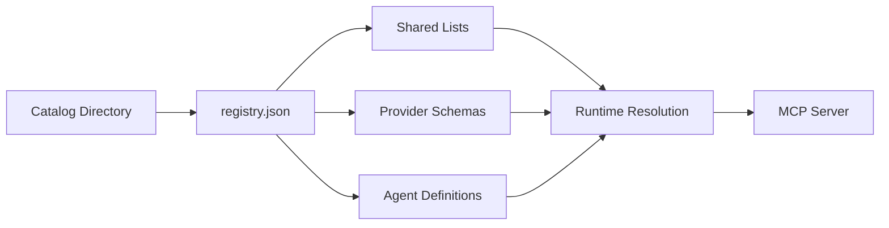
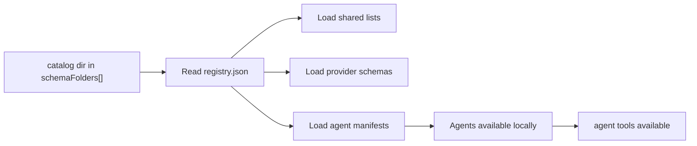
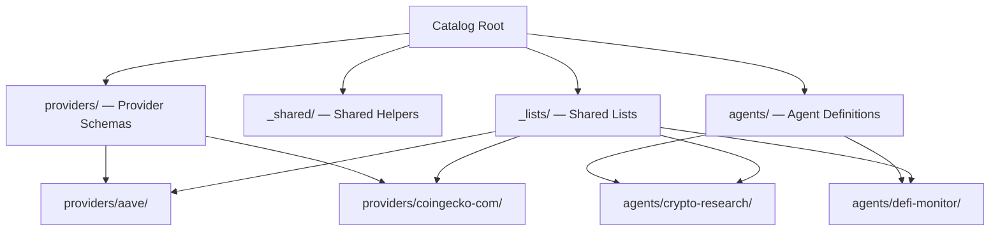

# 15. Catalog

| Field | Value |
|---|---|
| Status | Normative |
| Depends on | [00-overview.md](./00-overview.md), [01-schema-format.md](./01-schema-format.md) |
| Related | [03-shared-lists.md](./03-shared-lists.md), [06-agents.md](./06-agents.md), [16-id-schema.md](./16-id-schema.md), [21-schema-lifecycle.md](./21-schema-lifecycle.md) |

A Catalog is the top-level organizational unit in FlowMCP v4. It is a named directory containing a `registry.json` manifest that describes all shared lists, provider schemas, and agent definitions within that directory. Multiple catalogs can coexist side by side, enabling community, company-internal, and experimental tool collections to operate independently.

---

## Purpose

As FlowMCP grows beyond individual schemas and shared lists, a higher-level structure is needed to group related content into a cohesive, distributable unit. Without catalogs:

- **No manifest** — the runtime MUST scan directories and infer relationships between schemas, lists, and agents
- **No isolation** — company-internal schemas mix with community schemas in a flat namespace
- **No load boundary** — a runtime that consumes the directory needs knowledge of its internal file structure

Catalogs solve this by providing a single `registry.json` manifest that declares everything the directory contains. The runtime reads this manifest instead of scanning the filesystem, and the CLI uses it as the entry point when the directory is registered in `schemaFolders[]`. Schemas load directly from the configured folder — there is no separate remote-import or download step.



The diagram shows how the catalog directory contains a manifest that references shared lists, provider schemas, and agent definitions. The runtime resolves all three through the manifest and exposes them via the MCP server.

---

## Catalog Structure

A catalog is a named directory containing a `registry.json` manifest and three content areas: shared lists, provider schemas, and agent definitions.

```
schemas/v4.0.0/
└── flowmcp-community/              <- Named catalog directory
    ├── registry.json                <- Catalog manifest
    ├── _lists/                      <- Shared Lists (root level)
    │   ├── evm-chains.mjs
    │   ├── german-bundeslaender.mjs
    │   └── ...
    ├── _shared/                     <- Shared Helpers (root level)
    ├── providers/                   <- All provider schemas
    │   ├── aave/
    │   │   └── reserves.mjs
    │   ├── coingecko-com/
    │   │   ├── simple-price.mjs
    │   │   └── prompts/             <- Provider prompts (model-neutral)
    │   └── ...
    ├── selections/                  <- Curated tool subsets (v4.3.0)
    │   ├── evm-research/
    │   │   └── selection.mjs
    │   └── defi-monitor/
    │       └── selection.mjs
    └── agents/                      <- Agent definitions
        ├── crypto-research/
        │   ├── agent.mjs            <- Agent manifest (export const agent)
        │   ├── prompts/             <- Agent-specific prompts
        │   │   └── prompt-name.mjs
        │   ├── skills/              <- Agent-specific skills
        │   │   └── skill-name.mjs
        │   └── resources/           <- Agent-specific resources (optional)
        └── defi-monitor/
            ├── agent.mjs
            ├── prompts/
            ├── skills/
            └── resources/
```

### Directory Conventions

| Directory | Level | Purpose |
|-----------|-------|---------|
| `_lists/` | Root | Shared value lists consumed by all providers and agents |
| `_shared/` | Root | Shared helper modules consumed by provider schemas |
| `providers/` | Root | Provider schema directories, one per namespace |
| `selections/` | Root | Curated tool subsets for agent context loading (v4.3.0). See `17-selections.md`. |
| `providers/{namespace}/` | Provider | Schema files for a single data source |
| `providers/{namespace}/prompts/` | Provider | Model-neutral prompts for the provider's tools |
| `agents/` | Root | Agent definition directories |
| `agents/{agent-name}/` | Agent | Agent manifest, prompts, skills, and resources |
| `agents/{agent-name}/prompts/` | Agent | Agent-specific prompts |
| `agents/{agent-name}/skills/` | Agent | Agent-specific skills |
| `agents/{agent-name}/resources/` | Agent | Agent-specific resources (optional) |

### Naming Rules

- The catalog directory name MUST match the `name` field in `registry.json`
- Directory names use kebab-case: `flowmcp-community`, `my-company-tools`
- Provider namespace directories use kebab-case: `coingecko-com`, `defi-llama`
- A provider namespace directory name MUST equal `main.namespace` of every schema it contains (folder↔namespace invariant, `VAL019` in `09-validation-rules.md`). For an all-unparseable folder the directory name is the fallback namespace and is renamed to match once a schema parses (rename-on-parse, see `16-id-schema.md`).
- Agent directories use kebab-case: `crypto-research`, `defi-monitor`

---

## Multiple Catalogs

Multiple catalogs can exist side by side under the same parent directory. Each catalog is fully self-contained — its `registry.json` references only files within its own directory tree. There are no cross-catalog dependencies.

```
schemas/v4.0.0/
├── flowmcp-community/           <- Official community catalog
│   └── registry.json
├── my-company-tools/            <- Company-internal catalog
│   └── registry.json
└── experimental/                <- Personal experiments
    └── registry.json
```

### Isolation Guarantees

1. **No cross-catalog shared lists** — a schema in `my-company-tools` cannot reference a shared list defined in `flowmcp-community`. If both catalogs need the same list, each MUST include its own copy.
2. **No namespace collisions across catalogs** — two catalogs MAY contain providers with the same namespace (e.g. both have `etherscan/`). The runtime qualifies tool names with the catalog name to prevent collisions.
3. **Independent versioning** — each catalog has its own `version` field. Updating `flowmcp-community` to version `3.1.0` does not affect `my-company-tools` at version `3.0.0`.
4. **Independent configuration** — each catalog is referenced independently in the CLI's `schemaFolders[]`. Adding one catalog does not pull in others.

---

## Registry Manifest Format

The `registry.json` file is the entry point for a catalog. It declares identity metadata and lists all shared lists, provider schemas, and agent definitions within the catalog.

```json
{
    "name": "flowmcp-community",
    "version": "4.0.0",
    "description": "Official FlowMCP community catalog",
    "schemaSpec": "4.0.0",
    "contentHash": "sha256:a1b2c3d4e5f6789abcdef01234567890abcdef01234567890abcdef01234567890",

    "shared": [
        { "file": "_lists/evm-chains.mjs", "name": "evmChains" },
        { "file": "_lists/german-bundeslaender.mjs", "name": "germanBundeslaender" }
    ],

    "schemas": [
        {
            "namespace": "coingecko-com",
            "file": "providers/coingecko-com/simple-price.mjs",
            "name": "CoinGecko Simple Price",
            "requiredServerParams": [],
            "hasHandlers": false,
            "sharedLists": []
        }
    ],

    "agents": [
        {
            "name": "crypto-research",
            "description": "Cross-provider crypto analysis agent",
            "manifest": "agents/crypto-research/agent.mjs"
        }
    ],

    "selections": [
        {
            "name": "evm-research",
            "description": "Tools for EVM contract and token research",
            "file": "selections/evm-research/selection.mjs"
        },
        {
            "name": "defi-monitor",
            "description": "Tools for DeFi protocol monitoring",
            "file": "selections/defi-monitor/selection.mjs"
        }
    ]
}
```

### `contentHash` Field

The `contentHash` field contains the **SHA-256 hash of the canonically serialized registry contents**. It provides integrity verification for the catalog.

**Hash input:** The hash is computed over a canonical JSON serialization of all referenced Primitives (schemas, shared lists, agents, selections). The algorithm:

1. Collect all file paths referenced in the registry (`shared[].file`, `schemas[].file`, `agents[].manifest`, `selections[].file`)
2. For each file, read the raw content and sort by file path (alphabetical)
3. Concatenate: `{filePath}:{fileContent}\n` for each file
4. Compute SHA-256 of the concatenated string

This ensures that any change to any referenced file invalidates the hash, signaling that the catalog needs re-validation.

**Note:** The `contentHash` field is optional. When absent, the runtime skips integrity verification for the catalog.

All file paths in `registry.json` are relative to the catalog root directory. Absolute paths and paths that escape the catalog directory (e.g. `../other-catalog/file.mjs`) are forbidden.

---

## Registry Fields

### Top-Level Fields

| Field | Type | Required | Description |
|-------|------|----------|-------------|
| `name` | `string` | Yes | Catalog name. Must match the catalog directory name. Kebab-case. |
| `version` | `string` | Yes | Catalog version (semver). Independent of schema spec version. |
| `description` | `string` | Yes | Human-readable description of the catalog's purpose. |
| `schemaSpec` | `string` | Yes | FlowMCP specification version this catalog conforms to (e.g. `"4.0.0"`). |
| `shared` | `array` | Yes | Shared list references. May be empty (`[]`). |
| `schemas` | `array` | Yes | Schema entries. May be empty (`[]`). |
| `agents` | `array` | Yes | Agent entries. May be empty (`[]`). |

### Shared List Entry Fields

Each object in the `shared` array describes one shared list file.

| Field | Type | Required | Description |
|-------|------|----------|-------------|
| `file` | `string` | Yes | Relative path from catalog root to the `.mjs` list file. |
| `name` | `string` | Yes | List name (camelCase). Must match `meta.name` in the referenced file. |

### Schema Entry Fields

Each object in the `schemas` array describes one provider schema file.

| Field | Type | Required | Description |
|-------|------|----------|-------------|
| `namespace` | `string` | Yes | Provider namespace (kebab-case). Groups schemas by data source. |
| `file` | `string` | Yes | Relative path from catalog root to the `.mjs` schema file. |
| `name` | `string` | Yes | Human-readable schema name. |
| `requiredServerParams` | `string[]` | Yes | Server parameters (API keys) the schema requires. May be empty. |
| `hasHandlers` | `boolean` | Yes | Whether the schema exports a `handlers` factory function. |
| `sharedLists` | `string[]` | Yes | Names of shared lists this schema references. May be empty. |

### Agent Entry Fields

Each object in the `agents` array describes one agent definition.

| Field | Type | Required | Description |
|-------|------|----------|-------------|
| `name` | `string` | Yes | Agent name (kebab-case). Must match the agent directory name. |
| `description` | `string` | Yes | Human-readable description of the agent's purpose. |
| `manifest` | `string` | Yes | Relative path from catalog root to the agent's `agent.mjs` file. |
| `prompts` | `Object` | No | Agent-specific prompts exported by the agent. |
| `skills` | `Object` | No | Agent-specific skills exported by the agent. |
| `resources` | `Object` | No | Agent-specific resources exported by the agent. |

---

## Catalog Resolution Flow

This describes how a catalog's contents are resolved once its directory is referenced in the CLI's `schemaFolders[]`. Agent manifests are resolved alongside provider schemas and shared lists.



The diagram shows how a catalog referenced in `schemaFolders[]` is resolved: registry.json is read, then shared lists, provider schemas, and agent manifests are loaded, making the catalog's tools and agents available locally.

### Phase 1: Catalog Read

1. **Read `registry.json`** from the referenced catalog directory.
2. **Validate manifest** — check required fields, verify `schemaSpec` compatibility.
3. **Load shared lists** — resolve each `shared[].file` path and load the `.mjs` files.
4. **Load provider schemas** — resolve each `schemas[].file` path and load the `.mjs` files.
5. **Load agent manifests** — resolve each `agents[].manifest` path and load the `agent.mjs` files (and associated prompt, skill, and resource files).
6. **Index locally** — register all loaded entries from the catalog directory.

### Phase 2: Agent Resolution

1. **Read agent manifest** — parse the locally stored `agent.mjs` for the named agent.
2. **Resolve tool dependencies** — identify which provider schemas the agent requires.
3. **Make tools available** — the agent's required tools become callable from the resolved catalog.
4. **Register prompts** — make the agent's prompts available as MCP prompts.

---

## Three-Level Architecture

The catalog structure maps directly to the three-level architecture of FlowMCP: Root, Provider, and Agent.



The diagram shows how shared lists at the root level flow down to both providers and agents. Providers and agents consume shared lists but never define their own.

### Root Level

The root level contains resources shared across all providers and agents:

| Directory | Content | Consumed By |
|-----------|---------|-------------|
| `_lists/` | Shared value lists (`.mjs` files) | Providers, agents |
| `_shared/` | Shared helper modules | Providers |
| `registry.json` | Catalog manifest | Runtime, CLI |

### Provider Level

Each provider directory contains schemas for a single data source:

| Content | Description |
|---------|-------------|
| `*.mjs` schema files | Tool and resource definitions |
| `prompts/` directory | Model-neutral prompts for the provider's tools |

Providers reference shared lists from the root `_lists/` directory via `main.sharedLists`. They never define their own lists.

### Agent Level

Each agent directory contains a manifest and prompts for a pre-built tool composition:

| Content | Description |
|---------|-------------|
| `agent.mjs` | Agent manifest (`export const agent`), metadata, tool dependencies, configuration |
| `prompts/` directory | Agent-specific prompts |
| `skills/` directory | Agent-specific skills |
| `resources/` directory | Agent-specific resources (optional) |

Agents reference tools from providers and shared lists from root. Like providers, agents never define their own shared lists.

### Shared List Ownership Rule

Shared lists are defined **exclusively** at the catalog root level in the `_lists/` directory. Neither providers nor agents define their own lists — they consume from root. This ensures:

- **Single source of truth** — one canonical version of each list
- **No duplication** — providers and agents reference the same list entries
- **Consistent updates** — changing a list at root propagates to all consumers

---

## Validation Rules

The following rules are enforced when loading and validating a catalog.

| Code | Severity | Rule |
|------|----------|------|
| CAT001 | error | `registry.json` must exist in the catalog root directory |
| CAT002 | error | `name` field MUST match the catalog directory name |
| CAT003 | error | All `shared[].file` paths MUST resolve to existing files |
| CAT004 | error | All `schemas[].file` paths MUST resolve to existing files |
| CAT005 | error | All `agents[].manifest` paths MUST resolve to existing files |
| CAT006 | warning | Orphaned files (exist in the catalog directory but are not listed in `registry.json`) should be reported |
| CAT007 | error | `schemaSpec` must be a valid FlowMCP specification version |

### Rule Details

**CAT001** — The `registry.json` file is the entry point for catalog resolution. Without it, the runtime cannot discover the catalog contents. A directory without `registry.json` is not a catalog.

**CAT002** — The catalog name in the manifest MUST match the directory name. If the directory is `flowmcp-community/`, then `name` must be `"flowmcp-community"`. This prevents confusion when multiple catalogs coexist.

**CAT003** — Every shared list declared in `shared[]` must have a corresponding `.mjs` file at the declared path. Missing files indicate a broken manifest that was not regenerated after file operations.

**CAT004** — Every schema declared in `schemas[]` must have a corresponding `.mjs` file at the declared path. The validator checks file existence, not schema validity — schema-level validation is handled by the rules in `01-schema-format.md` and `09-validation-rules.md`.

**CAT005** — Every agent declared in `agents[]` must have an `agent.mjs` at the declared path. Missing manifests prevent agent activation.

**CAT006** — Files that exist in the catalog directory tree but are not referenced in `registry.json` may indicate forgotten schemas or leftover files from development. The validator reports these as warnings to help catalog authors maintain a clean manifest.

**CAT007** — The `schemaSpec` field MUST reference a known FlowMCP specification version. This ensures the runtime applies the correct validation rules and loading behavior for the catalog's contents. Invalid version strings (e.g. `"latest"`, `"2.x"`) are rejected.

### Validation Command

```bash
flowmcp validate-catalog <catalog-directory>
```

The command runs all CAT rules and reports errors and warnings. A catalog with any error-level violations cannot be loaded or published.


<!-- IMPLEMENTED-BY — rendered backlink lives in the dist (generated/bridge/<family>/<stem>.backlink.md); source stays authored-only (F2 Dist-Split) -->
## Related

- [./00-overview.md](./00-overview.md) — see chapter 00.
- [./01-schema-format.md](./01-schema-format.md) — see chapter 01.
- [./03-shared-lists.md](./03-shared-lists.md) — see chapter 03.
- [./06-agents.md](./06-agents.md) — see chapter 06.
- [./16-id-schema.md](./16-id-schema.md) — see chapter 16.
- [./21-schema-lifecycle.md](./21-schema-lifecycle.md) — see chapter 21.
